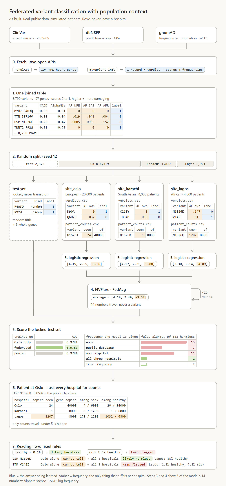
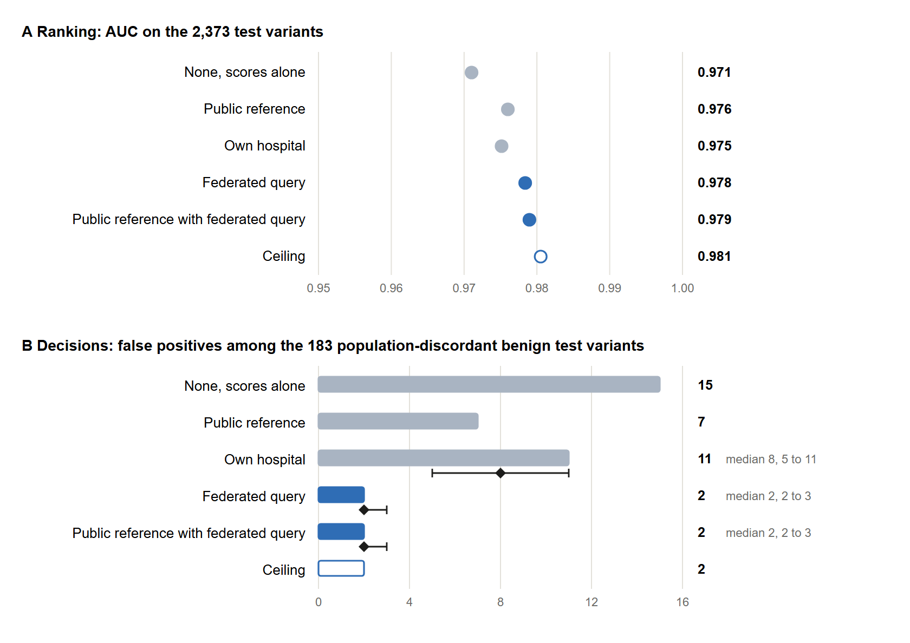
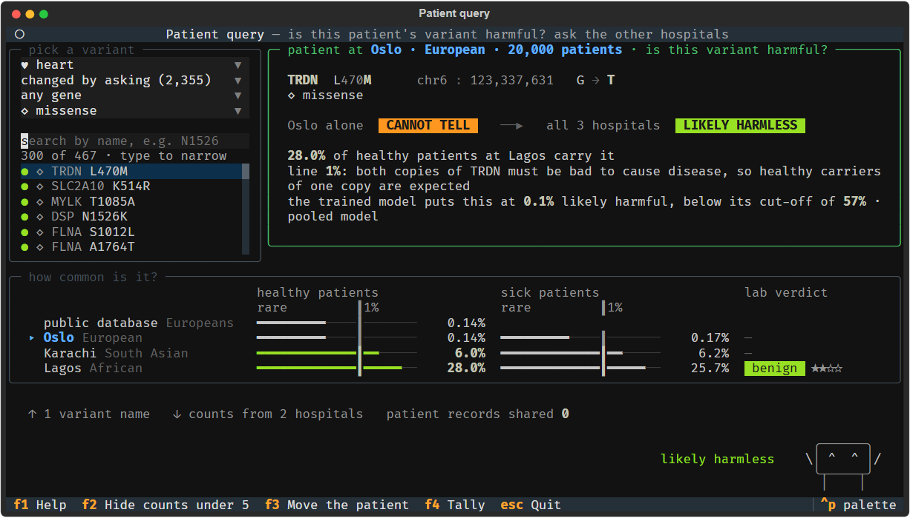

<!-- Author order follows the README team list. Confirm order, affiliations and the bracketed placeholders before submission. -->
<!-- Build the PDF with: uv run --with markdown python scripts/build_manuscript.py -->

# Hello World! Federated Learning for Clinical Diagnostics: population-aware variant classification across three simulated hospitals

Yan Li<sup>1</sup>, Mohit B. Panwar<sup>2</sup>, Shreya Srivastava<sup>3</sup>, Oumaima Boussouis<sup>4</sup>

<sup>1</sup> Department of Public Health, University of Copenhagen, Denmark<br>
<sup>2</sup> Department of Clinical Neuroscience, Institute of Neuroscience and Physiology, Sahlgrenska Academy, University of Gothenburg, Gothenburg, Sweden<br>
<sup>3</sup> Department of Computational and Data Sciences, Indian Institute of Science, Bengaluru, India<br>
<sup>4</sup> ENSIAS, Mohammed V University in Rabat, Morocco

ORCID: Yan Li [0009-0004-6076-1570](https://orcid.org/0009-0004-6076-1570); Mohit B. Panwar [0009-0002-8866-8170](https://orcid.org/0009-0002-8866-8170); Oumaima Boussouis [0009-0005-6498-3805](https://orcid.org/0009-0005-6498-3805)

Correspondence: Mohit B. Panwar, mohit.panwar@gu.se

## Abstract

**Background.** How common a genetic variant is in the general population is strong evidence on whether it can cause a rare disease. Public frequency references cover ancestries unevenly, and patients have received incorrect genetic diagnoses because a variant common in their own population appeared rare in the reference. Hospitals that serve under-represented populations hold the missing counts and are rarely able to share patient-level data.

**Methods.** We built a reproducible prototype from open data during a hackathon. Expert classifications from ClinVar, 12 functional prediction scores from dbNSFP and per-population allele frequencies from gnomAD were assembled for 8,790 missense variants in 97 cardiac disease genes drawn from NHS-approved PanelApp panels. Three hospitals were simulated, each serving one ancestry group, alongside a locked test set of 2,373 variants. A logistic regression with 14 coefficients was trained at each hospital, on the pooled data, and across hospitals by federated averaging in NVIDIA FLARE. Models were scored with frequency evidence from different sources. A query tool returns carrier counts from each hospital and no patient-level record.

**Results.** The source of frequency evidence left ranking performance almost unchanged, with an area under the ROC curve between 0.975 and 0.981. Classification decisions did change. Among 183 benign test variants whose frequency differs at least tenfold between populations, the model produced 15 false positives without frequency, 7 with a European-only public reference and 2 when the three hospitals exchanged counts, equal to the result obtained with gnomAD's own per-population frequencies. The federated result stayed at 2 or 3 across 200 re-simulated cohorts, and sensitivity remained at 0.92. The model trained by federated averaging matched the pooled model in five runs, with a mean AUC of 0.9783 against 0.9784 and 2 false positives for both.

**Conclusions.** In this simulation, exchanging aggregate carrier counts recovered the benefit of population-matched frequency data, and federated training cost no accuracy, while patient records stayed in place. All code, and the commands that rebuild every table, are openly available.

**Keywords:** federated learning; variant classification; allele frequency; genetic ancestry; ClinVar; NVIDIA FLARE

## 1. Introduction

Clinical laboratories classify each variant found in a patient as pathogenic, meaning disease-causing, or benign, by weighing several lines of evidence. Population frequency is among the most decisive. Under the ACMG/AMP guidelines, an allele frequency above what the disorder can account for is strong evidence that a variant is benign, and a frequency above 5% is sufficient on its own [1]. That reasoning holds only when the reference population resembles the patient. Manrai et al. described variants that had been reported to patients as causes of hypertrophic cardiomyopathy and were later reclassified as benign. All of the affected patients were of African or unspecified ancestry, and the variants were far more common among Black Americans than among White Americans [2]. The large majority of participants in genome-wide association studies were of European descent in 2016 [3], and gnomAD, the largest public frequency reference, samples ancestry groups unevenly [4].

The counts that would close this gap already exist inside hospitals that serve under-represented populations, yet patient-level genomic data rarely leave the institution that generated them. Federated learning offers one route: sites train a shared model and exchange only its parameters [5]. In federated averaging, the most widely used scheme, a server averages the parameters returned by each site, weighted by the number of training examples [6]. NVIDIA FLARE provides an open-source framework for such experiments, with a simulator that runs all sites on one machine [7]. For frequency evidence itself, the GA4GH Beacon v2 standard lets an institution answer how many carriers of a given variant it holds without releasing records [8].

Montalvo et al. recently trained pathogenicity classifiers across ClinVar submitters treated as separate sites and reported that federated models generally outperformed local ones and could match centralised training [9]. The prototype described here follows the same logic at a smaller scale and adds one design choice: each simulated hospital serves a different ancestry group and therefore holds frequency evidence that the public reference lacks. We ask whether the classification of a variant changes once that evidence is shared as aggregate counts. This report documents what was completed during the hackathon, separates finished components from planned ones, and names the script behind every reported number.

## 2. Methods

### 2.1 Overview

The design has seven steps (Figure 1). Steps 0 to 4 and step 6 are built and tested, and steps 5 and 7 are planned. All code is Python 3.12 with numpy and pandas, and every table and result is rebuilt from public sources by the commands listed under Data and code availability.



**Figure 1.** The prototype as built. Two open interfaces deliver the gene list and the three public sources as one table. A seeded random split locks the test set and distributes the remaining variants over three simulated hospitals, drawn to scale in step 2. Each hospital fits a logistic regression, of which three of the 14 coefficients are shown, and NVIDIA FLARE averages them over 20 rounds. Step 5 gives the AUC by training arm and the false positives by source of frequency evidence. Steps 6 and 7 show the count query and the rule-based reading for two variants. Blue marks the label and amber marks frequency. Patient counts are simulated and all other values are real.

### 2.2 Gene panel and variant table

Genes were taken from six heart-related panels of Genomics England PanelApp that are signed off for use by the NHS Genomic Medicine Service [10]. Only genes rated green, the level PanelApp assigns when the evidence supports diagnostic use, were kept, and panel versions were pinned (Table 1). The union of the six panels contains 104 genes and is written by `scripts/00_fetch_gene_panel.py`.

**Table 1.** PanelApp panels that define the gene list. A gene can appear on more than one panel.

| Panel | PanelApp id | Version | Green genes |
|---|---|---|---|
| Hypertrophic cardiomyopathy | 49 | 6.4 | 24 |
| Dilated and arrhythmogenic cardiomyopathy | 652 | 4.11 | 35 |
| Cardiac arrhythmias | 842 | 14.33 | 14 |
| Thoracic aortic aneurysm or dissection | 700 | 5.8 | 35 |
| Familial hypercholesterolaemia | 772 | 2.7 | 5 |
| Hereditary systemic amyloidosis | 502 | 1.31 | 7 |

For each gene, `scripts/01_build_table.py` retrieved every ClinVar variant that carries an AlphaMissense score, which restricts the table to missense variants, those that exchange one amino acid in the protein. Records came from the hg38 index of the myvariant.info service [11] in its build of 24 June 2025. That build serves ClinVar release 2025-05 [12], dbNSFP 4.8a [13] and gnomAD v2.1.1 exomes [4] as a single record per variant.

*Labels.* A variant was labelled pathogenic when every ClinVar submission with at least one review star called it pathogenic or likely pathogenic, and benign when every such submission called it benign or likely benign. Review stars run from one, a single submitter with stated criteria, to four, a practice guideline. Variants with any starred submission of uncertain significance, or with conflicting interpretations, were removed.

*Prediction scores.* Seventeen functional and conservation scores were requested as dbNSFP rank scores, which place the output of each tool on a common scale from 0 to 1 where higher means more damaging. Rank scores need no site-specific scaling, so hospitals never have to exchange summary statistics to standardise their inputs. Tools reported to be trained on ClinVar or HGMD labels were excluded to avoid the circularity described by Grimm et al. [14]; the script lists them. Scores missing for more than 30% of variants were set aside, which left 13.

*Frequencies.* Allele frequency, the share of gene copies in a population that carry the variant, was taken from gnomAD for the non-Finnish European (NFE), South Asian (SAS) and African or African American (AFR) groups. A variant absent from gnomAD was assigned a frequency of zero.

*Population-discordant variants.* A variant was flagged as population-discordant when its frequency reached at least 0.1% in one of the three groups and was at least ten times lower in another, with frequencies below 0.001% treated as 0.001% when forming the ratio. The flag was fixed when the table was built, before any model was trained. It defines an evaluation subset and is never a model input.

### 2.3 Simulated hospitals and the locked test set

`scripts/02_simulate_hospitals.py` splits the table with a fixed random seed. A test set was locked first. It combines two parts. The first is a random fifth of the variants, stratified by label and by the discordant flag and grouped by gene and amino-acid position, so that two DNA changes producing the same protein change cannot fall on opposite sides of the split. The second consists of all variants of six genes withheld entirely (CACNA1C, COL5A2, DMD, MYBPC3, TNNI3, TNNT2). The withheld genes test whether a model works on a gene it has never seen, a necessary check because labels in this table track genes closely.

The remaining variants were distributed over three hospitals named after the populations they serve: Oslo for NFE with 20,000 patients, Karachi for SAS with 4,000 and Lagos for AFR with 4,000. Each variant received one owning hospital, drawn with probability proportional to the hospital's share of the variant's expected carriers multiplied by its share of classification capacity, set to 70%, 15% and 15%. Every other hospital could also hold the variant, with probability equal to half its share of carriers, so that laboratories overlap as real ones do. Hospital files contain the label, the scores, the public frequency and a local frequency, and no per-population column from gnomAD.

*Patient cohorts.* Carrier counts were simulated for every variant at every hospital. Counts among unaffected patients were drawn from a binomial distribution with the gnomAD frequency of the population that the hospital serves, so they carry no information about the label. Fifteen per cent of each cohort were designated heart patients. Among them, pathogenic variants were made five times more frequent, and one fifth of patients were assigned a single causal pathogenic variant. Counts among affected patients therefore depend on the label. They serve the query demonstration only and never enter a model. These settings are illustrative and were not estimated from data.

*Public reference.* The reference given to every hospital was restricted to the NFE frequency of gnomAD. The restriction is a deliberate simplification that stands in for populations that real references cover poorly, while the SAS and AFR frequencies play the part of knowledge held only by the local hospital.

### 2.4 Model and local training

`scripts/03_train_local.py` fits a logistic regression on 12 rank scores and one frequency input, which gives 14 coefficients with the intercept. PolyPhen-2 was dropped at this stage because it was missing for 29 to 32% of training variants. Remaining gaps were filled with the neutral rank score of 0.5. No missingness indicator was added, since gaps follow the gene and the gene follows the label. A frequency *f* entered the model as (log<sub>10</sub>(*f* + 10<sup>−6</sup>) + 6) / 6, a fixed transform onto the range 0 to 1 that requires no fitted scaler. Models were fitted by full-batch gradient descent with an L2 penalty of 0.001 that spares the intercept, written in numpy without a machine-learning library.

A linear model was chosen for three reasons. Federated averaging of a convex model has a single optimum to converge to. The claim under test concerns one coefficient, which a linear model exposes directly. A more flexible model would also find it easier to recognise genes.

One model was trained per hospital on its own classified variants with its own local frequency, and one on the three files pooled with duplicates removed. For every model the decision threshold was set on its training data at 95% sensitivity and applied unchanged to the test set.

### 2.5 Federated averaging

`scripts/04_federated_train.py` trains the same model by federated averaging [6] in the simulator of NVIDIA FLARE 2.9.0 [7], with a server and three clients running as separate processes and each client reading only the folder of its hospital. In each of 20 rounds a client takes 150 gradient steps from the current global coefficients and returns 14 coefficients and its number of training variants, and the server averages the coefficients weighted by that number. The total of 3,000 steps equals the budget of local training. The decision threshold is federated as well: each hospital takes the 95% sensitivity quantile on its own variants under the global model, and the server averages the three values weighted by training-set size.

Training is deterministic, so repeated runs on one partition would be identical. The five reported runs therefore re-draw which hospital has classified which variant, under seeds 100 to 104, while the test set and the patient cohorts stay fixed. Each run trains three arms on the same partition: Oslo alone, the federated model and the pooled model.

### 2.6 Sources of frequency evidence and evaluation

The pooled model was scored on the test set with its frequency input drawn from six sources:

1. none, using a separate model trained on the 12 scores alone;
2. the public reference;
3. the own hospital, taken as the unaffected patients at Oslo;
4. the federated query, defined as the highest frequency reported among the unaffected patients of the three hospitals;
5. the public reference combined with the federated query, taking the higher of the two;
6. a ceiling given by the highest of the three gnomAD population frequencies, which no hospital could use in practice.

Taking the highest value across populations follows the argument of Whiffin et al. that a variant too common in any population cannot cause a rare penetrant disease [15].

We report the area under the ROC curve (AUC), the number of false positives among benign variants at the fixed threshold, and sensitivity among pathogenic variants. The subset of interest was the population-discordant benign test variants. Proportions carry 95% Wilson intervals. Because every source is scored on the same variants, sources were compared with a two-sided exact sign test on the variants whose call changed. `scripts/03_check_results.py` adds four checks: an exact Newton solution of the same objective, 200 re-simulated patient cohorts with the model held fixed, the corresponding change among pathogenic variants, and the combined source.

### 2.7 Patient query

`scripts/hospital_query.py` implements the count query, with a command-line front end and an interactive terminal application (Figure 3). For a chosen variant, each hospital returns the number of carriers and the number of gene copies examined, separately for its unaffected and its affected patients, together with its own classification if it has one. Counts from one to four are reported as "fewer than 5". Two fixed rules convert the answers into a reading, and no statistical or language model is involved. Rule 1 marks a variant as likely harmless when its frequency among unaffected patients reaches 0.1% at any hospital or in the public reference. Rule 2 overrides rule 1 and keeps the variant flagged when, at a hospital where it is common, it is at least three times more frequent among affected than among unaffected patients. In all other cases frequency is reported as uninformative. The reading is computed twice, once from the patient's own hospital with the public reference and once from all hospitals, so that the change attributable to the query is visible.

### 2.8 Reproducibility and licences

The project is managed with uv and pins Python 3.12 and all package versions. The simulation uses seed 12, files are written with Unix line endings, and step 2 compares a fingerprint of its output with a reference stored in the repository, so that builds on Windows, macOS and Linux can be confirmed identical. dbNSFP is distributed for academic use under CC BY-NC-ND 4.0, which does not allow derived tables to be shared. The repository therefore shares the code that rebuilds the tables and never the tables themselves. gnomAD data are released under CC0.

## 3. Results

### 3.1 The variant table and the split

The table holds 8,790 missense variants in 97 genes. Seven panel genes (ACTC1, APOA2, APOC2, GLA, NOTCH1, PLN, TNNI3K) returned no dbNSFP annotation from the service. Of the variants, 4,960 are pathogenic and 3,830 benign, with 6,730 at one review star, 1,865 at two and 195 at three. gnomAD reports 2,922 of them in at least one of the three populations. The population-discordant flag applies to 622 variants, of which 620 are benign and 2 pathogenic, TTR V142I and KCNQ1 G92A. With two pathogenic members the subset cannot support an AUC, and we evaluate it by counting false positives.

After the split, the three hospitals held 4,319, 1,817 and 1,921 classified variants (Table 2), and 1,525 of the 6,417 distinct training variants were held by more than one hospital. The test set contains 2,373 variants, 1,596 from the random part and 777 from the withheld genes, with 1,152 pathogenic and 1,221 benign. No test variant occurs in any training file, no gene and amino-acid position is shared between training and the random part, and the withheld genes are absent from training.

**Table 2.** The three simulated hospitals. Discordant refers to population-discordant variants among those the hospital has classified.

| Hospital | Population | Patients | Classified variants | Pathogenic | Benign | Discordant |
|---|---|---|---|---|---|---|
| Oslo | NFE | 20,000 | 4,319 | 2,811 | 1,508 | 95 |
| Karachi | SAS | 4,000 | 1,817 | 1,102 | 715 | 114 |
| Lagos | AFR | 4,000 | 1,921 | 1,084 | 837 | 259 |

### 3.2 Ranking did not depend on the hospital or on the frequency source

Single-hospital models and the pooled model ranked test variants equally well. With frequency from the public reference, the own hospital, the federated query or the ceiling, AUC on all test variants lay between 0.974 and 0.981 for every model. The largest gap between a single-hospital model and the pooled model was 0.001, and 0.003 on the withheld genes. A model trained on the 1,817 variants at Karachi therefore matched one trained on all 6,417. For the pooled model, AUC was 0.971 without frequency and 0.976 to 0.981 with it (Table 3, Figure 2A).

The task is easier than the classification of variants of uncertain significance. AlphaMissense alone reached an AUC of 0.950 on the test set, MPC 0.916 and CADD 0.906, as expected for labels that represent star-rated consensus in well-studied genes.

The fitted coefficients show how the model uses frequency. In the pooled model the largest were AlphaMissense at 4.01, log frequency at −3.73, MPC at 3.05 and CADD at 2.51, and frequency was the only input with a large negative coefficient. Gradient descent had converged: an exact Newton solution differed by at most 0.011 in any coefficient and changed 1 of 9,492 test calls.

**Table 3.** The pooled model under six sources of frequency evidence. AUC is given for all 2,373 test variants and for the 777 from withheld genes. False positives are counted among the 183 population-discordant benign test variants and among all 1,221 benign test variants, and sensitivity among the 1,152 pathogenic ones, at the threshold fixed on training data. Values are from `scripts/03_check_results.py`.

| Frequency evidence | AUC, all | AUC, withheld genes | False positives, discordant | False positives, all benign | Sensitivity |
|---|---|---|---|---|---|
| None, scores alone | 0.971 | 0.967 | 15 | 115 | 0.922 |
| Public reference | 0.976 | 0.971 | 7 | 86 | 0.919 |
| Own hospital | 0.975 | 0.969 | 11 | 95 | 0.921 |
| Federated query | 0.978 | 0.974 | 2 | 74 | 0.919 |
| Public reference with federated query | 0.979 | 0.975 | 2 | 66 | 0.917 |
| Ceiling | 0.981 | 0.977 | 2 | 61 | 0.917 |



**Figure 2.** Effect of the frequency source on ranking and on decisions, pooled model. **A**, AUC on the 2,373 test variants. **B**, false positives among the 183 population-discordant benign test variants at the threshold fixed on training data. Bars show the reported build. For the three sources that depend on simulated patients, the line spans the lowest and highest count across 200 re-simulated cohorts and the diamond marks the median.

### 3.3 The frequency source changed decisions on population-discordant variants

Among the 183 population-discordant benign test variants, the scores-only model produced 15 false positives. The public reference reduced them to 7 and the federated query to 2, the number also obtained with the ceiling (Table 3, Figure 2B). The same two variants, CACNA1C G67R and KCNH2 V193G, remained under both. Wilson intervals for the proportions overlap, 0.019 to 0.077 for the public reference and 0.003 to 0.039 for the federated query, so the paired comparison carries more information. Moving from the public reference to the federated query removed 5 false positives and introduced none, an exact p of 0.0625. With five changed calls, 0.0625 is the smallest value a two-sided sign test can return, so the comparison cannot reach conventional significance at the present sample size.

On all 1,221 benign test variants, false positives numbered 86 with the public reference and 74 with the federated query, against 61 for the ceiling. Here the federated query removed 20 false positives and introduced 8, with p = 0.036. The 8 arose because the federated query replaces the public reference with hospital samples, and a sample can fall below the public value for a variant that is common in Europeans. When the public reference was kept and the hospital answers were added to it, 66 false positives remained. The same 20 were removed and none could be introduced, since the frequency passed to the model can only rise and its coefficient is negative.

The cost among pathogenic variants was small. Sensitivity was 0.919 with the public reference and 0.917 with the combined source. Three of 1,152 pathogenic test variants lost their flag, MYBPC3 D770N, MYBPC3 R502W and LDLR E288K, each with a gnomAD frequency below 0.02% in all three populations.

*Robustness to the simulated cohort.* With the model fixed and all patients re-drawn 200 times, the federated query gave a median of 2 false positives on the discordant subset, with a range of 2 to 3, and stayed below the 7 of the public reference in every cohort. On all benign variants the combined source gave a median of 67 and a range of 62 to 73, against 86 for the public reference. The own-hospital source was more variable. It produced 11 false positives in the reported build, a value reached in 2 of 200 re-drawn cohorts, with a median of 8 and a range of 5 to 11. A single European hospital consulting only its own patients thus performed about as well as the public reference, and the reported build is an unfavourable draw for that source.

### 3.4 Federated training matched pooled training

Across the five partitions, the federated and the pooled model differed by 0.0001 in mean AUC, which equals the standard deviation between runs (Table 4). Both produced 7 false positives on the discordant subset with the public reference and 2 with the federated query in every run. The model trained at Oslo alone was the only arm that varied, with 8, 7, 7, 7 and 9 false positives under the public reference and 3, 2, 2, 2 and 2 under the federated query.

Averaging preserved the effect of frequency. The coefficient for log frequency was −3.57 after federated averaging and −3.73 after pooled training, and the largest difference in any of the 14 coefficients was 0.156. In local training the hospitals had differed most on this coefficient, with −3.26 at Oslo, −3.80 at Karachi and −4.09 at Lagos. Replacing the federated threshold with the pooled one changed none of the reported values.

**Table 4.** Federated training in NVIDIA FLARE against training at Oslo alone and on pooled data. Mean and standard deviation over five partitions of the training variants, scored on the locked test set. False positives are counted among the 183 population-discordant benign test variants. Values are from `scripts/04_federated_train.py`.

| Training | AUC, public reference | AUC, federated query | False positives, public reference | False positives, federated query |
|---|---|---|---|---|
| Oslo alone | 0.9758 (0.0002) | 0.9781 (0.0002) | 7.6 (0.9) | 2.2 (0.4) |
| Federated averaging | 0.9759 (0.0001) | 0.9783 (0.0001) | 7.0 (0.0) | 2.0 (0.0) |
| Pooled | 0.9760 (0.0001) | 0.9784 (0.0001) | 7.0 (0.0) | 2.0 (0.0) |

### 3.5 The patient query

For a patient at Oslo, asking the other two hospitals changed the rule-based reading for 492 of 8,682 distinctly named variants. Of these, 488 moved from uninformative to likely harmless, 2 from uninformative to flagged and 2 from likely harmless to flagged. The corresponding totals were 342 for a patient at Karachi and 154 for a patient at Lagos, whose own cohort already supplies the African frequencies behind most discordant variants (Table 2).

Two variants illustrate the two rules. DSP N1526K is benign, with a frequency of 0.05% in the public reference and 20 carriers among 34,000 gene copies at Oslo. Lagos reported 1,032 carriers among 6,800 gene copies, 15.2%, and the reading moved from uninformative to likely harmless. TTR V142I, historically named V122I, is an established cause of late-onset cardiac amyloidosis found mainly in people of African ancestry [16]. Its public frequency was 0.003%. Lagos reported 102 carriers among 6,800 gene copies from unaffected patients, 1.5%, and 93 among 1,200 from affected patients, 7.8%, so rule 2 kept it flagged although rule 1 alone would have dismissed it.

Rule 2 also showed a weakness. Of the four variants kept flagged, TTR V142I and KCNQ1 G92A are pathogenic, while APOB D1113H and TTN V2823F are benign. Both benign variants were flagged on six affected carriers at Lagos, although the larger cohort at Oslo showed nearly equal frequencies among affected and unaffected patients, 1.05% and 1.03% for APOB D1113H. Turning small-count suppression off raised the number of flagged variants from 4 to 6 and the number of changed readings for a patient at Oslo from 492 to 493.



**Figure 3.** The interactive patient query. A patient at Oslo carries MYLK T1085A. The public reference and the Oslo cohort both place the variant below 0.1%, so frequency is uninformative. Lagos reports it in 20.4% of gene copies from unaffected patients and has classified it benign with two review stars, and the reading becomes likely harmless. The last line states what crossed hospital boundaries: one variant name outwards, counts from two hospitals inwards, and no patient record.

## 4. Discussion

In this simulation the source of frequency evidence had almost no effect on how well the model ranked variants and a visible effect on which benign variants it flagged. The pattern has a simple explanation. Frequency is uninformative for the large majority of variants, which are rare everywhere, and decisive for a small number that are common in one population. A ranking metric averaged over 2,373 variants barely registers those few, while each of them corresponds to a patient who could receive a wrong report of the kind Manrai et al. documented [2].

Exchanging aggregate counts recovered nearly all of the benefit of population-matched frequencies: 2 false positives on the discordant subset for both, and 66 against 61 on all benign variants once the public reference was retained. Agreement was expected, because the hospital cohorts were simulated from the same gnomAD frequencies that define the ceiling. The result shows that cohorts of 4,000 to 20,000 patients lose little to sampling error at the 0.1% scale. Whether real hospital populations mirror gnomAD is a question a simulation cannot answer. The query itself is a small instance of what Beacon v2 networks already provide [8]. The contribution here is the coupling of such counts to a classifier and the measurement of their effect on decisions.

Single-hospital models matched the pooled model to within 0.003 AUC. A model with 14 coefficients saturates well below 1,800 training variants, and the rule that common variants are harmless is shared by all populations. Federated averaging accordingly landed on the pooled result, in line with the parity between federated and centralised training reported by Montalvo et al. [9]. Because ranking was already saturated, the flat AUC shows that federated training cost nothing in accuracy and says little about how well it would perform on a harder task. Its visible contribution was stability: a single hospital's result depended on which variants it happened to have classified, and the federated model removed that dependence. The larger benefit of federation in this design comes from evidence shared at the time of classification.

The scores-only model already avoided 168 of the 183 discordant benign variants. One likely reason is that AlphaMissense, the input with the largest coefficient, was itself trained with population frequency as a weak label for benign variants [17], so part of the frequency signal reaches the model through that score.

### 4.1 Limitations

All patient counts are simulated, and the agreement between the federated query and the ceiling is partly built into that simulation, as noted above.

The discordant subset holds 183 variants and five calls changed, which is too few for a conclusive test. Extending the table from 104 cardiac genes to all genes with classified missense variants requires only download time and is the most direct remedy.

The test set contains no pathogenic population-discordant variant, so the risk that frequency evidence silences a variant that is both common and disease-causing could not be measured. Only two such variants exist in the table and both fell in the training pool. TTR V142I shows that the case is real.

ClinVar labels are themselves partly derived from gnomAD frequencies, because submitters apply the ACMG/AMP frequency criteria when calling a variant benign [1]. Part of the advantage of the ceiling is therefore circular, and labels for under-represented populations may inherit the bias this work addresses [2, 3].

The public reference was restricted to European frequencies by design. gnomAD does include African and South Asian samples, so the gap simulated here overstates the present gap for those two groups and is intended as a stand-in for populations that references cover poorly.

The frequency input acts as a smooth slope without a threshold, so a handful of carriers can move a borderline pathogenic variant below the decision threshold, as happened for three variants. Disease-specific maximum credible frequencies [15] would give a principled floor.

Rule 2 of the query compares frequencies within one hospital on counts that can be in single digits, which produced two incorrect flags. A pooled exact test across hospitals would be more appropriate. Counts among affected patients were generated from the labels, so the flagged examples demonstrate the mechanism and carry no evidential weight.

Federated training ran in simulator mode, with three clients on one machine. Stragglers, dropped clients, network latency and secure aggregation were outside its scope, and the five runs vary only the partition of the training variants.

Small-count suppression is the only privacy protection implemented. Aggregate genomic queries are known to permit re-identification under some conditions [18], and no formal guarantee such as secure aggregation or differential privacy is provided.

### 4.2 Work in progress

Step 5 will score the federated model under all six frequency sources with the paired test used here, and will relate model quality to hospital size and to the small-count rule. Step 7 will add a ranked shortlist of candidate diseases from the symptoms of the patient, using the open annotations of the Human Phenotype Ontology [19]. Two extensions would strengthen the present results: the all-genes table described above, and repetition of the split itself over several seeds.

## Data and code availability

All code is available at https://github.com/collaborativebioinformatics/Hello-World-Federated-Learning-for-Clinical-Diagnostics. The tables are rebuilt from public sources with

```
uv run python scripts/00_fetch_gene_panel.py
uv run python scripts/01_build_table.py
uv run python scripts/02_simulate_hospitals.py
uv run python scripts/03_train_local.py
uv run python scripts/03_check_results.py
uv run python scripts/04_federated_train.py
```

and the patient query starts with `uv run python scripts/06_query_tui.py`. The tables themselves are not redistributed because of the dbNSFP licence. `docs/data_contract.md` describes every file and column, and `scripts/fetch_references.py` retrieves the reference list of this manuscript from PubMed and arXiv.

## Acknowledgements

[Hackathon name, organisers and compute sponsors to be added.]

## Use of AI tools

Claude Code, a coding assistant from Anthropic, assisted with programming and with drafting this text. The authors reviewed all code, numbers and wording and take responsibility for the content.

## Competing interests

[To be completed by the team.]

## References

1. Richards S, Aziz N, Bale S, Bick D, Das S, Gastier-Foster J, et al. Standards and guidelines for the interpretation of sequence variants: a joint consensus recommendation of the American College of Medical Genetics and Genomics and the Association for Molecular Pathology. Genet Med. 2015;17(5):405-24. doi:10.1038/gim.2015.30
2. Manrai AK, Funke BH, Rehm HL, Olesen MS, Maron BA, Szolovits P, et al. Genetic Misdiagnoses and the Potential for Health Disparities. N Engl J Med. 2016;375(7):655-65. doi:10.1056/NEJMsa1507092
3. Popejoy AB, Fullerton SM. Genomics is failing on diversity. Nature. 2016;538(7624):161-164. doi:10.1038/538161a
4. Karczewski KJ, Francioli LC, Tiao G, Cummings BB, Alföldi J, Wang Q, et al. The mutational constraint spectrum quantified from variation in 141,456 humans. Nature. 2020;581(7809):434-443. doi:10.1038/s41586-020-2308-7
5. Rieke N, Hancox J, Li W, Milletarì F, Roth HR, Albarqouni S, et al. The future of digital health with federated learning. NPJ Digit Med. 2020;3:119. doi:10.1038/s41746-020-00323-1
6. McMahan HB, Moore E, Ramage D, Hampson S, Agüera y Arcas B. Communication-Efficient Learning of Deep Networks from Decentralized Data. arXiv:1602.05629 [preprint]. 2016.
7. Roth HR, Cheng Y, Wen Y, Yang I, Xu Z, Hsieh YT, et al. NVIDIA FLARE: Federated Learning from Simulation to Real-World. arXiv:2210.13291 [preprint]. 2022.
8. Rambla J, Baudis M, Ariosa R, Beck T, Fromont LA, Navarro A, et al. Beacon v2 and Beacon networks: A "lingua franca" for federated data discovery in biomedical genomics, and beyond. Hum Mutat. 2022;43(6):791-799. doi:10.1002/humu.24369
9. Montalvo N, Requena F, Capriotti E, Rausell A. Federated learning for the pathogenicity annotation of genetic variants in multi-site clinical settings. Bioinformatics. 2025;41(10). doi:10.1093/bioinformatics/btaf523
10. Martin AR, Williams E, Foulger RE, Leigh S, Daugherty LC, Niblock O, et al. PanelApp crowdsources expert knowledge to establish consensus diagnostic gene panels. Nat Genet. 2019;51(11):1560-1565. doi:10.1038/s41588-019-0528-2
11. Xin J, Mark A, Afrasiabi C, Tsueng G, Juchler M, Gopal N, et al. High-performance web services for querying gene and variant annotation. Genome Biol. 2016;17(1):91. doi:10.1186/s13059-016-0953-9
12. Landrum MJ, Lee JM, Benson M, Brown GR, Chao C, Chitipiralla S, et al. ClinVar: improving access to variant interpretations and supporting evidence. Nucleic Acids Res. 2018;46(D1):D1062-D1067. doi:10.1093/nar/gkx1153
13. Liu X, Li C, Mou C, Dong Y, Tu Y. dbNSFP v4: a comprehensive database of transcript-specific functional predictions and annotations for human nonsynonymous and splice-site SNVs. Genome Med. 2020;12(1):103. doi:10.1186/s13073-020-00803-9
14. Grimm DG, Azencott CA, Aicheler F, Gieraths U, MacArthur DG, Samocha KE, et al. The evaluation of tools used to predict the impact of missense variants is hindered by two types of circularity. Hum Mutat. 2015;36(5):513-23. doi:10.1002/humu.22768
15. Whiffin N, Minikel E, Walsh R, O'Donnell-Luria AH, Karczewski K, Ing AY, et al. Using high-resolution variant frequencies to empower clinical genome interpretation. Genet Med. 2017;19(10):1151-1158. doi:10.1038/gim.2017.26
16. Jacobson DR, Pastore RD, Yaghoubian R, Kane I, Gallo G, Buck FS, et al. Variant-sequence transthyretin (isoleucine 122) in late-onset cardiac amyloidosis in black Americans. N Engl J Med. 1997;336(7):466-73. doi:10.1056/NEJM199702133360703
17. Cheng J, Novati G, Pan J, Bycroft C, Žemgulytė A, Applebaum T, et al. Accurate proteome-wide missense variant effect prediction with AlphaMissense. Science. 2023;381(6664):eadg7492. doi:10.1126/science.adg7492
18. Shringarpure SS, Bustamante CD. Privacy Risks from Genomic Data-Sharing Beacons. Am J Hum Genet. 2015;97(5):631-46. doi:10.1016/j.ajhg.2015.09.010
19. Gargano MA, Matentzoglu N, Coleman B, Addo-Lartey EB, Anagnostopoulos AV, Anderton J, et al. The Human Phenotype Ontology in 2024: phenotypes around the world. Nucleic Acids Res. 2024;52(D1):D1333-D1346. doi:10.1093/nar/gkad1005
