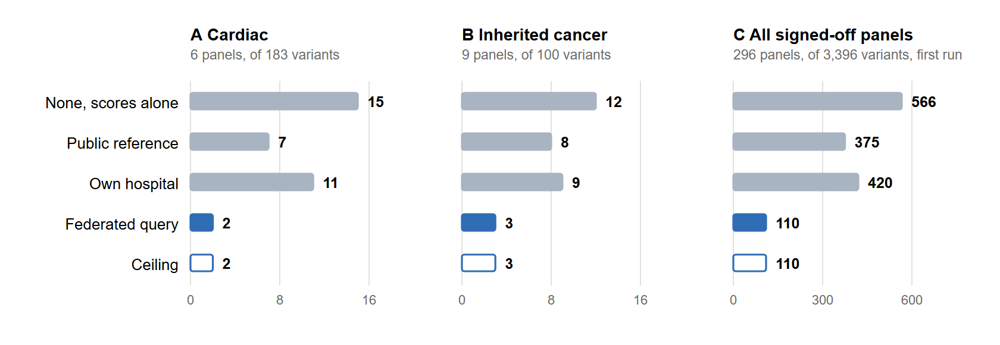
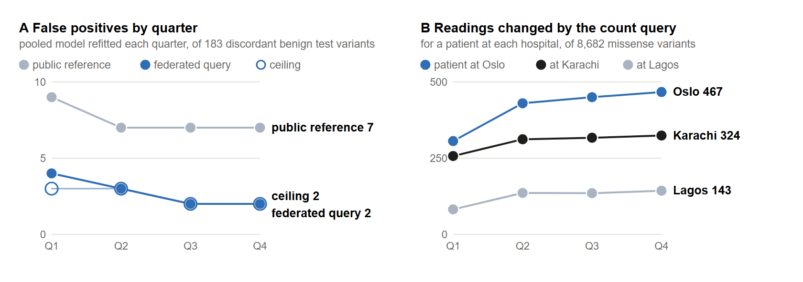
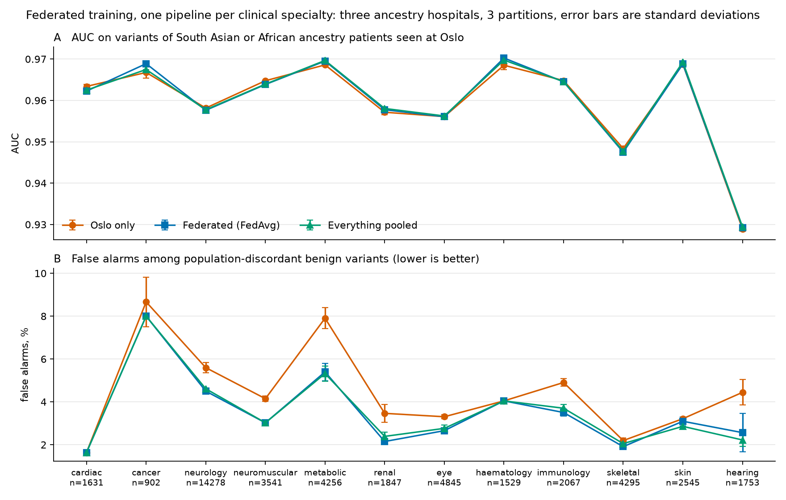

<!-- Author order follows the README team list. Confirm order, affiliations and the bracketed placeholders before submission. -->
<!-- Build the PDF with: uv run --with markdown python scripts/build_manuscript.py -->

# REFLECT, Respectfully Exchanging Federated-Learning Evidence across Clinics, Together: population-aware variant classification across three simulated hospitals

Yan Li<sup>1</sup>, Mohit B. Panwar<sup>2</sup>, Shreya Srivastava<sup>3</sup>, Oumaima Boussouis<sup>4</sup>

<sup>1</sup> Department of Public Health, University of Copenhagen, Denmark<br>
<sup>2</sup> Department of Clinical Neuroscience, Institute of Neuroscience and Physiology, Sahlgrenska Academy, University of Gothenburg, Gothenburg, Sweden<br>
<sup>3</sup> Department of Computational and Data Sciences, Indian Institute of Science, Bengaluru, India<br>
<sup>4</sup> ENSIAS, Mohammed V University in Rabat, Morocco

ORCID: Yan Li [0009-0004-6076-1570](https://orcid.org/0009-0004-6076-1570); Mohit B. Panwar [0009-0002-8866-8170](https://orcid.org/0009-0002-8866-8170); Oumaima Boussouis [0009-0005-6498-3805](https://orcid.org/0009-0005-6498-3805)

Correspondence: Mohit B. Panwar, mohit.panwar@gu.se

## Abstract

**Background.** How common a genetic variant is in the general population is strong evidence on whether it can cause a rare disease. Public frequency references cover ancestries unevenly, and patients have received incorrect genetic diagnoses because a variant common in their own population appeared rare in the reference. Hospitals that serve under-represented populations hold the missing counts and are rarely able to share patient-level data.

**Methods.** We built a reproducible prototype from open data during a hackathon. Expert classifications from ClinVar, 12 functional prediction scores from dbNSFP and per-population allele frequencies from gnomAD were assembled for 8,790 missense variants in 97 cardiac disease genes drawn from NHS-approved PanelApp panels. Three hospitals were simulated, each serving one ancestry group, alongside a locked test set of 2,373 variants. A logistic regression with 14 coefficients was trained at each hospital, on the pooled data, and across hospitals by federated averaging in NVIDIA FLARE. Models were scored with frequency evidence from different sources. A query tool returns carrier counts from each hospital and no patient-level record. The same pipeline was then rerun on 41 inherited cancer genes from nine panels and, as a first look, on the 4,206 genes of all 296 NHS signed-off panels, and the query was extended to every other small mutation in the cardiac genes and to a frequency line that depends on how each gene is inherited.

**Results.** The source of frequency evidence left ranking performance almost unchanged, with an area under the ROC curve between 0.975 and 0.981. Classification decisions did change. Among 183 benign test variants whose frequency differs at least tenfold between populations, the model produced 15 false positives without frequency, 7 with a European-only public reference and 2 when the three hospitals exchanged counts, equal to the result obtained with gnomAD's own per-population frequencies. The federated result stayed at 2 or 3 across 200 re-simulated cohorts, and sensitivity remained at 0.92. The model trained by federated averaging matched the pooled model in five runs, with a mean AUC of 0.9783 against 0.9784 and 2 false positives for both. On the inherited cancer genes the pooled model produced 12, 8 and 3 false positives among 100 such variants under the same three sources, and federated training matched pooled training in five further runs. On the first run over every signed-off panel the counts were 566, 375 and 110 of 3,396, with 266 false positives removed and 1 introduced, p = 2.3 × 10<sup>−78</sup>, while sensitivity moved from 0.948 to 0.947. Outside missense the mutation type matched the ClinVar label for 99.7% of 66,298 variants, so the model stays missense-only and the count query, with one canonical spelling for insertions and deletions, covers the other types.

**Conclusions.** In this simulation, exchanging aggregate carrier counts recovered the benefit of population-matched frequency data, and federated training cost no accuracy, while patient records stayed in place. The result repeated in a second disease area and reached conventional significance once the table covered every signed-off panel, where genes that need two damaged copies show the limit of a single frequency line. All code, and the commands that rebuild every table, are openly available.

**Keywords:** federated learning; variant classification; allele frequency; genetic ancestry; ClinVar; NVIDIA FLARE

## 1. Introduction

Clinical laboratories classify each variant found in a patient as pathogenic, meaning disease-causing, or benign, by weighing several lines of evidence. Population frequency is among the most decisive. Under the ACMG/AMP guidelines, an allele frequency above what the disorder can account for is strong evidence that a variant is benign, and a frequency above 5% is sufficient on its own [1]. That reasoning holds only when the reference population resembles the patient. Manrai et al. described variants that had been reported to patients as causes of hypertrophic cardiomyopathy and were later reclassified as benign. All of the affected patients were of African or unspecified ancestry, and the variants were far more common among Black Americans than among White Americans [2]. The large majority of participants in genome-wide association studies were of European descent in 2016 [3], and gnomAD, the largest public frequency reference, samples ancestry groups unevenly [4].

The counts that would close this gap already exist inside hospitals that serve under-represented populations, yet patient-level genomic data rarely leave the institution that generated them. Federated learning offers one route: sites train a shared model and exchange only its parameters [5]. In federated averaging, the most widely used scheme, a server averages the parameters returned by each site, weighted by the number of training examples [6]. NVIDIA FLARE provides an open-source framework for such experiments, with a simulator that runs all sites on one machine [7]. For frequency evidence itself, the GA4GH Beacon v2 standard lets an institution answer how many carriers of a given variant it holds without releasing records [8].

Montalvo et al. recently trained pathogenicity classifiers across ClinVar submitters treated as separate sites and reported that federated models generally outperformed local ones and could match centralised training [9]. The prototype described here follows the same logic at a smaller scale and adds one design choice: each simulated hospital serves a different ancestry group and therefore holds frequency evidence that the public reference lacks. We ask whether the classification of a variant changes once that evidence is shared as aggregate counts. This report documents what was completed during the hackathon, separates finished components from planned ones, and names the script behind every reported number. After the first results, the same pipeline was rerun on a second disease area and on every NHS signed-off panel to test whether the finding and the code scale, the count query was extended beyond missense variants, and the simulation was replayed quarter by quarter.

## 2. Methods

### 2.1 Overview

The design has seven steps (Figure 1). Steps 0 to 4 and step 6 are built and tested. Step 5 is represented by a quarterly replay that refits the model as the simulated hospitals grow, with the pooled fit standing in for federated training, and step 7 is planned. All code is Python 3.12 with numpy and pandas, and every table and result is rebuilt from public sources by the commands listed under Data and code availability. The cardiac build is the one every number refers to unless another disease area is named.


**Figure 1.** The prototype as built. Step 0 draws the gene lists of three disease areas from NHS signed-off PanelApp panels, with each gene's mode of inheritance, and the reference genome. Step 1 joins ClinVar, dbNSFP and gnomAD into one missense table per area, and a second table of every other small mutation of the cardiac genes with one spelling per insertion or deletion. A seeded split locks the test set and distributes the remaining variants over three simulated hospitals, drawn to scale in step 2; the same scripts deal any area. Each hospital fits a logistic regression, of which three of the 14 cardiac coefficients are shown, and NVIDIA FLARE averages them over 20 rounds, with the AUC by training arm. Step 5 is the quarterly replay. The results strip gives the false positives by source of frequency evidence in the three areas. Step 6 shows the count query for one variant with the per-gene line and the model's probability, and the bottom box the reading for three variants. Blue marks the label and amber marks frequency. Patient counts are simulated and all other values are real.

### 2.2 Gene panel and variant table

Genes were taken from six heart-related panels of Genomics England PanelApp that are signed off for use by the NHS Genomic Medicine Service [10]. Only genes rated green, the level PanelApp assigns when the evidence supports diagnostic use, were kept, and panel versions were pinned (Table 1). The union of the six panels contains 104 genes and is written by `scripts/00_fetch_gene_panel.py`.

**Table 1.** PanelApp panels that define the gene list. A gene can appear on more than one panel.

| Panel | PanelApp id | Version | Green genes |
|---|---|---|---|
| Hypertrophic cardiomyopathy | 49 | 6.4 | 24 |
| Dilated and arrhythmogenic cardiomyopathy | 652 | 4.11 | 35 |
| Cardiac arrhythmias | 842 | 14.33 | 14 |
| Thoracic aortic aneurysm or dissection | 700 | 5.8 | 35 |
| Familial hypercholesterolaemia | 772 | 2.7 | 5 |
| Hereditary systemic amyloidosis | 502 | 1.31 | 7 |

For each gene, `scripts/01_build_table.py` retrieved every ClinVar variant that carries an AlphaMissense score, which restricts the table to missense variants, those that exchange one amino acid in the protein. Records came from the hg38 index of the myvariant.info service [11] in its build of 24 June 2025. That build serves ClinVar release 2025-05 [12], dbNSFP 4.8a [13] and gnomAD v2.1.1 exomes [4] as a single record per variant.

*Labels.* A variant was labelled pathogenic when every ClinVar submission with at least one review star called it pathogenic or likely pathogenic, and benign when every such submission called it benign or likely benign. Review stars run from one, a single submitter with stated criteria, to four, a practice guideline. Variants with any starred submission of uncertain significance, or with conflicting interpretations, were removed.

*Prediction scores.* Seventeen functional and conservation scores were requested as dbNSFP rank scores, which place the output of each tool on a common scale from 0 to 1 where higher means more damaging. Rank scores need no site-specific scaling, so hospitals never have to exchange summary statistics to standardise their inputs. Tools reported to be trained on ClinVar or HGMD labels were excluded to avoid the circularity described by Grimm et al. [14]; the script lists them. Scores missing for more than 30% of variants were set aside, which left 13.

*Frequencies.* Allele frequency, the share of gene copies in a population that carry the variant, was taken from gnomAD for the non-Finnish European (NFE), South Asian (SAS) and African or African American (AFR) groups. A variant absent from gnomAD was assigned a frequency of zero.

*Population-discordant variants.* A variant was flagged as population-discordant when its frequency reached at least 0.1% in one of the three groups and was at least ten times lower in another, with frequencies below 0.001% treated as 0.001% when forming the ratio. The flag was fixed when the table was built, before any model was trained. It defines an evaluation subset and is never a model input.

### 2.3 Disease areas, gene symbols and inheritance

A disease area is a named set of PanelApp panels with pinned versions in `config/panel_sets.json`, and everything after the gene list is the same code. Three areas were built. The cardiac area is the six panels of Table 1, 104 genes. The inherited cancer area is nine panels signed off for the NHS Genomic Medicine Service, pinned on 17 September 2026 at the versions the signed-off list reported that day (ids 635, 143, 504, 503, 524, 1223, 521, 522 and 648), which give 41 green genes. The third area takes every panel on the signed-off list on 18 September 2026, 296 panels at the version the list reported, recorded panel by panel in `config/all_panel_versions.json`, which give 4,206 green genes. For that build `scripts/01_build_table.py` asks myvariant.info for up to 50 genes in one query and deals the records into the same per-gene cache files as before; on 2,925 cached records of nine cardiac genes the grouped query and the single-gene query returned the same records in the same order, and the cardiac table rebuilt from the cache kept the same bytes.

On the all-panels list 356 genes first returned no record, and myvariant.info knew 228 of them under another name. For 62 of the 228 ClinVar's index uses a symbol that HGNC approved after the panel's, AARS1 for AARS among them; for 136 the index files the variants under a neighbouring locus and only dbNSFP names the gene itself, as with HBB under LOC106099062; and 30 have records of both kinds. The build therefore asks a second time for every gene that answered nothing, under the current and previous symbols that HGNC lists for it [15] and under dbNSFP's gene name, and keeps that answer in a separate cache so that the cardiac and cancer tables are unchanged. Aliases are never used, because an alias can be another gene's approved symbol. The second pass recovered records for 228 genes and 4,164 rows. Of the list, 128 genes remain empty: 46 are not protein-coding, 65 have scored missense records without a pathogenic or benign verdict, 14 have ClinVar records without an AlphaMissense score, NOTCH1 among them, 2 have ClinVar records without any dbNSFP score, and 1, RYBP, has no ClinVar record under any name.

Each gene's mode of inheritance, PanelApp's `mode_of_inheritance` shortened to words such as MONOALLELIC and BIALLELIC, is recorded beside the gene in `config/<area>_gene_panel.txt`. Of the 4,206 genes, 1,161 are listed only as one-copy, 2,246 only as two-copy, 537 with both patterns, 225 as X-linked, 36 as mitochondrial and 1, GNAS, as unknown. The sizes of the three tables are given in section 3.5.

The areas are also used a fourth way. `scripts/07_disease_areas.py` partitions the all-panels table into twelve clinical specialties, each a named set of signed-off panel identifiers, and runs the comparison of section 3.4 inside each one: a gene belongs to a specialty when it is green on any of that specialty's panels, and genes shared between specialties are kept in each, since a gene serving several clinical services is a property of the biology rather than an error. Within one specialty the training pool and the locked test set are restricted to that specialty's genes, the three hospitals, cohorts, model and threshold rule of sections 2.4 to 2.7 are applied unchanged, and three arms are compared: Oslo alone, federated averaging and pooled training. Federated averaging is computed in NumPy over 20 rounds of 150 local gradient steps weighted by row count, which reproduces the NVIDIA FLARE result of section 3.4 to three decimals, and the partition of the training variants is redrawn under three seeds. Every arm receives the same frequency evidence, the federated count query, so that training is the only difference between them. This run used the all-panels build before the alias second pass described above, 123,454 variants in 3,787 genes with rows and a locked test set of 25,509 variants, so its table is smaller than the 127,618 variants of Table 5 and its counts are not directly comparable with those reported elsewhere for that area.

### 2.4 Simulated hospitals and the locked test set

`scripts/02_simulate_hospitals.py` splits the table with a fixed random seed. A test set was locked first. It combines two parts. The first is a random fifth of the variants, stratified by label and by the discordant flag and grouped by gene and amino-acid position, so that two DNA changes producing the same protein change cannot fall on opposite sides of the split. The second consists of all variants of six genes withheld entirely (CACNA1C, COL5A2, DMD, MYBPC3, TNNI3, TNNT2). The withheld genes test whether a model works on a gene it has never seen, a necessary check because labels in this table track genes closely. The same script, with a `--panel` flag, splits the other two areas with the same seed and settings, and the six withheld genes are drawn afresh for each table: ATM, BRCA1, MLH1, RET, SMAD4 and VHL for inherited cancer, and ARID1A, COL10A1, CYP11A1, MYH9, TPO and TUBA1A for all panels.

The remaining variants were distributed over three hospitals named after the populations they serve: Oslo for NFE with 20,000 patients, Karachi for SAS with 4,000 and Lagos for AFR with 4,000. Each variant received one owning hospital, drawn with probability proportional to the hospital's share of the variant's expected carriers multiplied by its share of classification capacity, set to 70%, 15% and 15%. Every other hospital could also hold the variant, with probability equal to half its share of carriers, so that laboratories overlap as real ones do. Hospital files contain the label, the scores, the public frequency and a local frequency, and no per-population column from gnomAD.

*Patient cohorts.* Carrier counts were simulated for every variant at every hospital. Counts among unaffected patients were drawn from a binomial distribution with the gnomAD frequency of the population that the hospital serves, so they carry no information about the label. Fifteen per cent of each cohort were designated heart patients. Among them, pathogenic variants were made five times more frequent, and one fifth of patients were assigned a single causal pathogenic variant. Counts among affected patients therefore depend on the label. They serve the query demonstration only and never enter a model. These settings are illustrative and were not estimated from data.

*Public reference.* The reference given to every hospital was restricted to the NFE frequency of gnomAD. The restriction is a deliberate simplification that stands in for populations that real references cover poorly, while the SAS and AFR frequencies play the part of knowledge held only by the local hospital.

### 2.5 Model and local training

`scripts/03_train_local.py` fits a logistic regression on 12 rank scores and one frequency input, which gives 14 coefficients with the intercept. PolyPhen-2 was dropped at this stage because it was missing for 29 to 32% of training variants. For the other two areas the recommended list is read from the table's own column file and gives 15 scores and 17 coefficients, because three scores too sparse in the cardiac table are filled in there. Remaining gaps were filled with the neutral rank score of 0.5. No missingness indicator was added, since gaps follow the gene and the gene follows the label. A frequency *f* entered the model as (log<sub>10</sub>(*f* + 10<sup>−6</sup>) + 6) / 6, a fixed transform onto the range 0 to 1 that requires no fitted scaler. Models were fitted by full-batch gradient descent with an L2 penalty of 0.001 that spares the intercept, written in numpy without a machine-learning library.

A linear model was chosen for three reasons. Federated averaging of a convex model has a single optimum to converge to. The claim under test concerns one coefficient, which a linear model exposes directly. A more flexible model would also find it easier to recognise genes.

One model was trained per hospital on its own classified variants with its own local frequency, and one on the three files pooled with duplicates removed. For every model the decision threshold was set on its training data at 95% sensitivity and applied unchanged to the test set.

### 2.6 Federated averaging

`scripts/04_federated_train.py` trains the same model by federated averaging [6] in the simulator of NVIDIA FLARE 2.9.0 [7], with a server and three clients running as separate processes and each client reading only the folder of its hospital. In each of 20 rounds a client takes 150 gradient steps from the current global coefficients and returns 14 coefficients and its number of training variants, and the server averages the coefficients weighted by that number. The total of 3,000 steps equals the budget of local training. The decision threshold is federated as well: each hospital takes the 95% sensitivity quantile on its own variants under the global model, and the server averages the three values weighted by training-set size.

Training is deterministic, so repeated runs on one partition would be identical. The five reported runs therefore re-draw which hospital has classified which variant, under seeds 100 to 104, while the test set and the patient cohorts stay fixed. Each run trains three arms on the same partition: Oslo alone, the federated model and the pooled model.

### 2.7 Sources of frequency evidence and evaluation

The pooled model was scored on the test set with its frequency input drawn from six sources:

1. none, using a separate model trained on the 12 scores alone;
2. the public reference;
3. the own hospital, taken as the unaffected patients at Oslo;
4. the federated query, defined as the highest frequency reported among the unaffected patients of the three hospitals;
5. the public reference combined with the federated query, taking the higher of the two;
6. a ceiling given by the highest of the three gnomAD population frequencies, which no hospital could use in practice.

Taking the highest value across populations follows the argument of Whiffin et al. that a variant too common in any population cannot cause a rare penetrant disease [16].

We report the area under the ROC curve (AUC), the number of false positives among benign variants at the fixed threshold, and sensitivity among pathogenic variants. The subset of interest was the population-discordant benign test variants. Proportions carry 95% Wilson intervals. Because every source is scored on the same variants, sources were compared with a two-sided exact sign test on the variants whose call changed. `scripts/03_check_results.py` adds four checks: an exact Newton solution of the same objective, 200 re-simulated patient cohorts with the model held fixed, the corresponding change among pathogenic variants, and the combined source.

### 2.8 Patient query

`scripts/hospital_query.py` implements the count query, with a command-line front end and an interactive terminal application (Figure 5). For a chosen variant, each hospital returns the number of carriers and the number of gene copies examined, separately for its unaffected and its affected patients, together with its own classification if it has one. Counts from one to four are reported as "fewer than 5". Two fixed rules convert the answers into a reading, and no statistical or language model is involved. Rule 1 marks a variant as likely harmless when its frequency among unaffected patients reaches a line at any hospital or in the public reference. The line depends on the gene: 0.1% when one damaged copy of the gene is enough to cause disease, and 1% when every mode of inheritance recorded for the gene requires two damaged copies, because a two-copy disease expects healthy carriers of one copy. A gene recorded with both patterns, or absent from the file, takes the 0.1% line, which is the cautious choice. Rule 2 overrides rule 1 and keeps the variant flagged when, at a hospital where it is common, it is at least three times more frequent among affected than among unaffected patients. In all other cases frequency is reported as uninformative. The reading is computed twice, once from the patient's own hospital with the public reference and once from all hospitals, so that the change attributable to the query is visible. The query covers the three areas, and each area's screen starts on its own example variants.

The trained model is connected to the query. For a missense variant the query builds the feature row as `scripts/03_train_local.py` does, with the same score columns, the neutral 0.5 for a missing score and the same fixed transform of the highest frequency any hospital reported, and applies the pooled coefficients and threshold saved by step 3, or the coefficients of the first NVIDIA FLARE run when step 4 has saved them. `scripts/06_check_query_rules.py` scores the 2,373 cardiac test variants through this path: the feature rows are identical to those of step 3, with a largest difference of 0, the false positives on the 183 population-discordant benign variants are 7, 11, 2 and 2 under the public reference, the own hospital, the federated query and the ceiling, as saved, and sensitivity and the withheld-gene AUC match to the last digit. The model's probability appears as one line beside the rules and takes no part in them; for the other mutation types the line says that the model scores missense changes only.

### 2.9 Other mutation types and the spelling of insertions and deletions

The count query does not depend on what a variant does to the protein, so it was extended to every small mutation of the cardiac genes while the model stayed missense-only. `scripts/01_build_other_types.py` builds a second table from the same myvariant.info index: every ClinVar variant in the 104 genes that the missense table cannot hold, up to 50 letters long, with the mutation type taken from the snpEff annotation of the panel gene, most severe effect first, and from ClinVar's names for the 2,504 duplications that carry no snpEff annotation. Of 79,189 records, 73,570 rows were kept: 13,056 pathogenic, 60,256 benign and 258 contested. A contested variant is one that ClinVar's submitters call uncertain or disagree about; it is kept only when it reaches 0.1% in one of the three populations, because those are the variants a laboratory would ask other hospitals about, and it carries no label. Dropped were 3,938 uncertain and 9 conflicting variants below that frequency everywhere, 1,318 with no starred submission, 190 longer than 50 letters and 164 without exact positions, mostly large deletions and duplications given as ranges. Labels follow the rule of section 2.2 unchanged. `scripts/02_simulate_other_types.py` deals this table to the three hospitals with the functions of step 2 and a separate random generator, so the missense files are untouched; contested variants appear in every hospital's patient counts and in no hospital's verdict file.

An insertion or deletion inside a repeat can be written at several positions that give the same sequence. Deleting the first GAGAGGG of GAGAGGGGAGAGGG leaves the same DNA as deleting the second, and the two spellings receive different positions and different identifiers. Left alignment is the usual normalisation in variant calling [18], the HGVS recommendations place the change at the rightmost position [17], and a duplication can also be written as an insertion. If one hospital files a variant under one spelling and another asks for a different one, the count comes back zero and nothing says why. `scripts/variant_spelling.py` slides every insertion and deletion as far left as the reference sequence allows and uses that spelling as the identifier throughout the table, keeping the spelling that myvariant.info uses, the rightmost spelling and the number of positions the change can slide. The reference letters are read offline from the GRCh38 assembly, downloaded and indexed from UCSC by `scripts/00_fetch_reference_genome.py`, with a per-gene Ensembl cache as the fallback; both sources gave the same spellings for all 8,890 insertions and deletions. As a check of coordinates and build, all 64,222 single-letter changes name the letter the reference holds at that position, and all 6,004 deletions for which ClinVar gives the deleted letters remove exactly those letters. Each simulated hospital writes its insertions and deletions in a convention of its own, Oslo leftmost, Karachi rightmost and Lagos as the public database files them, and the query converts whatever is typed to the canonical spelling before any hospital is asked. A `--no-spelling-fix` option passes the text on as typed, to show the failure that the conversion prevents.

For the other types the query adds a starting presumption from the mutation type, the way a laboratory starts: a change that cuts the protein short, shifts the reading frame or breaks a splice site is presumed harmful, a synonymous or intronic change harmless, and the rest carry none. The presumption is one reason line, and the two frequency rules can overrule it. For the three presumed-harmful types the query also reports how many patients at each hospital carry any such change in the gene, for the case of a variant no hospital has seen.

### 2.10 Quarterly replay

`scripts/05_quarterly_replay.py` replays the simulation as if the three hospitals had grown over four quarters. Step 2 is rerun with its own functions and seed, which reproduces the build byte for byte as the fourth quarter. Each hospital's final cohort is then cut into nested sub-cohorts of 25%, 50% and 75% of its patients, with carriers drawn without replacement from the final counts so that a carrier seen in one quarter is still present in the next, and each hospital's verdicts are placed in one fixed random order of which a quarter holds the first 25%, 50%, 75% or 100%. Each quarter is written in the layout of step 2, the model of step 3 is refitted on it unchanged with the threshold rule of section 2.5, and the fit is scored on the locked test set with that quarter's counts as evidence. The pooled fit stands in for the federated model, because section 3.4 shows that federated averaging lands on it; NVIDIA FLARE was not run for the quarters. The count query is applied to each quarter's counts with the two rules and the per-gene line, and the number of variants whose reading changes once the other hospitals answer is recorded for a patient at each hospital. Cohorts and verdicts grow at all three hospitals at once and by equal steps, which real hospitals would not.

### 2.11 Reproducibility and licences

The project is managed with uv and pins Python 3.12 and all package versions. The simulation uses seed 12, files are written with Unix line endings, and step 2 compares a fingerprint of its output with a reference stored in the repository, so that builds on Windows, macOS and Linux can be confirmed identical. dbNSFP is distributed for academic use under CC BY-NC-ND 4.0, which does not allow derived tables to be shared. The repository therefore shares the code that rebuilds the tables and never the tables themselves. gnomAD data are released under CC0.

Steps 0 and 1 take a `--panel` flag on the main branch. When the inherited cancer run was made, the same flag for steps 2 to 4 lived on the branch `panel-flag`, which keeps one reference fingerprint per area; the all-panels numbers were produced by loading steps 2 and 3 unchanged from a scratch script with the data folder redirected, and are reported as a first look. Step 4 for the inherited cancer area ran under WSL Ubuntu from the same checkout and lock file, because the simulator of NVIDIA FLARE 2.9.0 calls `os.setsid`, which Windows Python lacks.

## 3. Results

### 3.1 The variant table and the split

The table holds 8,790 missense variants in 97 genes. Seven panel genes (ACTC1, APOA2, APOC2, GLA, NOTCH1, PLN, TNNI3K) returned no dbNSFP annotation from the service. Of the variants, 4,960 are pathogenic and 3,830 benign, with 6,730 at one review star, 1,865 at two and 195 at three. gnomAD reports 2,922 of them in at least one of the three populations. The population-discordant flag applies to 622 variants, of which 620 are benign and 2 pathogenic, TTR V142I and KCNQ1 G92A. With two pathogenic members the subset cannot support an AUC, and we evaluate it by counting false positives.

After the split, the three hospitals held 4,319, 1,817 and 1,921 classified variants (Table 2), and 1,525 of the 6,417 distinct training variants were held by more than one hospital. The test set contains 2,373 variants, 1,596 from the random part and 777 from the withheld genes, with 1,152 pathogenic and 1,221 benign. No test variant occurs in any training file, no gene and amino-acid position is shared between training and the random part, and the withheld genes are absent from training.

**Table 2.** The three simulated hospitals. Discordant refers to population-discordant variants among those the hospital has classified.

| Hospital | Population | Patients | Classified variants | Pathogenic | Benign | Discordant |
|---|---|---|---|---|---|---|
| Oslo | NFE | 20,000 | 4,319 | 2,811 | 1,508 | 95 |
| Karachi | SAS | 4,000 | 1,817 | 1,102 | 715 | 114 |
| Lagos | AFR | 4,000 | 1,921 | 1,084 | 837 | 259 |

### 3.2 Ranking did not depend on the hospital or on the frequency source

Single-hospital models and the pooled model ranked test variants equally well. With frequency from the public reference, the own hospital, the federated query or the ceiling, AUC on all test variants lay between 0.974 and 0.981 for every model. The largest gap between a single-hospital model and the pooled model was 0.001, and 0.003 on the withheld genes. A model trained on the 1,817 variants at Karachi therefore matched one trained on all 6,417. For the pooled model, AUC was 0.971 without frequency and 0.976 to 0.981 with it (Table 3, Figure 2A).

The task is easier than the classification of variants of uncertain significance, and most of the AUC reflects how the labels were made. On the test set AlphaMissense alone reached an AUC of 0.950, MPC 0.916 and CADD 0.906, and the plain mean of the 13 rank scores 0.942. Gene identity alone, scoring each variant of the random part of the test set by the share of pathogenic verdicts among the training variants of its gene, reached 0.916, because labels track genes. Within single genes the scores still separate the labels: averaged over the 9 genes of the test set with at least 10 variants of each label, the within-gene AUC was 0.925 for AlphaMissense and 0.953 for the mean of the 13 scores. Frequency is built into the labels as well, since 84.6% of the benign test variants are reported in gnomAD against 11.5% of the pathogenic ones. Grimm et al. describe two kinds of circularity in the evaluation of variant-effect predictors: variants used to train a tool reappearing in its evaluation, and evaluation sets in which most variants of a gene carry one label [14]. The second applies here directly, and the first indirectly, because ClinVar submitters use these scores and frequencies as evidence when they assign the labels [1]. The AUC therefore states the known performance of the scores on star-rated consensus labels in well-studied genes, and the claim of this report rests on the false positives, which the scores alone leave in place.

The fitted coefficients show how the model uses frequency. In the pooled model the largest were AlphaMissense at 4.01, log frequency at −3.73, MPC at 3.05 and CADD at 2.51, and frequency was the only input with a large negative coefficient. Gradient descent had converged: an exact Newton solution differed by at most 0.011 in any coefficient and changed 1 of 9,492 test calls.

**Table 3.** The pooled model under six sources of frequency evidence. AUC is given for all 2,373 test variants and for the 777 from withheld genes. False positives are counted among the 183 population-discordant benign test variants and among all 1,221 benign test variants, and sensitivity among the 1,152 pathogenic ones, at the threshold fixed on training data. Values are from `scripts/03_check_results.py`.

| Frequency evidence | AUC, all | AUC, withheld genes | False positives, discordant | False positives, all benign | Sensitivity |
|---|---|---|---|---|---|
| None, scores alone | 0.971 | 0.967 | 15 | 115 | 0.922 |
| Public reference | 0.976 | 0.971 | 7 | 86 | 0.919 |
| Own hospital | 0.975 | 0.969 | 11 | 95 | 0.921 |
| Federated query | 0.978 | 0.974 | 2 | 74 | 0.919 |
| Public reference with federated query | 0.979 | 0.975 | 2 | 66 | 0.917 |
| Ceiling | 0.981 | 0.977 | 2 | 61 | 0.917 |


**Figure 2.** Effect of the frequency source on ranking and on decisions, pooled model. **A**, AUC on the 2,373 test variants. **B**, false positives among the 183 population-discordant benign test variants at the threshold fixed on training data. Bars show the reported build. For the three sources that depend on simulated patients, the line spans the lowest and highest count across 200 re-simulated cohorts and the diamond marks the median.

### 3.3 The frequency source changed decisions on population-discordant variants

Among the 183 population-discordant benign test variants, the scores-only model produced 15 false positives. The public reference reduced them to 7 and the federated query to 2, the number also obtained with the ceiling (Table 3, Figure 2B). The same two variants, CACNA1C G67R and KCNH2 V193G, remained under both. Wilson intervals for the proportions overlap, 0.019 to 0.077 for the public reference and 0.003 to 0.039 for the federated query, so the paired comparison carries more information. Moving from the public reference to the federated query removed 5 false positives and introduced none, an exact p of 0.0625. With five changed calls, 0.0625 is the smallest value a two-sided sign test can return, so the comparison cannot reach conventional significance at the present sample size.

On all 1,221 benign test variants, false positives numbered 86 with the public reference and 74 with the federated query, against 61 for the ceiling. Here the federated query removed 20 false positives and introduced 8, with p = 0.036. The 8 arose because the federated query replaces the public reference with hospital samples, and a sample can fall below the public value for a variant that is common in Europeans. When the public reference was kept and the hospital answers were added to it, 66 false positives remained. The same 20 were removed and none could be introduced, since the frequency passed to the model can only rise and its coefficient is negative.

The cost among pathogenic variants was small. Sensitivity was 0.919 with the public reference and 0.917 with the combined source. Three of 1,152 pathogenic test variants lost their flag, MYBPC3 D770N, MYBPC3 R502W and LDLR E288K, each with a gnomAD frequency below 0.02% in all three populations.

*Robustness to the simulated cohort.* With the model fixed and all patients re-drawn 200 times, the federated query gave a median of 2 false positives on the discordant subset, with a range of 2 to 3, and stayed below the 7 of the public reference in every cohort. On all benign variants the combined source gave a median of 67 and a range of 62 to 73, against 86 for the public reference. The own-hospital source was more variable. It produced 11 false positives in the reported build, a value reached in 2 of 200 re-drawn cohorts, with a median of 8 and a range of 5 to 11. A single European hospital consulting only its own patients thus performed about as well as the public reference, and the reported build is an unfavourable draw for that source.

### 3.4 Federated training matched pooled training

Across the five partitions, the federated and the pooled model differed by 0.0001 in mean AUC, which equals the standard deviation between runs (Table 4). Both produced 7 false positives on the discordant subset with the public reference and 2 with the federated query in every run. The model trained at Oslo alone was the only arm that varied, with 8, 7, 7, 7 and 9 false positives under the public reference and 3, 2, 2, 2 and 2 under the federated query.

Averaging preserved the effect of frequency. The coefficient for log frequency was −3.57 after federated averaging and −3.73 after pooled training, and the largest difference in any of the 14 coefficients was 0.156. In local training the hospitals had differed most on this coefficient, with −3.26 at Oslo, −3.80 at Karachi and −4.09 at Lagos. Replacing the federated threshold with the pooled one changed none of the reported values.

**Table 4.** Federated training in NVIDIA FLARE against training at Oslo alone and on pooled data. Mean and standard deviation over five partitions of the training variants, scored on the locked test set. False positives are counted among the 183 population-discordant benign test variants. Values are from `scripts/04_federated_train.py`.

| Training | AUC, public reference | AUC, federated query | False positives, public reference | False positives, federated query |
|---|---|---|---|---|
| Oslo alone | 0.9758 (0.0002) | 0.9781 (0.0002) | 7.6 (0.9) | 2.2 (0.4) |
| Federated averaging | 0.9759 (0.0001) | 0.9783 (0.0001) | 7.0 (0.0) | 2.0 (0.0) |
| Pooled | 0.9760 (0.0001) | 0.9784 (0.0001) | 7.0 (0.0) | 2.0 (0.0) |

### 3.5 The result repeated in a second disease area and scaled to every signed-off panel

The three areas differ in size and label balance (Table 5). The inherited cancer table holds 4,107 missense variants in 41 genes and is 41.9% pathogenic against 56.4% for the cardiac table; the all-panels table holds 127,618 variants in 3,989 genes with rows and is 39.2% pathogenic. Labels follow genes in every table. PTEN, BRCA1 and MLH1 supply 575 of the 1,721 pathogenic cancer variants, and the ten largest genes of the all-panels table hold 6.6% of its rows, so no gene dominates it the way MYH7 and TTN dominate the cardiac table. The cancer test set is 44.5% of its table because the withheld-gene draw took BRCA1, its largest gene, and the withheld-gene part of the all-panels test set rests on 676 variants, 2.6% of that test set.

**Table 5.** The three disease areas as built. Population-discordant counts are for the whole table; the last row gives the benign population-discordant variants of the locked test set on which false positives are counted. Values are written by `scripts/00_fetch_gene_panel.py`, `scripts/01_build_table.py` and `scripts/02_simulate_hospitals.py` for each area.

| | Cardiac | Inherited cancer | All signed-off panels |
|---|---|---|---|
| Panels | 6 | 9 | 296 |
| Green genes | 104 | 41 | 4,206 |
| Genes with no usable record | 7 | 0 | 128 |
| Records downloaded | 16,747 | 12,911 | 203,384 |
| Missense variants kept | 8,790 | 4,107 | 127,618 |
| Pathogenic | 4,960 | 1,721 | 49,994 |
| Benign | 3,830 | 2,386 | 77,624 |
| Population-discordant, benign | 620 | 265 | 16,846 |
| Population-discordant, pathogenic | 2 | 2 | 136 |
| Rank scores in the model | 12 | 15 | 15 |
| Test set, of which from withheld genes | 2,373, 777 | 1,829, 1,247 | 26,023, 676 |
| Population-discordant benign test variants | 183 | 100 | 3,396 |

The false positives follow the same pattern in every area (Table 6, Figure 3). On the inherited cancer genes the pooled model produced 12 false positives among the 100 population-discordant benign test variants without frequency, 8 with the public reference, 9 with Oslo's own patients and 3 with the federated query, again equal to the ceiling. Moving from the public reference to the federated query removed 5 and introduced none, p = 0.0625 as for the heart, and sensitivity on the 851 pathogenic test variants was 0.912 with the public reference and 0.911 with the federated query; three pathogenic variants lost their flag, ATM E2039K, BRIP1 A349P and CDKN2A D68H. Over 200 re-simulated cohorts the federated query gave a median of 3 false positives, range 3 to 4, against 8 for the public reference. The cancer test set holds one pathogenic population-discordant variant, MUTYH Y151C, in a gene where disease needs two damaged copies, and the model called it pathogenic under every source, with a probability of 0.545 against a threshold of 0.411. Five NVIDIA FLARE runs on this area repeated the heart result: federated averaging and pooled training both gave 3 false positives under the federated query in every run, with a mean AUC of 0.9776 (0.0003) against 0.9779 (0.0000), and the coefficient for log frequency was −3.05 (0.10) after averaging against −3.22 (0.04) pooled. Oslo alone gave 5, 3, 3, 4 and 3.

On the all-panels table the counts are large enough for a statistic. These numbers come from steps 2 and 3 run unchanged on that table from a scratch script, and they are a first look. Among 3,396 population-discordant benign test variants the pooled model produced 566 false positives without frequency, 375 with the public reference, 420 with Oslo's own patients and 110 with the federated query or the ceiling. The federated query removed 266 of the public reference's false positives and introduced 1, p = 2.3 × 10<sup>−78</sup>, while sensitivity on the 10,200 pathogenic test variants moved from 0.948 to 0.947. AUC on all 26,023 test variants was 0.966 with the public reference and 0.970 with the federated query, and 0.928 on the 676 variants from the withheld genes. The largest coefficients were log frequency at −3.86, AlphaMissense at 3.15 and CADD at 2.38.

**Table 6.** False positives of the pooled model among population-discordant benign test variants in the three disease areas, by source of frequency evidence, at each model's threshold fixed on training data. The paired rows compare the public reference with the federated query on the same variants. The cardiac and inherited cancer values are from `scripts/03_check_results.py`; the all-panels values come from steps 2 and 3 run unchanged on that table from a scratch script and are a first look.

| Frequency evidence | Cardiac, of 183 | Inherited cancer, of 100 | All signed-off panels, of 3,396 |
|---|---|---|---|
| None, scores alone | 15 | 12 | 566 |
| Public reference | 7 | 8 | 375 |
| Own hospital | 11 | 9 | 420 |
| Federated query | 2 | 3 | 110 |
| Ceiling | 2 | 3 | 110 |
| Removed and introduced, public reference to federated query | 5 and 0 | 5 and 0 | 266 and 1 |
| Exact p | 0.0625 | 0.0625 | 2.3 × 10<sup>−78</sup> |
| Sensitivity, public reference and federated query | 0.919 and 0.919 | 0.912 and 0.911 | 0.948 and 0.947 |



**Figure 3.** False positives of the pooled model among population-discordant benign test variants, by disease area and source of frequency evidence, at the threshold fixed on training data. **A**, the 6 cardiac panels, 183 variants. **B**, the 9 inherited cancer panels, 100 variants. **C**, all 296 signed-off panels, 3,396 variants, from a first run. Blue marks the source that uses the hospitals' counts and the hollow bar the ceiling that no hospital could use.

Split by the inheritance recorded for the gene, the reduction appears in every class and is largest in count where it is least safe. From the public reference to the federated query the false positives went from 73 to 31 of 834 in genes needing one damaged copy, 43 removed and 1 introduced, p = 5.1 × 10<sup>−12</sup>; from 225 to 58 of 1,872 in genes needing two, 167 removed and none introduced, p = 1.1 × 10<sup>−50</sup>; from 61 to 14 of 549 in genes with both patterns, 47 and none, p = 1.4 × 10<sup>−14</sup>; and from 16 to 7 of 138 in X-linked genes, 9 and none, p = 0.0039. Sensitivity was 0.962 and 0.961 in one-copy genes and 0.923 and 0.921 in two-copy genes. The test set holds 27 pathogenic population-discordant variants, and the model called the same 11 of them pathogenic under both sources, so no true call was lost in this draw; in an earlier draw of the same table, before the symbol lookup added rows, three were lost, among them CRB1 P767T and SRD5A2 R246Q in two-copy genes. Of the 136 pathogenic population-discordant variants in the whole table, 96 sit in two-copy genes and 32 in genes with both patterns; the one-copy genes contribute 2, TTR V142I and TSHZ3 S58G.

### 3.6 Beyond missense: the count query on every other small mutation

Outside missense, the mutation type nearly is the label. Among the 73,570 other variants of the cardiac genes, changes that cut the protein short are pathogenic in 3,699 of 3,722 clean verdicts, frameshifts in 6,261 of 6,302 and splice-site changes in 2,420 of 2,440, while synonymous changes are benign in 34,349 of 34,371 and intronic changes in 19,370 of 19,463. Across the five types that carry a presumption it equals the verdict for 66,099 of 66,298 variants, 99.7%. A model trained on these rows would learn the type and little else, so the model stays missense-only and the query carries the other types.

The query's numbers there are small and are reported as such. Of the 84 benign variants whose type presumes harm (23 protein-cutting, 41 frameshift and 20 splice-site), the public reference alone clears 1 as likely harmless and all three hospitals together clear 3: ACTN2 P32fs, carried by most people in every population, PCSK9 C679*, at 0.8% in the African-ancestry cohort and near zero elsewhere, and TTN c.11254+2T>C, at 0.4% in the same cohort. The last two are cleared by Lagos alone, so a patient at Oslo or Karachi carrying either keeps the harmful presumption until Lagos is asked, and the other 81 are too rare everywhere for frequency to speak. On the cost side, rule 1 wrongly clears 1 of the 13,056 pathogenic variants, KCNH2 P298fs c.893del, a frameshift at 0.3% among Europeans with a single one-star submission, and the public reference clears it on its own. The population-discordant flag applies to 2,317 of these variants: 1 pathogenic, the same KCNH2 frameshift, 2,099 benign and 217 contested.

Of the 8,890 insertions and deletions in the table, 6,494 have more than one valid spelling, 73.0%, and the longest can be written at 56 positions; myvariant.info files 6,377 of them at the leftmost position and 2,424 at the rightmost. A 25-letter deletion in MYBPC3, rs36212066, at 3.21% among South Asians and below 0.01% in the other two populations, has 8 valid spellings and appears in the index under two identifiers, one with ClinVar and gnomAD records and one without. Without the spelling fix, a patient at Oslo, whose laboratory writes it leftmost, receives zero carriers from Karachi, whose laboratory writes it rightmost, and the reading is uninformative; with the fix Karachi reports 215 carriers among 6,800 gene copies, 3.16%, and the reading becomes likely harmless. ClinVar's submissions on this variant range from benign to likely pathogenic, so it is contested, and the count is all the query says about it.

### 3.7 The per-gene line for genes that need two damaged copies

A single 0.1% line clears pathogenic variants in genes where healthy carriers of one damaged copy are expected. The effect of the per-gene line was measured with rule 1 alone, all hospitals plus the public reference and counts under 5 hidden, so that the counts among affected patients play no part. In the cardiac area 19 of the 104 genes require two damaged copies in every recorded mode and hold 5,415 variants of both tables; the 0.1% line cleared 1 pathogenic variant among them, PPA2 E172K at 0.12%, and the 1% line clears none, at the price of the benign variants cleared falling from 372 to 205. In inherited cancer, 3 genes with 118 variants, the two MUTYH variants at 0.49% and 0.27% were cleared on the 0.1% line and are kept on the 1% line, and cleared benign variants fell from 16 to 9. Across all panels, 2,339 genes with 44,297 variants, 129 pathogenic variants were cleared on the 0.1% line and 6 remain cleared on the 1% line: HFE C259Y at 5.74%, BTD D424H at 3.97%, SERPINA1 E288V at 3.66%, WNT10A F228I at 2.13%, ABCA4 R899H at 2.12% and ABCA4 G753E at 1.38%, named by dbNSFP's first protein position, so that HFE C259Y is the variant usually called C282Y and SERPINA1 E288V the Z allele usually called E342K. Cleared benign variants fell from 13,010 to 7,011. For one-copy genes every count and every reading is unchanged, which was checked by recording the full query output before and after the change.

### 3.8 The quarterly replay

Replayed quarter by quarter, the cardiac hospitals grew from 5,000, 1,000 and 1,000 patients and 1,917 pooled verdicts in the first quarter to 20,000, 4,000 and 4,000 patients and 6,417 verdicts in the fourth, which reproduces the build (Table 7, Figure 4). The pooled model refitted each quarter gave 4, 3, 2 and 2 false positives among the 183 population-discordant benign test variants with the federated query against 9, 7, 7 and 7 with the public reference and 3, 3, 2 and 2 with the ceiling. The coefficient for log frequency grew from −2.74 to −3.73 as the verdicts accumulated, and the paired comparison removed 5, 4, 5 and 5 false positives and introduced none. AUC with the federated query rose from 0.976 to 0.978 and sensitivity stayed between 0.917 and 0.922. Without a model, the count query changed the reading of 306, 430, 450 and 467 variants for a patient at Oslo, 257, 312, 317 and 324 for a patient at Karachi and 82, 136, 135 and 143 for a patient at Lagos, and the number of variants likely harmless once all hospitals answered rose from 653 to 803. The fourth quarter reproduces the step 2 files byte for byte and the step 3 counts exactly. On the inherited cancer table the same replay gave 2, 2, 4 and 3 false positives of 100 with the federated query against 6, 6, 8 and 8 with the public reference.

**Table 7.** The quarterly replay of the cardiac area. False positives are counted among the 183 population-discordant benign test variants under the pooled model refitted on the verdicts held at the end of each quarter, and the last column gives the number of variants whose rule-based reading changes once the other hospitals answer. Values are from `scripts/05_quarterly_replay.py`.

| Quarter | Patients at Oslo, Karachi, Lagos | Pooled verdicts | None | Public reference | Own hospital | Federated query | Ceiling | Coefficient, log frequency | Readings changed for a patient at Oslo, Karachi, Lagos |
|---|---|---|---|---|---|---|---|---|---|
| Q1 | 5,000, 1,000, 1,000 | 1,917 | 15 | 9 | 13 | 4 | 3 | −2.74 | 306, 257, 82 |
| Q2 | 10,000, 2,000, 2,000 | 3,594 | 13 | 7 | 10 | 3 | 3 | −3.21 | 430, 312, 136 |
| Q3 | 15,000, 3,000, 3,000 | 5,071 | 14 | 7 | 10 | 2 | 2 | −3.54 | 450, 317, 135 |
| Q4 | 20,000, 4,000, 4,000 | 6,417 | 15 | 7 | 11 | 2 | 2 | −3.73 | 467, 324, 143 |



**Figure 4.** The quarterly replay of the cardiac area. **A**, false positives among the 183 population-discordant benign test variants under the pooled model refitted each quarter, with the public reference, the federated query and the ceiling as the source of frequency evidence. **B**, the number of variants whose rule-based reading changes for a patient at each hospital once the other two answer, out of 8,682 named missense variants. Cohorts and verdicts grow by a quarter of their final size each quarter, and the fourth quarter is the build.

### 3.9 The patient query

For a patient at Oslo, asking the other two hospitals changed the rule-based reading for 467 of 8,682 distinctly named missense variants. Of these, 463 moved from uninformative to likely harmless, 2 from uninformative to flagged and 2 from likely harmless to flagged. The corresponding totals were 324 for a patient at Karachi and 143 for a patient at Lagos, whose own cohort already supplies the African frequencies behind most discordant variants (Table 2). Under a single 0.1% line for every gene the totals had been 492, 342 and 154; the difference comes from the per-gene line, which raises the line to 1% for the 372 missense variants in the 19 two-copy cardiac genes.

Two variants illustrate the two rules. DSP N1526K is benign, with a frequency of 0.05% in the public reference and 20 carriers among 34,000 gene copies at Oslo. Lagos reported 1,032 carriers among 6,800 gene copies, 15.2%, and the reading moved from uninformative to likely harmless. TTR V142I, historically named V122I, is an established cause of late-onset cardiac amyloidosis found mainly in people of African ancestry [19]. Its public frequency was 0.003%. Lagos reported 102 carriers among 6,800 gene copies from unaffected patients, 1.5%, and 93 among 1,200 from affected patients, 7.8%, so rule 2 kept it flagged although rule 1 alone would have dismissed it.

Rule 2 also showed a weakness. Of the four variants kept flagged, TTR V142I and KCNQ1 G92A are pathogenic, while APOB D1113H and TTN V2823F are benign. Both benign variants were flagged on six affected carriers at Lagos, although the larger cohort at Oslo showed nearly equal frequencies among affected and unaffected patients, 1.05% and 1.03% for APOB D1113H. Turning small-count suppression off raised the number of flagged variants from 4 to 6 and the number of changed readings for a patient at Oslo from 467 to 468.


**Figure 5.** The interactive patient query. A patient at Oslo carries TRDN L470M, in a gene where disease requires two damaged copies, so the line of rule 1 is 1%. The public reference and the Oslo cohort both report 0.14%, below that line, and Oslo alone cannot tell. Karachi reports the variant in 6.0% and Lagos in 28.0% of gene copies from unaffected patients, Lagos has classified it benign with two review stars, and the reading becomes likely harmless. The model line gives the pooled model's probability, 0.1%, against its cut-off of 57%. The last line states what crossed hospital boundaries: one variant name outwards, counts from two hospitals inwards, and no patient record.

### 3.10 Federated training across twelve clinical specialties

Sections 3.4 and 3.5 leave one gap: the all-panels table had been scored with the pooled model only, without a federated run. Partitioning it into twelve clinical specialties and running the three arms inside each closes that gap and separates what the two metrics can see (Figure 6, Table 8).

Ranking did not distinguish the arms in any specialty. On the variants of South Asian or African ancestry patients, the arms lay within 0.0021 AUC in every specialty, and the ordering was not consistent: training at Oslo alone was up to 0.0011 above federated averaging in one specialty and up to 0.0021 below it in another, against standard deviations between partitions of up to 0.0014.

False positives among the population-discordant benign variants did separate them. Training at Oslo alone was never better than federated averaging, worse in ten of the twelve specialties and level in the remaining two, while federated averaging and pooled training agreed to within 1.7 variants everywhere. The two largest specialties carry the clearest counts: in neurology 83.3 false positives against 67.0 of 1,489 discordant benign variants, and in metabolic disease 33.7 against 23.0 of 426. The deficit was not paid for with missed disease. Sensitivity differed from federated averaging by at most 0.004 in any specialty and was the higher value for Oslo alone in nine of the twelve.

The cause is the coefficient this work turns on, not the calibration. In metabolic disease under the first partition, the coefficient for log frequency was −3.35 after training at Oslo alone and −3.99 after federated averaging, while Oslo's decision threshold was the stricter of the two, 0.514 against 0.474. Oslo therefore produced more false positives from a stricter threshold, which locates the difference in the model. The training rows account for the coefficient: 331 of Oslo's 11,382 rows in that specialty are population-discordant, 2.9%, against 1,108 of 5,024 at Lagos, 22%. A hospital whose patients are European holds few examples of a variant that is common and nonetheless harmless, and learns a correspondingly weaker frequency veto; averaging supplies the veto its own patients cannot teach it. In that specialty and partition, averaging removed eight false positives and introduced none. SGSH R61C illustrates the size of the shift: at 0.34% in the African group and 0.0019% in the European, its probability fell from 0.587 at Oslo to 0.445 after averaging, crossing both thresholds.

Comparisons between specialties are not interpretable as specialty effects, because the specialties contain different variants; only the comparison between arms within one specialty is meaningful. The twelve subsets of discordant benign test variants sum to 4,907 against 3,273 in the whole test set of this build, because a gene green on the panels of two specialties is counted in both.

**Table 8.** Federated training against training at Oslo alone and on pooled data, in twelve clinical specialties of the all-panels table. Mean over three partitions of the training variants, with standard deviations for AUC, scored on the locked test set. Travelling variants are those whose gnomAD frequency is highest in the South Asian or the African group, standing for a patient whose ancestry the treating hospital rarely sees. False positives are counted among the population-discordant benign test variants of each specialty, whose number is the last column. Values are from `scripts/07_disease_areas.py`.

| Disease area | Genes | Test variants | Travelling variants | Travelling pathogenic | AUC, Oslo alone | AUC, federated | AUC, pooled | False alarms, Oslo alone | False alarms, federated | False alarms, pooled | Discordant benign |
|---|---|---|---|---|---|---|---|---|---|---|---|
| cardiac | 104 | 1,631 | 318 | 24 | 0.9634 (0.0005) | 0.9623 (0.0007) | 0.9625 (0.0002) | 2.0 | 2.0 | 2.0 | 122 |
| cancer | 41 | 902 | 115 | 14 | 0.9668 (0.0014) | 0.9689 (0.0000) | 0.9675 (0.0000) | 4.3 | 4.0 | 4.0 | 50 |
| neurology | 2160 | 14,278 | 3,793 | 347 | 0.9582 (0.0000) | 0.9576 (0.0000) | 0.9577 (0.0000) | 83.3 | 67.0 | 68.7 | 1,489 |
| neuromuscular | 442 | 3,541 | 1,160 | 132 | 0.9648 (0.0000) | 0.9639 (0.0002) | 0.9639 (0.0001) | 19.7 | 14.3 | 14.3 | 474 |
| metabolic | 795 | 4,256 | 1,109 | 274 | 0.9686 (0.0003) | 0.9695 (0.0001) | 0.9697 (0.0000) | 33.7 | 23.0 | 22.7 | 426 |
| renal | 260 | 1,847 | 541 | 64 | 0.9571 (0.0006) | 0.9578 (0.0002) | 0.9580 (0.0001) | 9.7 | 6.0 | 6.7 | 279 |
| eye | 595 | 4,845 | 1,406 | 150 | 0.9561 (0.0002) | 0.9561 (0.0002) | 0.9562 (0.0000) | 20.3 | 16.3 | 17.0 | 615 |
| haematology | 243 | 1,529 | 350 | 34 | 0.9685 (0.0010) | 0.9702 (0.0005) | 0.9698 (0.0001) | 7.0 | 7.0 | 7.0 | 173 |
| immunology | 378 | 2,067 | 697 | 43 | 0.9648 (0.0003) | 0.9645 (0.0002) | 0.9645 (0.0001) | 16.3 | 11.7 | 12.3 | 333 |
| skeletal | 495 | 4,295 | 1,117 | 75 | 0.9484 (0.0005) | 0.9475 (0.0007) | 0.9477 (0.0001) | 10.3 | 9.0 | 9.7 | 471 |
| skin | 281 | 2,545 | 612 | 55 | 0.9688 (0.0003) | 0.9688 (0.0002) | 0.9693 (0.0001) | 9.0 | 8.7 | 8.0 | 280 |
| hearing | 165 | 1,753 | 535 | 46 | 0.9289 (0.0006) | 0.9293 (0.0003) | 0.9294 (0.0001) | 8.7 | 5.0 | 4.3 | 195 |



**Figure 6.** Federated training in twelve clinical specialties of the all-panels table, three ancestry hospitals, three partitions of the training variants, error bars are standard deviations. **A**, AUC on the variants of South Asian or African ancestry patients seen at Oslo: the three arms coincide in every specialty. **B**, false positives among the population-discordant benign variants of each specialty, as a percentage of that specialty's subset: training at Oslo alone lies above federated averaging and pooled training in ten of the twelve specialties and level in the other two. The contrast between the panels is the result, and it is the contrast of Figure 2 seen from the training side. Frequency evidence does not reorder variants, so a metric averaged over thousands of them cannot register a change confined to the few that sit near the decision threshold.

## 4. Discussion

In this simulation the source of frequency evidence had almost no effect on how well the model ranked variants and a visible effect on which benign variants it flagged. The pattern has a simple explanation. Frequency is uninformative for the large majority of variants, which are rare everywhere, and decisive for a small number that are common in one population. A ranking metric averaged over 2,373 variants barely registers those few, while each of them corresponds to a patient who could receive a wrong report of the kind Manrai et al. documented [2].

Exchanging aggregate counts recovered nearly all of the benefit of population-matched frequencies: 2 false positives on the discordant subset for both, and 66 against 61 on all benign variants once the public reference was retained. Agreement was expected, because the hospital cohorts were simulated from the same gnomAD frequencies that define the ceiling. The result shows that cohorts of 4,000 to 20,000 patients lose little to sampling error at the 0.1% scale. Whether real hospital populations mirror gnomAD is a question a simulation cannot answer. The query itself is a small instance of what Beacon v2 networks already provide [8]. The contribution here is the coupling of such counts to a classifier and the measurement of their effect on decisions.

The pattern repeated on the inherited cancer genes with no change to the model, the sampling or the evaluation, with the same five-to-nothing paired count, and it became a statistic once the table covered every signed-off panel: 266 false positives removed against 1 introduced. That table also shows where a single frequency line breaks. More than half of its genes need two damaged copies, and 96 of its 136 pathogenic population-discordant variants sit in those genes against 2 in one-copy genes, so a veto set for dominant disease clears recessive alleles that healthy carriers are expected to carry. The per-gene line moved the query to 1% for such genes, which kept 123 of the 129 pathogenic variants that the 0.1% line had cleared across all panels and left 6 above 1%, HFE C259Y at 5.74% among them. Disease-specific maximum credible frequencies, which depend on inheritance, penetrance and the share of cases a variant explains, would place each gene's line where the evidence puts it [16]. The model has no equivalent of the per-gene line; an inheritance input, or the per-class reporting used here, are the two obvious routes.

Single-hospital models matched the pooled model to within 0.003 AUC. A model with 14 coefficients saturates well below 1,800 training variants, and the rule that common variants are harmless is shared by all populations. Federated averaging accordingly landed on the pooled result, in line with the parity between federated and centralised training reported by Montalvo et al. [9]. Because ranking was already saturated, the flat AUC shows that federated training cost nothing in accuracy and says little about how well it would perform on a harder task. Its visible contribution was stability: a single hospital's result depended on which variants it happened to have classified, and the federated model removed that dependence. Across twelve clinical specialties a second contribution appeared, again in the decision metric rather than the ranking one: a hospital training alone carried more false positives on variants common in a population other than its own, because its own classified variants hold few examples of a variant that is common and harmless, and averaging supplied the stronger frequency veto. The larger benefit of federation in this design comes from evidence shared at the time of classification.

The scores-only model already avoided 168 of the 183 discordant benign variants. One likely reason is that AlphaMissense, the input with the largest coefficient, was itself trained with population frequency as a weak label for benign variants [20], so part of the frequency signal reaches the model through that score.

The flat AUC also has a second reading. Section 3.2 measured that gene identity alone reaches 0.916 and AlphaMissense alone 0.950 on the test set, and that benign labels lean on gnomAD while pathogenic ones lean on the scores. Every model in this design, federated or pooled, inherits that ceiling and that circularity [14], and the count of false positives on the discordant subset is the measurement the scores cannot supply.

Beyond missense the query carries a presumption from the mutation type that is right for 66,099 of 66,298 cardiac variants, so its value there lies in the exceptions: two benign presumed-harmful variants common only in the African-ancestry cohort, which only Lagos can clear, and one identifier problem, the MYBPC3 deletion filed under two identifiers, which returned zero carriers from the hospital that spells it differently until the spelling was normalised. Both are small in count and say more about what a count query has to handle than about the variants.

In a deployment we would separate two cadences: counts flow at any time through the query, and the model is retrained on a fixed schedule after the references are refreshed, quarterly in the replay of section 3.8. NVIDIA FLARE offers two pieces that would fit, a proof-of-concept mode that runs a real server and client processes on one machine, and a federated statistics workflow that would compute the carrier counts on each client and return only the aggregate under a minimum-count rule. Neither has been run, and this remains a plan.

### 4.1 Limitations

All patient counts are simulated, and the agreement between the federated query and the ceiling is partly built into that simulation, as noted above.

The discordant subset holds 183 variants and five calls changed, which is too few for a conclusive test on the cardiac genes alone. The all-panels table removes that limit in count, 266 against 1, and replaces it with two others: the run is a first look from a scratch script with no NVIDIA FLARE run behind it, and half of its genes need two damaged copies, for which the 0.1% line that defines the population-discordant flag is wrong.

The test set contains no pathogenic population-discordant variant, so the risk that frequency evidence silences a variant that is both common and disease-causing could not be measured. Only two such variants exist in the table and both fell in the training pool. When the pooled model was refitted without them and both were scored as unseen variants, KCNQ1 G92A was flagged under every source of frequency evidence. TTR V142I was cleared under every source, with a predicted probability of 0.021 given the public reference and 0.004 given the federated query, against a threshold of 0.575. Frequency evidence therefore changed neither call, and the prediction scores alone already placed TTR V142I on the benign side. In the patient query only rule 2 keeps this variant flagged, and it does so on counts generated from the label.

ClinVar labels are themselves partly derived from gnomAD frequencies, because submitters apply the ACMG/AMP frequency criteria when calling a variant benign [1]; in the test set 84.6% of benign variants are reported in gnomAD against 11.5% of pathogenic ones. Part of the advantage of the ceiling is therefore circular, and labels for under-represented populations may inherit the bias this work addresses [2, 3]. Submitters also use the prediction scores as evidence, so the AUC of every model here carries the circularity that Grimm et al. describe [14] and is reported as the scores' performance on consensus labels.

The public reference was restricted to European frequencies by design. gnomAD does include African and South Asian samples, so the gap simulated here overstates the present gap for those two groups and is intended as a stand-in for populations that references cover poorly.

The frequency input acts as a smooth slope without a threshold, so a handful of carriers can move a borderline pathogenic variant below the decision threshold, as happened for three variants. Disease-specific maximum credible frequencies [16] would give a principled floor, allowing frequency to clear a variant without overriding independent evidence of pathogenicity.

Rule 2 of the query compares frequencies within one hospital on counts that can be in single digits, which produced two incorrect flags. A pooled exact test across hospitals would be more appropriate. Counts among affected patients were generated from the labels, so the flagged examples demonstrate the mechanism and carry no evidential weight.

Federated training ran in simulator mode, with three clients on one machine. Stragglers, dropped clients, network latency and secure aggregation were outside its scope, and the five runs vary only the partition of the training variants.

Small-count suppression is the only privacy protection implemented. Aggregate genomic queries are known to permit re-identification under some conditions [21], and no formal guarantee such as secure aggregation or differential privacy is provided.

The population-discordant flag of step 1 uses the 0.1% line for every gene. That is wrong for genes where every recorded mode of inheritance needs two damaged copies, 19 of the 104 cardiac genes and 2,339 of the 4,206 genes across all panels, with 537 more recorded with both patterns. The flag was left as it is so that the cardiac table keeps its bytes, and the all-panels results are reported per inheritance class instead. In the query, six recessive alleles remain above the 1% line, and a line above 1% or a disease-specific one would be needed for them.

Contested variants have no truth in this design. Their label is empty because submitters disagree, nothing scores them, and the 258 in the other-types table appear in the patient counts only. The MYBPC3 deletion demonstrates a count, and the count says common in the South Asian cohort, which is all it says.

The withheld-gene draw changes with the table. Step 2 withholds six whole genes whatever the size of the list, so the withheld-gene AUC rests on 777 of 2,373 test variants for the heart, on 1,247 of 1,829 for inherited cancer, where the draw took BRCA1 and the test set became 44.5% of the table, and on 676 of 26,023 for all panels, 2.6%. The six genes drawn changed when the symbol lookup added 4,164 rows to the all-panels table, and so did which pathogenic population-discordant variants fell in the test set.

The model is missense-only by measurement. Outside missense the type presumption matches the label for 99.7% of variants, so a model trained on those rows would learn the type, and the dbNSFP scores exist for missense changes only. The query covers the other types by counts and a presumption, and the numbers there are small: 3 benign presumed-harmful variants cleared and 1 pathogenic frameshift wrongly cleared, which are reported as counts of that size and support no rate.

The all-panels numbers come from steps 2 and 3 loaded unchanged from a scratch script, and no NVIDIA FLARE run exists for that table. Step 3 took 36 seconds on 127,618 rows; the five cancer runs of step 4 took 320 seconds under WSL, and a federated run on thirty times the rows has not been timed. The quarterly replay is a simulation replayed: cohorts and verdicts were cut from the final build, grow at all hospitals at once and by equal steps, and the pooled fit stands in for the federated model.

Variant names follow the first protein position that dbNSFP lists, so well-known variants can appear under unfamiliar numbers: MUTYH Y151C is usually named Y179C, HFE C259Y is C282Y and TTR V142I was historically V122I. The genomic identifier and the ClinVar identifier are the stable keys.

The twelve-specialty run of section 3.10 carries three limits of its own. It used the all-panels build before the alias second pass, so its table is 123,454 variants against the 127,618 of Table 5 and its counts cannot be compared with the all-panels counts reported elsewhere. Its specialties share genes, so the twelve subsets are not independent and their counts must not be summed into a single test. Federated averaging was computed in NumPy rather than in NVIDIA FLARE, on the evidence of section 3.4 that the two agree to three decimals, and the partition was redrawn three times rather than five.

### 4.2 Work in progress

Step 5 remains to be run as intended: the federated model of step 4 scored under all six frequency sources with the paired test used here. The quarterly replay of section 3.8 covers the relation between model quality and hospital size with the pooled model standing in, and the small-count rule has been measured for the query only. A planned extension will add a ranked shortlist of candidate diseases from the symptoms of the patient, using the open annotations of the Human Phenotype Ontology [22]. Section 3.10 supplies the federated arm the all-panels table lacked, by specialty and in NumPy; an official NVIDIA FLARE run on that table, rebuilt with the alias second pass, remains to be done. Two further extensions would strengthen the present results: an inheritance input or a per-gene line inside the model, and repetition of the split itself over several seeds.

## Data and code availability

All code is available at https://github.com/collaborativebioinformatics/Confidently-Flirting-With-Federated-Learning-for-Clinical-Diagnostics, and the patient query runs as a web page at https://collaborativebioinformatics.github.io/Confidently-Flirting-With-Federated-Learning-for-Clinical-Diagnostics/demo/. The tables are rebuilt from public sources with

```
uv run python scripts/00_fetch_gene_panel.py
uv run python scripts/01_build_table.py
uv run python scripts/02_simulate_hospitals.py
uv run python scripts/03_train_local.py
uv run python scripts/03_check_results.py
uv run python scripts/04_federated_train.py
```

and the other disease areas, the reference genome, the other mutation types, the query checks and the quarterly replay with

```
uv run python scripts/00_fetch_gene_panel.py --panel cancer     # or --panel all
uv run python scripts/01_build_table.py --panel cancer
uv run python scripts/00_fetch_reference_genome.py
uv run python scripts/01_build_other_types.py
uv run python scripts/variant_spelling.py --self-check
uv run python scripts/02_simulate_other_types.py
uv run python scripts/06_check_other_types.py
uv run python scripts/06_check_query_rules.py
uv run python scripts/05_quarterly_replay.py
uv run python scripts/07_disease_areas.py
```

where steps 2 to 4 take `--panel cancer` on the branch `panel-flag`. The patient query starts with `uv run python scripts/06_query_tui.py`, with `--panel` to open another area. The tables themselves are not redistributed because of the dbNSFP licence. `docs/data_contract.md` describes every file and column, and `scripts/fetch_references.py` retrieves the reference list of this manuscript from PubMed and arXiv.

## Acknowledgements

[Hackathon name, organisers and compute sponsors to be added.]

## Use of AI tools

Claude Code, a coding assistant from Anthropic, assisted with programming and with drafting this text. The authors reviewed all code, numbers and wording and take responsibility for the content.

## Competing interests

[To be completed by the team.]

## References

1. Richards S, Aziz N, Bale S, Bick D, Das S, Gastier-Foster J, et al. Standards and guidelines for the interpretation of sequence variants: a joint consensus recommendation of the American College of Medical Genetics and Genomics and the Association for Molecular Pathology. Genet Med. 2015;17(5):405-24. doi:10.1038/gim.2015.30
2. Manrai AK, Funke BH, Rehm HL, Olesen MS, Maron BA, Szolovits P, et al. Genetic Misdiagnoses and the Potential for Health Disparities. N Engl J Med. 2016;375(7):655-65. doi:10.1056/NEJMsa1507092
3. Popejoy AB, Fullerton SM. Genomics is failing on diversity. Nature. 2016;538(7624):161-164. doi:10.1038/538161a
4. Karczewski KJ, Francioli LC, Tiao G, Cummings BB, Alföldi J, Wang Q, et al. The mutational constraint spectrum quantified from variation in 141,456 humans. Nature. 2020;581(7809):434-443. doi:10.1038/s41586-020-2308-7
5. Rieke N, Hancox J, Li W, Milletarì F, Roth HR, Albarqouni S, et al. The future of digital health with federated learning. NPJ Digit Med. 2020;3:119. doi:10.1038/s41746-020-00323-1
6. McMahan HB, Moore E, Ramage D, Hampson S, Agüera y Arcas B. Communication-Efficient Learning of Deep Networks from Decentralized Data. arXiv:1602.05629 [preprint]. 2016.
7. Roth HR, Cheng Y, Wen Y, Yang I, Xu Z, Hsieh YT, et al. NVIDIA FLARE: Federated Learning from Simulation to Real-World. arXiv:2210.13291 [preprint]. 2022.
8. Rambla J, Baudis M, Ariosa R, Beck T, Fromont LA, Navarro A, et al. Beacon v2 and Beacon networks: A "lingua franca" for federated data discovery in biomedical genomics, and beyond. Hum Mutat. 2022;43(6):791-799. doi:10.1002/humu.24369
9. Montalvo N, Requena F, Capriotti E, Rausell A. Federated learning for the pathogenicity annotation of genetic variants in multi-site clinical settings. Bioinformatics. 2025;41(10). doi:10.1093/bioinformatics/btaf523
10. Martin AR, Williams E, Foulger RE, Leigh S, Daugherty LC, Niblock O, et al. PanelApp crowdsources expert knowledge to establish consensus diagnostic gene panels. Nat Genet. 2019;51(11):1560-1565. doi:10.1038/s41588-019-0528-2
11. Xin J, Mark A, Afrasiabi C, Tsueng G, Juchler M, Gopal N, et al. High-performance web services for querying gene and variant annotation. Genome Biol. 2016;17(1):91. doi:10.1186/s13059-016-0953-9
12. Landrum MJ, Lee JM, Benson M, Brown GR, Chao C, Chitipiralla S, et al. ClinVar: improving access to variant interpretations and supporting evidence. Nucleic Acids Res. 2018;46(D1):D1062-D1067. doi:10.1093/nar/gkx1153
13. Liu X, Li C, Mou C, Dong Y, Tu Y. dbNSFP v4: a comprehensive database of transcript-specific functional predictions and annotations for human nonsynonymous and splice-site SNVs. Genome Med. 2020;12(1):103. doi:10.1186/s13073-020-00803-9
14. Grimm DG, Azencott CA, Aicheler F, Gieraths U, MacArthur DG, Samocha KE, et al. The evaluation of tools used to predict the impact of missense variants is hindered by two types of circularity. Hum Mutat. 2015;36(5):513-23. doi:10.1002/humu.22768
15. Seal RL, Braschi B, Gray K, Jones TEM, Tweedie S, Haim-Vilmovsky L, et al. Genenames.org: the HGNC resources in 2023. Nucleic Acids Res. 2023;51(D1):D1003-D1009. doi:10.1093/nar/gkac888
16. Whiffin N, Minikel E, Walsh R, O'Donnell-Luria AH, Karczewski K, Ing AY, et al. Using high-resolution variant frequencies to empower clinical genome interpretation. Genet Med. 2017;19(10):1151-1158. doi:10.1038/gim.2017.26
17. den Dunnen JT, Dalgleish R, Maglott DR, Hart RK, Greenblatt MS, McGowan-Jordan J, et al. HGVS Recommendations for the Description of Sequence Variants: 2016 Update. Hum Mutat. 2016;37(6):564-9. doi:10.1002/humu.22981
18. Tan A, Abecasis GR, Kang HM. Unified representation of genetic variants. Bioinformatics. 2015;31(13):2202-4. doi:10.1093/bioinformatics/btv112
19. Jacobson DR, Pastore RD, Yaghoubian R, Kane I, Gallo G, Buck FS, et al. Variant-sequence transthyretin (isoleucine 122) in late-onset cardiac amyloidosis in black Americans. N Engl J Med. 1997;336(7):466-73. doi:10.1056/NEJM199702133360703
20. Cheng J, Novati G, Pan J, Bycroft C, Žemgulytė A, Applebaum T, et al. Accurate proteome-wide missense variant effect prediction with AlphaMissense. Science. 2023;381(6664):eadg7492. doi:10.1126/science.adg7492
21. Shringarpure SS, Bustamante CD. Privacy Risks from Genomic Data-Sharing Beacons. Am J Hum Genet. 2015;97(5):631-46. doi:10.1016/j.ajhg.2015.09.010
22. Gargano MA, Matentzoglu N, Coleman B, Addo-Lartey EB, Anagnostopoulos AV, Anderton J, et al. The Human Phenotype Ontology in 2024: phenotypes around the world. Nucleic Acids Res. 2024;52(D1):D1333-D1346. doi:10.1093/nar/gkad1005
