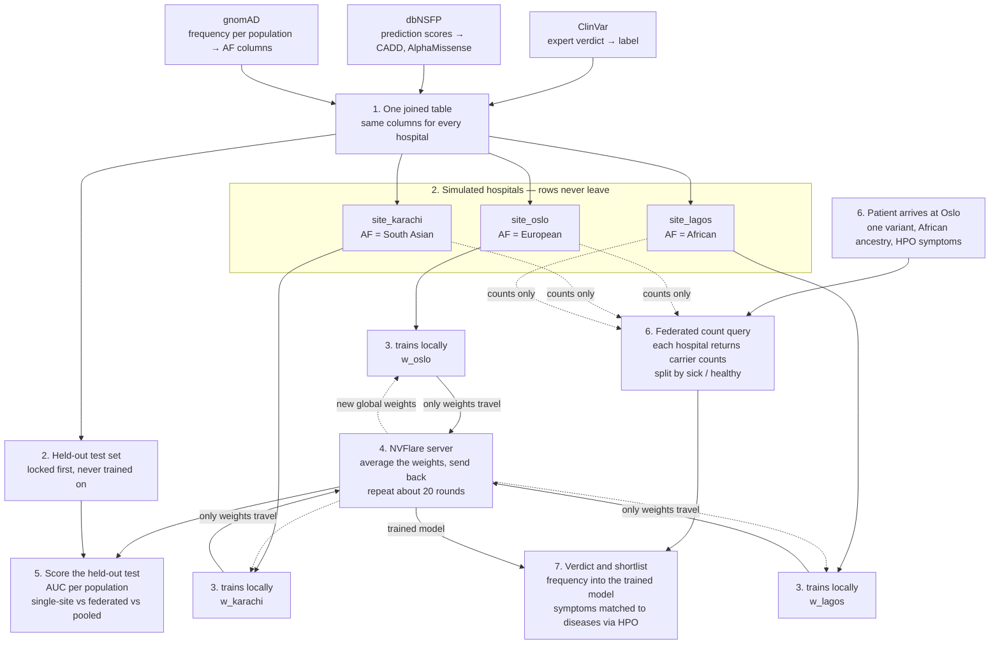
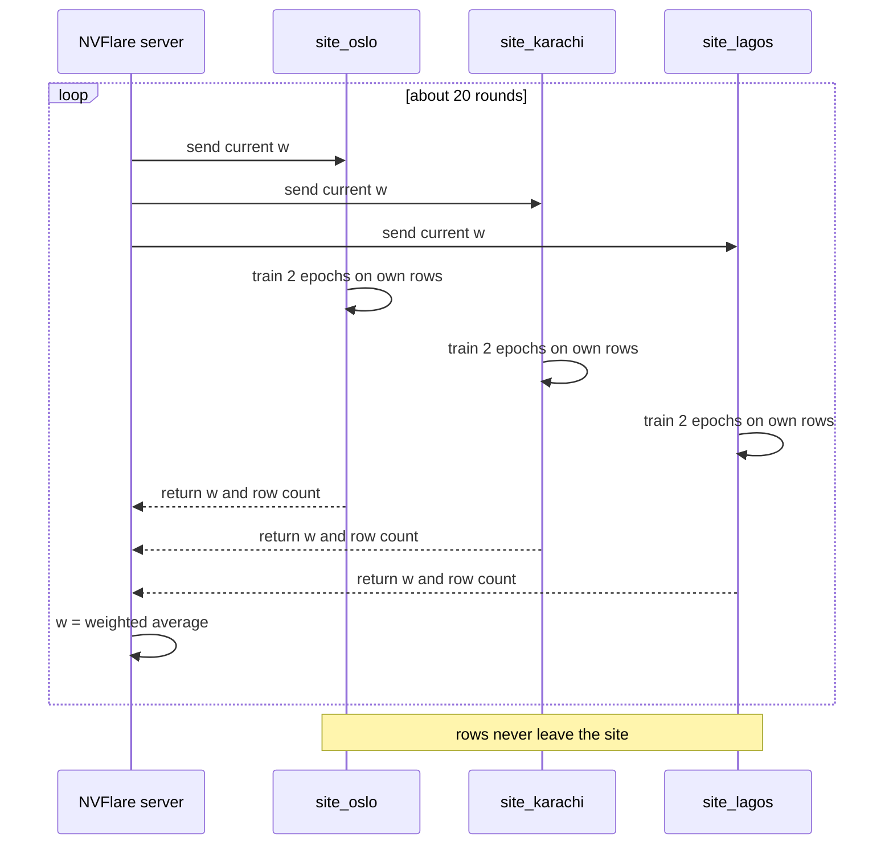

# Hello World! Federated Learning for Clinical Diagnostics

Team 12: federated variant classification with population context

**Team**

- Yan Li
- Mohit Panwar
- Shreya Srivastava
- Oumaima Boussouis
- Fenfen Ge
- Claude Code 😉

**Question:** Can three hospitals in different countries train one classifier that tells disease-causing DNA variants from harmless ones, without any hospital handing over its data? And can a hospital make the right call for a patient whose ancestry it rarely sees, by asking the other hospitals how common the variant is among *their* patients?

**Short answer to how:** every hospital holds the same kind of table (variant, prediction scores, frequency, expert label). Each trains a small classifier on its own rows. An NVFlare server averages the model weights and sends them back. Only weights travel during training, and only counts travel when a patient is queried. Rows never leave.

> Labels, scores and frequencies are real public data (ClinVar, dbNSFP, gnomAD). The hospitals and the demo patient are simulated. We never train on simulated labels. In the example tables, variant scores and frequencies are real values from our built table, and hospital patient counts are the ones step 2 simulates; model weights, AUCs and probabilities are illustrative.

---

## 0. Terms in one minute

| Term | Plain meaning |
|---|---|
| Variant | A one-letter typo in DNA at a known position, e.g. `MYH7 R403Q`. |
| Pathogenic / benign | Experts' verdict: causes disease / harmless. Our label is `1` / `0`. |
| ClinVar | Public list of expert verdicts. Covers only a small slice of possible variants. Our **answer key**. |
| Prediction score | A computer guess of how damaging a variant is (CADD, AlphaMissense, conservation). Our **input columns**. |
| dbNSFP | Public spreadsheet that collects those scores for every variant. |
| Allele frequency, AF | How common a variant is in a population. `0.012` means 1.2% of gene copies carry it. |
| gnomAD | Public counts giving one AF per population: NFE (Northern European), SAS (South Asian), AFR (African), and more. |
| Population-discordant | A variant that is common in one of our three populations and at least ten times rarer in another. These are the variants where "how common is this" depends on whose patients you count, so they are the ones the whole project is about. 622 of our 8,790. |
| Site | One simulated hospital, one folder, one population. |
| Federated learning, FedAvg | Each site trains locally; a server averages the model **weights**, not the predictions and not the data. |
| AUC | One score for a classifier: 0.5 is a coin flip, 1.0 is perfect. |
| HPO | Standard vocabulary for symptoms. |
| PanelApp | Genomics England's public catalogue of the gene panels NHS labs use. "Green" genes are diagnostic-grade. Our gene list comes from it. |
| HPO annotations | An open file that lists, for thousands of diseases, which HPO symptoms they cause. Used to match a patient's symptoms to diseases. |

---

## 1. The pipeline in one picture


Source for the picture: [docs/pipeline_flowchart.html](docs/pipeline_flowchart.html). Re-render with headless Chrome after editing:

```
chrome --headless=new --hide-scrollbars --force-device-scale-factor=2 --window-size=740,1496 --screenshot=docs/pipeline_flowchart.png docs/pipeline_flowchart.html
```

<details>
<summary>Same flow as a Mermaid diagram (text-searchable)</summary>



</details>

The line from the held-out test set straight to step 5 is the one to notice. Those rows skip training entirely, which is what makes the step 5 score honest.

---

## 2. Step by step, with example tables

### Step 1. Build one table

Join three public sources by variant. Every hospital will use exactly these columns.

| variant | CADD | AlphaMis | AF NFE | AF SAS | AF AFR | label |
|---|---|---|---|---|---|---|
| MYH7 R403Q | 0.93 | 0.81 | 0 | 0 | 0 | 1 |
| TTN I3716V | 0.08 | 0.04 | .019 | .041 | .004 | 0 |
| DSP N1526K | 0.22 | 0.47 | .0005 | .0003 | .152 | 0 |
| TNNT2 R92W | 0.91 | 0.79 | 0 | 0 | 0 | 1 |
| … 8,790 rows | | | | | | |

- Label: ClinVar pathogenic or likely pathogenic = `1`, benign or likely benign = `0`, uncertain dropped. At least one review star.
- Scores: dbNSFP **rank scores**, each tool rescaled to 0 to 1 where higher always means more damaging. One direction and one scale for every column, so no hospital has to share scaling statistics. Missense single-nucleotide variants only, since most scores exist only for those.
- Frequencies: one AF column per gnomAD population (exomes v2.1.1, as served by myvariant.info). Absent from gnomAD is recorded as 0.
- Restricted to 104 genes: the green, diagnostic-grade genes from six heart-related [Genomics England PanelApp](https://panelapp.genomicsengland.co.uk) panels signed off by the NHS Genomic Medicine Service. `scripts/00_fetch_gene_panel.py` fetches them at pinned versions and writes [config/cardiac_gene_panel.txt](config/cardiac_gene_panel.txt), which records each panel, its version and which panel each gene came from.

### Step 2. Lock a test set first, then split the rest into hospitals

The test set is locked before anything else and is never trained on. It is a random fifth of the variants, plus every variant of six whole genes that no hospital gets, so we can also ask whether the model works on a gene it has never seen. The random fifth is split by amino-acid position rather than by row, so two DNA changes that both give `ACTA2 M46I` cannot end up on opposite sides.

The rest is dealt out to three hospitals of unequal size. A real hospital keeps two things private, and we imitate both:

- **Its verdicts**, `verdicts.csv`: real ClinVar rows. A variant common in one population mostly lands at that population's hospital. Every variant has one owning hospital, and about a quarter are also classified by a second one, the way real labs overlap. Within a hospital a variant appears once.
- **Its patients**, `patient_counts.csv`: simulated cohorts drawn from the real gnomAD frequency of that hospital's population. For every variant: copies seen, overall and split by affected and unaffected.

What every hospital already shares is a public frequency reference, `af_public`. Ours covers Europeans only. That is a deliberate pretence: it stands in for the many populations that real references miss, while gnomAD's real South Asian and African columns play the truth only the local hospital can see.

| hospital | population | patients | verdicts | of which population-discordant |
|---|---|---|---|---|
| `site_oslo` | European | 20,000 | 4,319 | 95 |
| `site_karachi` | South Asian | 4,000 | 1,817 | 114 |
| `site_lagos` | African | 4,000 | 1,921 | 259 |

Oslo is the big lab, yet the variants where population matters sit mostly at the two small ones.

A hospital's file holds the scores, the verdict, `af_public`, and `af_local`, the frequency among its own unaffected patients. It holds none of gnomAD's per-population columns. Full details, and the rules on what may be trained on, are in [docs/data_contract.md](docs/data_contract.md).

Every run checks itself and stops rather than writing a split that is quietly wrong: no test variant in a hospital file, no variant twice in one hospital, both verdicts present at every site, and each `af_local` really drawn from that hospital's own population.

### Step 3. Each hospital trains on its own rows

**Logistic regression**, mapping scores plus frequency to a probability of disease.

```
p(disease) = sigmoid( w1·CADD + w2·AlphaMis + … + wk·log(AF) + b )
```

Twelve prediction scores and one log frequency, so fourteen weights including
the intercept. Small on purpose: weight averaging is clean for a linear model and
a heuristic for anything deeper, our sites are non-IID by construction, and the
claim we have to defend is a statement about one coefficient. A stronger model
would also be better at what we do not want, recognising the gene.

The weights `w` are what gets learned: how much to trust each score, and how
strongly a high frequency should push toward harmless. Three of the fourteen,
after real local training:

| site | AlphaMissense | CADD | log(AF) |
|---|---|---|---|
| Oslo | 4.19 | 2.59 | −3.26 |
| Karachi | 4.17 | 2.21 | −3.80 |
| Lagos | 3.30 | 2.14 | −4.09 |

Frequency comes out the second strongest input of thirteen and the only large
negative one. The model learned the veto from expert verdicts without being told
the rule, and the two hospitals whose patients gnomAD covers worst lean on it
hardest. This table is why the model is linear: on an MLP it would be a SHAP plot
and an argument.

### Step 4. NVFlare server averages the weights

The server collects the three weight lists, averages them (weighted by row count), and sends the average back. Each site trains again from the average. Repeat about 20 rounds.

```
[0.8, 2.1, −1.5] + [0.7, 2.3, −1.2] + [0.9, 1.9, −1.7]  →  average  →  [0.8, 2.1, −1.5]
```

The only thing that travels is this short list of numbers.

### Step 5. Score the held-out test

Report AUC separately for test variants that look like each population's patients, for three training setups.

| trained on | Oslo-like | Karachi-like | Lagos-like | |
|---|---|---|---|---|
| Oslo only | 0.90 | 0.78 | 0.75 | fails on other populations |
| federated (step 4) | 0.91 | 0.88 | 0.87 | the result we present |
| everything pooled | 0.92 | 0.89 | 0.88 | ceiling, not allowed in real life |

Expected shape: federated lands near pooled without anyone sharing rows, and the gain concentrates on populations the single site does not serve.

### Step 6. A patient arrives, ask every hospital for counts

A patient of West African ancestry at Oslo carries `DSP N1526K` and has heart symptoms coded as HPO terms. Oslo's own data says the variant is rare: 0.05% in Europeans. In gnomAD it sits at 15% in African-ancestry samples, and ClinVar calls it benign. The query asks each hospital how many of its patients carry it and how many of those were sick.

| hospital | copies seen | gene copies looked at | among sick | among healthy |
|---|---|---|---|---|
| Oslo | 24 | 40,000 | 4 / 6,000 | 20 / 34,000 |
| Karachi | 1 | 8,000 | 0 / 1,200 | 1 / 6,800 |
| Lagos | 1,207 | 8,000 | 175 / 1,200 | 1,032 / 6,800 |

At Lagos 15% of gene copies carry it, among sick and healthy alike. Only counts travel, never a patient record. These are the actual rows of each site's `patient_counts.csv`, simulated by step 2 from the real gnomAD frequencies. In that build Lagos is also the only hospital holding a verdict on this variant.

Each site answers with one row of its `patient_counts.csv`: `variant_id, ac, an, ac_affected, an_affected, ac_unaffected, an_unaffected`.

### Step 7. Verdict and shortlist

The frequency from step 6 fills the AF column for the patient's variant and goes into the step 4 model. The HPO terms are matched against the open HPO disease annotations for a ranked disease list.

| model knows | p(disease) | call |
|---|---|---|
| Oslo frequency only | 0.61 | suspicious |
| plus patient's population AF | 0.08 | likely benign |

| HPO disease match on symptoms | rank |
|---|---|
| hypertrophic cardiomyopathy | 1 |
| dilated cardiomyopathy | 2 |

---

## 3. Why frequency is the lever

Frequency is one-directional evidence. A variant that is common in healthy people cannot be the cause of a rare severe disease, so high frequency vetoes "pathogenic." Low frequency says almost nothing, because most rare variants are harmless too. Among rare variants, the scores do the work.

The model learns the strength of that veto from expert verdicts. The query supplies the fact the veto needs: how common the variant is in people like this patient. Oslo does not need to have treated a single African-ancestry patient to get the call right.

Two known exceptions, which is why the query returns sick and healthy counts separately: recessive conditions (healthy carriers are common) and late-onset or partial-effect variants such as `TTR V122I`, common in African-ancestry people and still a cause of cardiac amyloidosis. It is in our table under its modern name `TTR V142I`: pathogenic, 1.6% in African-ancestry samples, near zero elsewhere. If carriers pile up among the sick, the veto should not fire.

---

## 4. What NVFlare does

NVFlare is the courier. It ships the current weights to each site, runs our training script there, collects the updated weights and averages them. We run it in **simulator mode**: server and sites are processes on one laptop, each site reading its own folder. The same code deploys across real hospitals later.



What we write: one client script (ordinary training code wrapped in `flare.receive()` and `flare.send()`) and a short job config saying three clients, 20 rounds, FedAvg. The `hello-pt` example in the NVFlare repo is the template.

What NVFlare does not do: data prep (pandas), evaluation (scikit-learn AUC), the count query (our own code, about fifty lines). Single-site and pooled runs are plain PyTorch or scikit-learn with no federation.

Fallback: Flower, if the NVFlare simulator fights us for more than two hours on day one.

---

## 5. The experiment grid

Rows are training setups, columns are what the model is allowed to know. Every cell is scored per population on the held-out set.

| training setup | test AUC, public frequency | test AUC, federated counts | false alarms on the 183 discordant benign rows |
|---|---|---|---|
| Oslo only | 0.976 | 0.978 | 7 → 2 |
| Karachi only | 0.976 | 0.978 | 7 → 2 |
| Lagos only | 0.975 | 0.978 | 8 → 2 |
| Federated, FedAvg | step 4 | step 4 | step 4 |
| Pooled | 0.976 | 0.978 | 7 → 2 |

Step 3 filled every row but the federated one, with **logistic regression**: 12
prediction scores plus one log frequency, fourteen weights including the
intercept. Full method and numbers in [docs/step3_results.md](docs/step3_results.md).


> **No NVFlare yet.** Every model above was trained locally. The "federated"
> column is the step 6 **count query** — each hospital returning carrier counts at
> scoring time — not FedAvg. Federated *training* is step 4 and is not built.

Read that table twice. **The AUC column is flat** — training on 1,817 Karachi
rows scores what training on all 6,417 does, to three decimals. A fourteen-weight
model on these scores saturates long before 1,800 rows, so federation has no
accuracy to add and step 4 will not change these numbers. **The false-alarm
column is where the result is.**

The open question for step 4 is the federated row, and step 3 has already
narrowed it: since every single-site model matches pooled on AUC, the thing to
check is not whether FedAvg wins but whether it loses anything, and whether
averaging washes out the frequency coefficient that does the real work.

Read "per population" as the frequency evidence the model is given, not as three slices of test rows. Splitting the test set by population leaves 12 pathogenic variants in the African slice and none at all in the two thirds of rows gnomAD never saw, so an AUC per slice would be noise. The comparison that carries the result is the same rows scored under different frequency evidence: today's public reference, one hospital's own patients, the three hospitals' counts combined, and the gnomAD ceiling. [docs/data_contract.md](docs/data_contract.md) defines the four. The test set carries a `pop` column for the secondary read, and step 2 prints each slice's positive count so nobody quotes one by accident.

---

## 6. What is known and what is new

- Federated pathogenicity classification on ClinVar with a single-site vs federated vs centralized comparison was published in 2025 by [Montalvo, Requena, Capriotti and Rausell, *Bioinformatics*](https://academic.oup.com/bioinformatics/advance-article/doi/10.1093/bioinformatics/btaf523/8258608). They split sites by submitting lab. We treat this as the baseline we reproduce.
- Federated "how common is this variant" queries with counts and case-level filters are the [GA4GH Beacon v2](https://onlinelibrary.wiley.com/doi/10.1002/humu.24369) standard, in production since 2022. Our step 6 is a Beacon-style query whose answer feeds a classifier instead of a human.
- The motivating problem is real: [Manrai et al., *NEJM* 2016](https://www.nejm.org/doi/full/10.1056/NEJMsa1507092) showed variants called pathogenic for hypertrophic cardiomyopathy using mostly European data were common and benign in Black Americans, leading to misdiagnoses.
- What we add: sites split by ancestry using real gnomAD per-population frequencies, AUC reported per population, and a test of whether federated averaging preserves population-specific evidence or needs a personalization step.

Who benefits: the patient treated at a hospital whose reference data is mostly another ancestry, and the hospital with fewer labelled variants that borrows learning from a larger one without seeing its rows.

---

## 7. Data sources

| Source | What we take | Access |
|---|---|---|
| ClinVar | labels: P/LP = 1, B/LB = 0, VUS dropped, GRCh38 | [AWS Open Data mirror](https://registry.opendata.aws/) or NCBI FTP |
| dbNSFP | rank scores for 17 tools, version 4.8a | via the [myvariant.info](https://myvariant.info) API, which returns dbNSFP, gnomAD and ClinVar fields in one record. The full download at [dbnsfp.org](https://dbnsfp.org) is about 50 GB and needs registration with an institutional email |
| gnomAD | AF per population (NFE, SAS, AFR, …), exomes v2.1.1 | via myvariant.info. The current v4.1 files are open but 2 to 19 GB per chromosome |
| PanelApp | the gene list: green genes from six NHS-signed-off heart panels, versions pinned | open API at [panelapp.genomicsengland.co.uk](https://panelapp.genomicsengland.co.uk), no login. Cite Martin et al., *Nature Genetics* 2019 |
| HPO annotations | disease-to-symptom links for step 7 | open file, 36 MB: [phenotype.hpoa](https://purl.obolibrary.org/obo/hp/hpoa/phenotype.hpoa). We use this instead of PhenoDis, whose download sits behind a login |
| Manrai et al. 2016 | real misclassified variants for the patient demo | paper tables |
| UKB synthetic dataset (optional) | a name, age and sex for the demo patient; contains no genotypes or HPO terms | [biobank.ndph.ox.ac.uk/synthetic_dataset](https://biobank.ndph.ox.ac.uk/synthetic_dataset) |

Scores to avoid as inputs: ClinPred, BayesDel, REVEL, MetaLR and similar meta-predictors were trained on ClinVar or HGMD labels, so they leak the answer and flatten every comparison. Prefer CADD, AlphaMissense, SIFT, PolyPhen-2, phyloP, GERP.

---

## 8. Build status and how to run


Green means the step runs from a fresh clone with the command shown. To update the picture, open [docs/recipe_status.html](docs/recipe_status.html), change a step's one-word status (`todo`, `next` or `done`), and re-render with the command at the top of that file. Then raise the `?v=` number on the image link above, otherwise GitHub keeps serving its cached copy of the old picture. Where headless Chrome will not run, `uv run --with weasyprint --with pypdfium2 --with pillow python scripts/render_docs_png.py` produces the same picture; it does not work for the flowchart, whose arrows need Chrome.

Needs [uv](https://docs.astral.sh/uv/). Python 3.12 and the packages install themselves on first run.

```
git clone https://github.com/collaborativebioinformatics/Hello-World-Federated-Learning-for-Clinical-Diagnostics.git
cd Hello-World-Federated-Learning-for-Clinical-Diagnostics
uv sync

uv run python scripts/00_fetch_gene_panel.py        # step 0, the gene list from PanelApp (already committed)
uv run python scripts/01_build_table.py             # step 1, about 4 minutes, then cached
uv run python scripts/02_simulate_hospitals.py      # step 2, a few seconds, the hospital files
uv run python scripts/03_train_local.py            # step 3, a few seconds, the baselines
uv run python scripts/plot_step3.py                # step 3 figure, from the results file
```

Two flags worth knowing:

```
uv run python scripts/01_build_table.py --refresh          # re-download from myvariant.info
uv run python scripts/02_simulate_hospitals.py --self-check # break the split on purpose, expect it to stop
uv run python scripts/03_train_local.py --self-check        # test the AUC and the fit against brute force
```

**Step 1 is built.** It writes `data/variants.csv` and `data/columns.json`, the list of columns later steps should read instead of hard-coding. The table opens in Excel with the readable columns first: name, gene, verdict, stars, then the three site frequencies. Every column is explained in plain language in [docs/table_columns.md](docs/table_columns.md). `data/` is git-ignored because the upstream scores carry non-commercial terms, so we share the recipe and not the table.

### What step 1 produced

From the 17 September 2026 build:

| | |
|---|---|
| rows | 8,790 missense variants in 97 genes |
| labels | 4,960 pathogenic, 3,830 benign |
| features kept | 13 of 17 rank scores; four dropped for more than 30% missing |
| found in gnomAD | 3,680; the rest are recorded as frequency 0 |
| population-discordant | 622 variants whose frequency differs at least tenfold between the three site populations: 371 highest in AFR, 177 in SAS, 74 in NFE |

What the real data told us:

- **Labels track genes.** DMD, APOB, TTN and FLNA are almost all benign; FBN1, LDLR and MYH7 almost all pathogenic. Three genes supply 45% of the pathogenic rows and five supply 41% of the benign ones. A model can score well just by recognising the gene. Only 30 genes have at least ten of each verdict. Report AUC within genes, or with whole genes held out, before trusting a headline number.
- **The discordant subset is 620 benign to 2 pathogenic**, so AUC means nothing there. The right measure is the false-alarm rate: how many of those benign variants the model still calls disease-causing with Oslo-only frequency, versus with the patient's own population frequency.
- **The motivating problem is visible in our own table.** `TNNT2 K253R` is benign, at 1.5% in Europeans and about 15% in both South Asian and African-ancestry samples. `TTR V142I` is one of the two discordant variants that are pathogenic.
- **Seven panel genes are missing.** ACTC1, APOA2, APOC2, GLA, NOTCH1, PLN and TNNI3K have ClinVar entries in myvariant.info but no dbNSFP scores in its hg38 index.
- **The gene list inherits a European lean.** PanelApp is curated in the UK from a literature built mostly on European-ancestry families, and ClinVar verdicts come mostly from US and European labs. We correct the frequency evidence, not these two.
- Label rule: a variant is kept only if every ClinVar record with at least one review star agrees. About 8,000 downloaded variants were dropped as uncertain, conflicting or unreviewed.

**Step 2 is built and reviewed.** It turns the one table into a locked test set and three hospitals, in this order:

1. **Lock the test set first.** Six whole genes that no hospital will ever see, plus a fifth of the remaining variants. That fifth is split by amino-acid position, not by row, so two DNA changes that both spell `ACTA2 M46I` cannot land on opposite sides of the split.
2. **Deal the rest to three hospitals.** A variant common in one population mostly goes to that population's hospital. Every variant has one owning hospital, and with `SITE_OVERLAP = 0.5` a second one may also have classified it, the way real labs overlap.
3. **Simulate each hospital's patients.** A cohort drawn from the real gnomAD frequency of that hospital's population, giving carrier counts per variant, split by affected and unaffected.
4. **Give each hospital two frequencies.** `af_public`, the European-only reference everyone already shares, and `af_local`, measured on its own unaffected patients.
5. **Check the result and stop if it is wrong.** No test variant in a hospital file, no variant twice within one hospital, both verdicts present at every site with at least 100 pathogenic rows, and each `af_local` really drawn from its own population rather than a neighbour's cohort.

The seed is fixed, so the whole team gets byte-identical files, and the script ends by confirming your build matches `config/reference_build.json`. The one thing that can break that is myvariant.info updating its data between two people's downloads; the script detects it and says what to do. The sampling choices were reviewed by the ML side: [docs/step2_review.md](docs/step2_review.md) has every choice, the concerns and what changed. [docs/data_contract.md](docs/data_contract.md) lists every file and column and says what may be trained on.

### What step 2 wrote

```
data/
  test/variants.csv             2,373 rows, 43 columns   locked, never trained on
  public_reference.csv          8,790 rows               af_public, what every hospital already has
  sites.json                                             settings and sizes of this run
  site_oslo/verdicts.csv        4,319 rows, 26 columns   Oslo's private classified variants
  site_oslo/patient_counts.csv  8,790 rows               Oslo's private carrier counts
  site_karachi/...              same two files
  site_lagos/...                same two files
```

Each hospital, from the 17 September 2026 build:

| | `site_oslo` | `site_karachi` | `site_lagos` |
|---|---|---|---|
| population | European (NFE) | South Asian (SAS) | African (AFR) |
| patients in its cohort | 20,000 | 4,000 | 4,000 |
| classified variants | 4,319 | 1,817 | 1,921 |
| pathogenic | 2,811 | 1,102 | 1,084 |
| benign | 1,508 | 715 | 837 |
| share pathogenic | 65% | 61% | 56% |
| population-discordant | 95 | 114 | 259 |
| variants its own patients actually carry (`af_local > 0`) | 257 | 91 | 453 |
| variants no other hospital holds | 3,003 | 899 | 990 |

Three things to read off that table. Oslo is the big lab and holds more than twice the variants, which is the imbalance federation has to survive. The variants where population matters sit mostly at the two small hospitals: Lagos alone holds 259 of them. And although Lagos sequences a fifth as many patients as Oslo, its cohort actually carries 453 of its own variants against Oslo's 257, because the variants dealt to Lagos are the ones common in African-ancestry people.

The test set is 2,373 rows: 1,596 `random` and 777 from the six unseen genes CACNA1C, COL5A2, DMD, MYBPC3, TNNI3 and TNNT2. 183 of them are population-discordant and every one of those is benign, which is why that subset is scored with a false-alarm rate and not an AUC. 1,525 of the 6,417 training variants are held by more than one hospital.

**Step 3 is built.** It trains the single-site and pooled baselines with
**logistic regression** and scores them on the locked test set under the four
frequency-evidence settings, writing `data/results_local.json`. The method, every
table and the interpretation are in [docs/step3_results.md](docs/step3_results.md).

Two results decide how step 4 should be presented:

- **AUC is saturated and flat**, 0.97 to 0.98 in every cell. Training on 1,817
  Karachi rows scores what training on all 6,417 does. Federation has no accuracy
  to add, and a flat table is the honest outcome, not a failed experiment.
- **Frequency changes the decision, not the ranking.** Dropping the frequency
  feature costs 0.007 AUC and multiplies false alarms on the population-discordant
  rows sevenfold, 15 against 2 of 183. Federated counts match the gnomAD oracle
  exactly, and a hospital asking only its own patients does worse than today's
  public reference, because its cohort is a third the size of gnomAD's European
  set. [docs/step3_figure.png](docs/step3_figure.png) is the picture of this.

Sensitivity on the 1,152 pathogenic test rows stays at 0.92 throughout, so none
of that is bought by missing disease-causing variants.

To look at what you built:

```
uv run python -c "import pandas as pd; print(pd.read_csv('data/site_lagos/verdicts.csv').head())"
column -s, -t < data/site_lagos/verdicts.csv | less -S     # or just open it in Excel
cat data/sites.json                                        # every size and setting of your run
```

---

### Step 6 is built: the patient query

One variant in, carrier counts from every hospital out. It needs no model: each hospital reads its own `patient_counts.csv` and returns a handful of numbers, and two rules a clinical lab already applies by hand read them. Rule 1: common among healthy people somewhere means too common to cause a rare disease. Rule 2: if it piles up among the sick, keep it flagged anyway.

```
uv run python scripts/06_query_variant.py "DSP N1526K"    # run and print
uv run python scripts/06_query_variant.py "TTR V142I" --json
uv run python scripts/06_query_tui.py                     # interactive, needs a real terminal
```


Every bar is a frequency on one shared log scale, and the tick marks 0.1%, too common to cause a rare disease. A green "healthy" bar past the tick clears the variant; a red "sick" bar well past the healthy one keeps it flagged. The dot beside each variant in the list shows its call before you select it. The public database and the three hospitals are rows of one chart, so their bars line up and can be compared directly, and the screen reflows when the window is resized: bars shrink, then names shorten, and the numbers always stay. The `show` dropdown switches between the demo examples, the variants whose call changes once the other hospitals answer (492 for a patient at Oslo, in the current build), the ones kept flagged, and everything. The `gene` dropdown narrows to one gene, and typing filters by name. Arrow keys move through the list, Tab moves between controls, F2 switches small-count hiding on and off, and F3 moves the patient to the next hospital. The call is shown twice: what the patient's own hospital could say alone, with the public database, and what it can say once all hospitals have answered.

| try | what it shows |
|---|---|
| `DSP N1526K` | Oslo alone cannot clear it; Lagos's healthy patients show 15%, so it is likely harmless |
| `TTR V142I` | common at Lagos, yet five times more common among the sick, so it stays flagged |
| `MYH7 R403Q` | seen nowhere, so frequency says nothing and the scores have to decide |

Step 6 is four short files, one job each: `scripts/hospital_query.py` holds the logic, `scripts/query_drawing.py` holds the look (the palette and how to read the bars), and `06_query_variant.py` and `06_query_tui.py` are thin layers over them, so the two cannot disagree. Every reading is rule-based with fixed thresholds at the top of `hospital_query.py`; nothing is generated or random. The ML side can import it: `query("DSP N1526K").best_frequency` is the frequency to give a model for a patient the asking hospital knows little about, and `model_verdict()` in that file is the marked slot where the trained model plugs in. Until then the output says `model: not connected yet`.

One honest limit: rule 2 uses counts among affected patients, which step 2 generates from the verdict. It demonstrates what real hospital data would allow; it is not evidence, and those counts must never feed a model.

---

## 9. Decisions and conventions

- Real data is the signal. Simulated data is scaffolding (sites, patient). Never train on simulated labels.
- Open data only: every source downloads without a login or registration.
- Counts among unaffected patients are drawn from real population frequencies only and may be used as evidence. Counts among affected patients are generated from the verdict, so they are for the query demo and never a model input.
- The public reference covers Europeans only, as a stand-in for populations real references miss. We say so wherever we show a result.
- Any hand-edited "spiked" frequencies live only in the step 6 patient demo, never in the rows the AUC is computed on.
- Goal B "same frequency, different effect" is shown as "the query supports it," not measured; we have no real carrier-outcome data.
- If FedAvg blurs population differences, add per-population AF and the patient's population as input features (the population-aware column of the grid).
- Python. Runs on one laptop, no real network.
- One folder per site: `data/site_oslo/`, `data/site_karachi/`, `data/site_lagos/`, plus `data/test/`.
- Common schema everywhere: `variant_id, <feature columns>, af_local, label`.
- A working end-to-end pipeline beats any single polished step. Steps 1 to 5 are the demo; step 6 is an afternoon; step 7 is the stretch goal.

Open: NVFlare vs Flower (decide day one). Settled by the data: the sites are NFE, SAS and AFR, and 12 score columns are kept.
