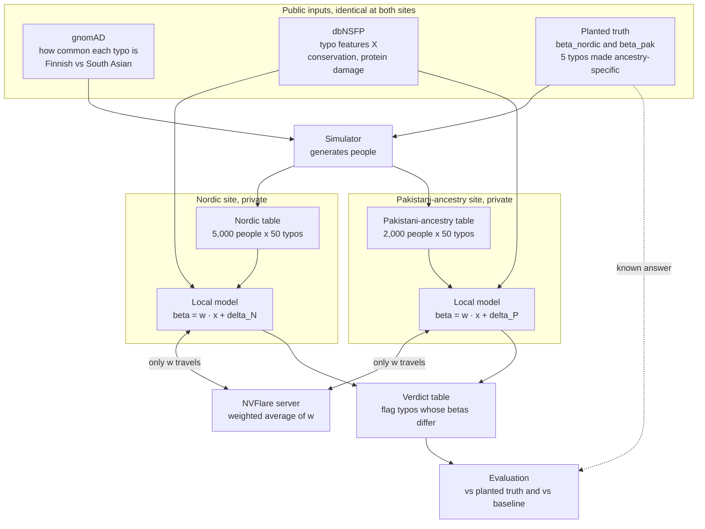
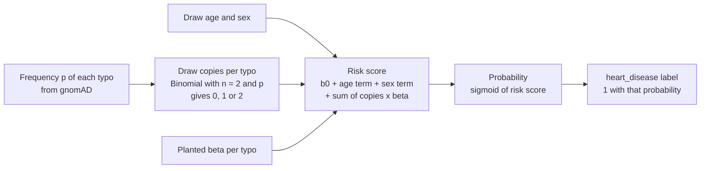
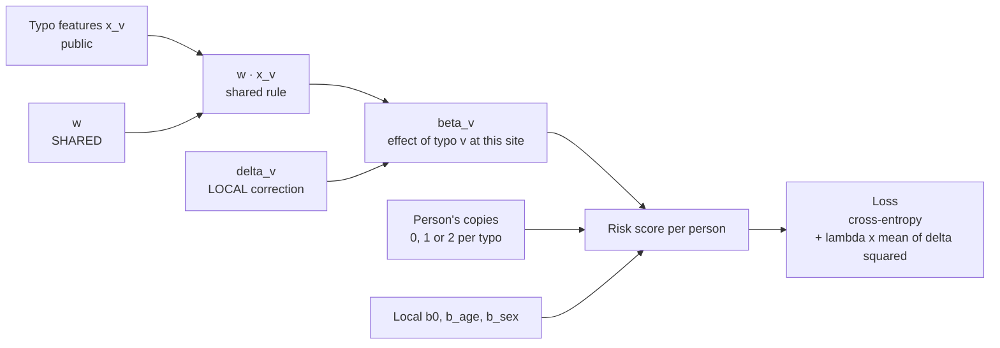
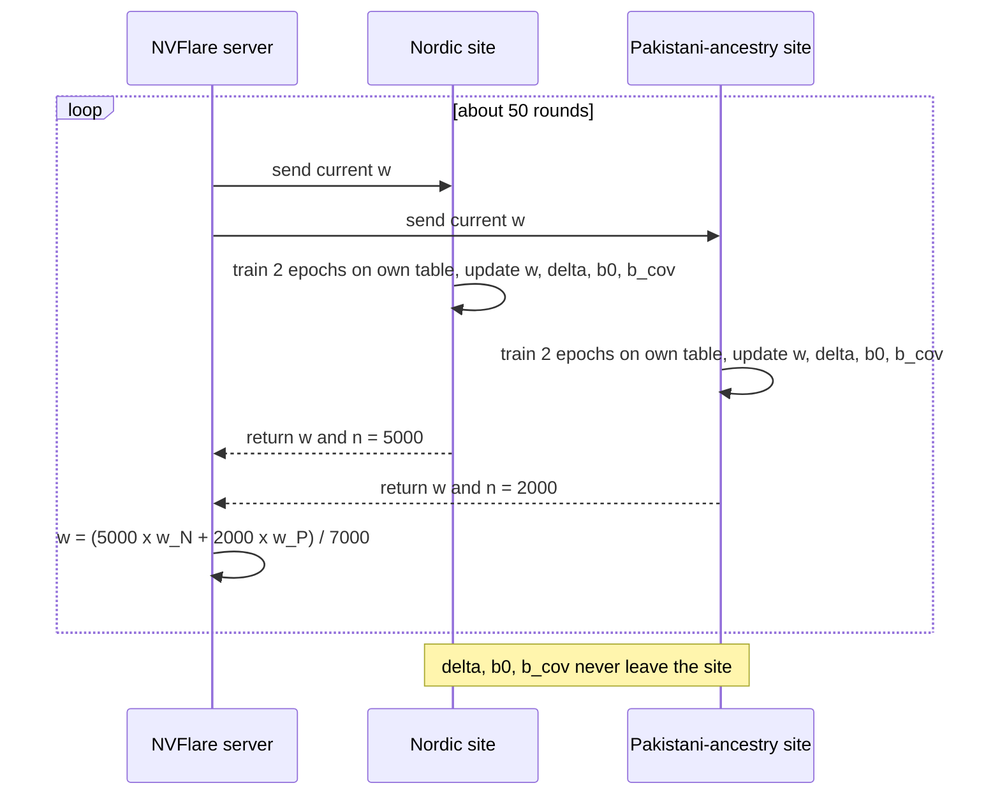
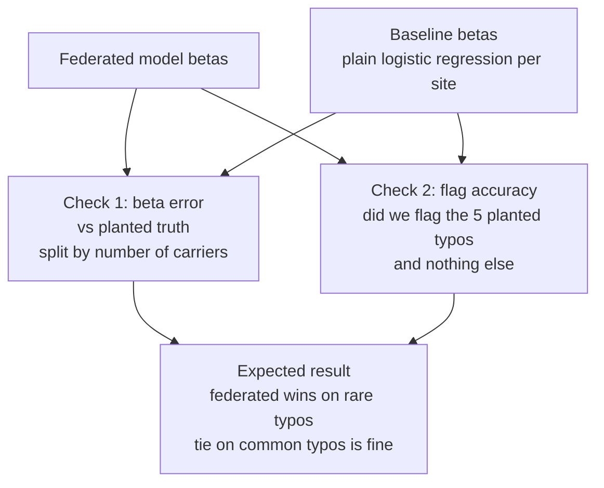

# Team 12: Ancestry-aware variant effects with personalized federated learning

**Question:** Does the same DNA typo (variant) raise heart disease risk differently in Nordic people and Pakistani-ancestry people? Can we find out without the two biobanks sharing any patient data?

**Short answer to how:** each site trains a logistic regression on its own patients. Each typo's weight is split into a shared part (learned together, the only thing that travels) and a local correction (never leaves the site). Typos where the two sites end up with different weights get flagged.

> All data here is simulated. Variant names like `var_1` are placeholders, not real variants.

---

## 0. Biology in one minute

| Term | Plain meaning |
|---|---|
| DNA | A 3-billion-letter text (letters A, C, G, T). Everyone has **two copies**, one from each parent. |
| Gene | A paragraph of that text that is a recipe for a protein (a small machine). Example: `LDLR` builds the machine that removes bad cholesterol. |
| Variant / mutation | A typo at one position, e.g. most people have A, some have T. |
| Copies (0, 1, 2) | How many of your two text copies carry the typo. |
| Pathogenic | "This typo causes disease." |
| Effect `beta` | How much one copy changes the odds of disease. `beta = 0.7` roughly doubles the odds. `beta = 0` means no effect. |

---

## 1. Full pipeline



The simulator sits outside the sites only because we are faking the data. In a real deployment each site would already have its own table.

---

## 2. What the data looks like

**People table** (private, one per site). One row = one person.

| person | age | sex | var_1 | var_2 | ... | var_50 | heart_disease |
|---|---|---|---|---|---|---|---|
| N-0001 | 61 | 1 | 1 | 0 | ... | 0 | 1 |
| N-0002 | 54 | 0 | 0 | 0 | ... | 2 | 0 |
| N-0003 | 67 | 1 | 0 | 1 | ... | 0 | 0 |

**Typo table `X`** (public, identical at both sites). One row = one typo.

| variant | conservation | protein damage score |
|---|---|---|
| var_1 | 0.95 | 0.80 |
| var_2 | 0.30 | 0.10 |

- **Conservation:** has this letter stayed the same across evolution? If yes, a typo there probably matters.
- **Protein damage score:** a computer prediction of how badly the typo breaks the machine.

### How one simulated person is generated



**Worked example.** Baseline risk 5% means odds 0.05 / 0.95 = 0.053. A person with one copy of a typo with `beta = 0.7` gets odds 0.053 x 2.0 = 0.106, which is a probability of about **9.6%**. The typo roughly doubled their risk.

---

## 3. The local model

It is an ordinary logistic regression. The only twist is how each typo's weight `beta_v` is built.

```
beta_v (at this site) = w · x_v + delta_v

risk score = b0 + b_age · age + b_sex · sex + sum over v of (copies_v x beta_v)
```

| Parameter | Size | Shared or local | What it learns |
|---|---|---|---|
| `w` | 3 | **shared** | which typo features mean "harmful" |
| `delta` | 50 | local | population-specific corrections |
| `b0`, `b_age`, `b_sex` | 3 | local | this population's baseline risk |



**Why the penalty on `delta`:** it says "assume this typo follows the shared rule unless your own data strongly disagrees."

- Typo with 150 local carriers: enough evidence, `delta` can move away from 0.
- Typo with 3 local carriers: not enough evidence, `delta` stays near 0, so `beta` is about `w · x`. The small site borrows knowledge from the big site through `w`. **This is the reason to use federated learning.**

**Example after training:**

| variant | shared rule `w · x` | Nordic `delta` | Nordic `beta` | Pakistani `delta` | Pakistani `beta` |
|---|---|---|---|---|---|
| var_1 | +0.6 | +0.1 | **+0.7** | -0.6 | **0.0** |
| var_3 | +0.5 | 0.0 | +0.5 | 0.0 | +0.5 |

---

## 4. One federated training round (what NVFlare does)

NVFlare is the courier: it ships the current `w` to each site, runs our training script there, collects the updated `w`, and averages it. Patient data never moves.



For the hackathon we run this in **NVFlare simulator mode**: server and both sites run as separate processes on one laptop, each site reading its own data folder.

---

## 5. Output: the verdict table

After training, each site reports its 50 estimated `beta` values (numbers per typo, no patient data).

| variant | Nordic `beta` | Pakistani `beta` | carriers (N / P) | verdict |
|---|---|---|---|---|
| var_1 | +0.7 | 0.0 | 150 / 40 | **FLAG: differs by ancestry** |
| var_2 | +0.4 | +0.4 | 300 / 120 | consistent |
| var_3 | +0.5 | +0.5 | 90 / 3 | consistent, but Pakistani value mostly from shared rule |

**Flag rule (first version):** flag a typo if both sites have at least 20 carriers AND the two `beta` values point in opposite directions or differ by more than a set threshold.

---

## 6. Evaluation

**Baseline (meta-analysis):** each site fits a plain logistic regression with one free weight per typo, and reports each `beta` with its uncertainty (standard error). Two sites' `beta` values are compared with a standard difference test.

- Works well for common typos.
- Fails for rare typos: with 3 carriers the uncertainty is so large the answer is "unknown."



**Hypotheses**

- **H1:** On typos with a truly different effect, a single shared FedAvg model predicts worse for the smaller site than our personalized model.
- **H2:** On rare typos, our model estimates `beta` and flags differences more accurately than per-site regression.

**Stop rule:** if our model does not beat the baseline on rare typos, federated learning did not earn its complexity, and we report that.

---

## 7. Data sources

| Source | What we take from it | Access |
|---|---|---|
| gnomAD | typo frequency in Finnish and South Asian groups | open |
| dbNSFP | typo features (conservation, protein damage) | open, very large, extract only chosen genes |
| ClinVar | candidate typos and existing labels | open |
| FinnGen R13 (stretch) | real Nordic effect sizes | free, online form first |
| Pan-UKB CSA / Genes & Health (stretch) | real South Asian effect sizes | Pan-UKB open on AWS; Genes & Health public GWAS page |

Suggested genes: `LDLR`, `APOB`, `PCSK9` (cholesterol and heart disease).
