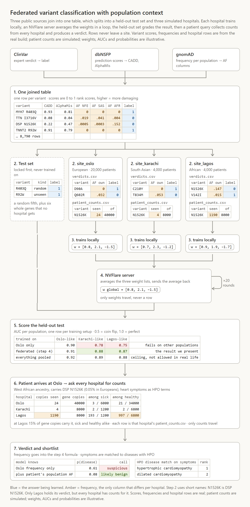
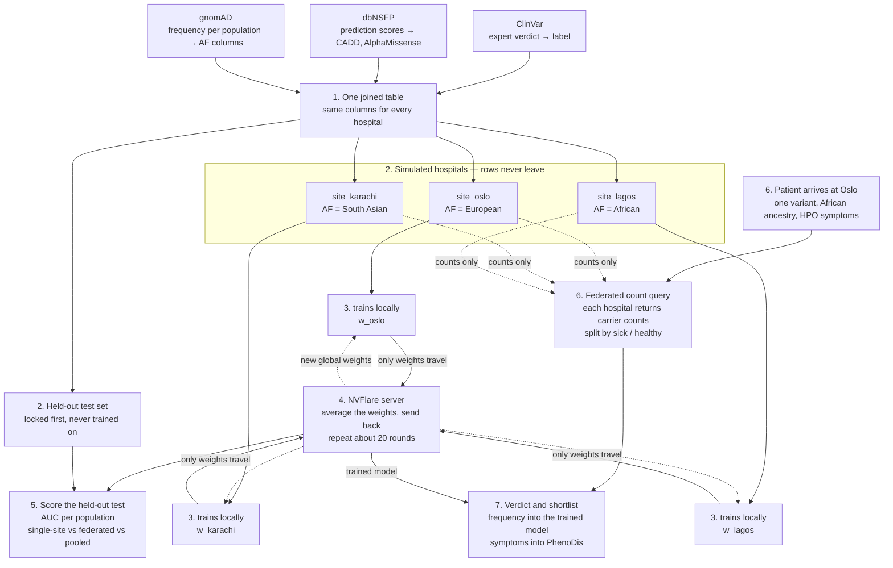
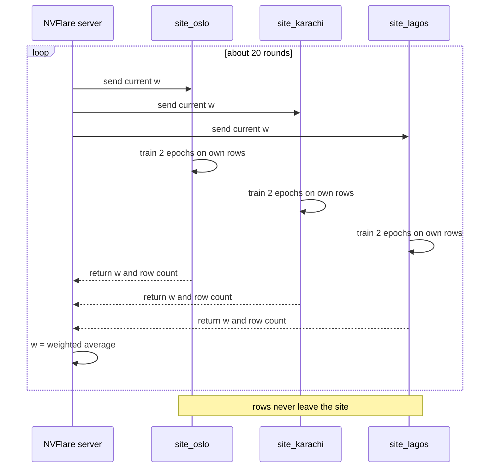

# Team 12: Federated variant classification with population context

**Team:** Yan Li, Mohit Panwar, Shreya Srivastava, Oumaima Boussouis, Fenfen Ge, and Claude Code 😉

**Question:** Can three hospitals in different countries train one classifier that tells disease-causing DNA variants from harmless ones, without any hospital handing over its data? And can a hospital make the right call for a patient whose ancestry it rarely sees, by asking the other hospitals how common the variant is among *their* patients?

**Short answer to how:** every hospital holds the same kind of table (variant, prediction scores, frequency, expert label). Each trains a small classifier on its own rows. An NVFlare server averages the model weights and sends them back. Only weights travel during training, and only counts travel when a patient is queried. Rows never leave.

> Labels, scores and frequencies are real public data (ClinVar, dbNSFP, gnomAD). The hospitals and the demo patient are simulated. We never train on simulated labels. Every number in the tables below is illustrative.

---

## 0. Terms in one minute

| Term | Plain meaning |
|---|---|
| Variant | A one-letter typo in DNA at a known position, e.g. `MYH7 R403Q`. |
| Pathogenic / benign | Experts' verdict: causes disease / harmless. Our label is `1` / `0`. |
| ClinVar | Public list of expert verdicts. Covers only a small slice of possible variants. Our **answer key**. |
| Prediction score | A computer guess of how damaging a variant is (CADD, AlphaMissense, conservation). Our **input columns**. |
| dbNSFP | Public spreadsheet that collects those scores for every variant. |
| Allele frequency, AF | How common a variant is in a population. `0.012` means 1.2% of gene copies carry it. |
| gnomAD | Public counts giving one AF per population: NFE (Northern European), SAS (South Asian), AFR (African), and more. |
| Site | One simulated hospital, one folder, one population. |
| Federated learning, FedAvg | Each site trains locally; a server averages the model **weights**, not the predictions and not the data. |
| AUC | One score for a classifier: 0.5 is a coin flip, 1.0 is perfect. |
| HPO | Standard vocabulary for symptoms. |
| PhenoDis | Database of rare cardiac diseases annotated with HPO symptoms and ClinVar variants. |

---

## 1. The pipeline in one picture



Source for the picture: [docs/pipeline_flowchart.html](docs/pipeline_flowchart.html). Re-render with headless Chrome after editing:

```
chrome --headless=new --hide-scrollbars --force-device-scale-factor=2 --window-size=740,1420 --screenshot=docs/pipeline_flowchart.png docs/pipeline_flowchart.html
```

<details>
<summary>Same flow as a Mermaid diagram (text-searchable)</summary>



</details>

The line from the held-out test set straight to step 5 is the one to notice. Those rows skip training entirely, which is what makes the step 5 score honest.

---

## 2. Step by step, with example tables

### Step 1. Build one table

Join three public sources by variant. Every hospital will use exactly these columns.

| variant | CADD | AlphaMis | AF NFE | AF SAS | AF AFR | label |
|---|---|---|---|---|---|---|
| MYH7 R403Q | 32 | 0.98 | 0 | 0 | 0 | 1 |
| TTN I1234V | 8 | 0.05 | .021 | .015 | .009 | 0 |
| MYBPC3 V158M | 22 | 0.41 | .0003 | .0009 | .012 | 0 |
| TNNT2 R92W | 29 | 0.95 | 0 | 0 | 0 | 1 |
| … a few thousand rows | | | | | | |

- Label: ClinVar pathogenic or likely pathogenic = `1`, benign or likely benign = `0`, uncertain dropped. At least one review star.
- Scores: 10 to 20 numeric columns from dbNSFP. Missense single-nucleotide variants only, since most scores exist only for those.
- Frequencies: one AF column per gnomAD population.
- Restrict to a cardiac gene panel taken from PhenoDis so the table stays small and matches the patient demo.

### Step 2. Lock a test set first, then split the rest into hospitals

The held-out rows are set aside before anything else and are never trained on. The remaining rows are dealt out to three site folders. Same columns, different rows, and each site keeps only the AF column that matches its own population. Rows are sampled weighted by that population's real gnomAD frequencies, so each site looks like a hospital serving that population.

| `data/site_oslo` | | | | `data/site_karachi` | | | | `data/site_lagos` | | |
|---|---|---|---|---|---|---|---|---|---|---|
| variant | AF NFE | label | | variant | AF SAS | label | | variant | AF AFR | label |
| R403Q | 0 | 1 | | R92W | 0 | 1 | | V158M | .012 | 0 |
| I1234V | .021 | 0 | | I1234V | .015 | 0 | | R403Q | 0 | 1 |

The same variant has the same scores and the same label everywhere. The only cell that differs per hospital is the frequency, because "how common is this" depends on whose patients you count.

### Step 3. Each hospital trains on its own rows

A small classifier, logistic regression or a two-layer MLP, that maps scores plus frequency to a probability of disease.

```
p(disease) = sigmoid( w1·CADD + w2·AlphaMis + … + wk·log(AF) + b )
```

The weights `w` are what gets learned: how much to trust each score, and how strongly a high frequency should push toward harmless.

| site | weights after local training |
|---|---|
| Oslo | `[0.8, 2.1, −1.5]` |
| Karachi | `[0.7, 2.3, −1.2]` |
| Lagos | `[0.9, 1.9, −1.7]` |

### Step 4. NVFlare server averages the weights

The server collects the three weight lists, averages them (weighted by row count), and sends the average back. Each site trains again from the average. Repeat about 20 rounds.

```
[0.8, 2.1, −1.5] + [0.7, 2.3, −1.2] + [0.9, 1.9, −1.7]  →  average  →  [0.8, 2.1, −1.5]
```

The only thing that travels is this short list of numbers.

### Step 5. Score the held-out test

Report AUC separately for test variants that look like each population's patients, for three training setups.

| trained on | Oslo-like | Karachi-like | Lagos-like | |
|---|---|---|---|---|
| Oslo only | 0.90 | 0.78 | 0.75 | fails on other populations |
| federated (step 4) | 0.91 | 0.88 | 0.87 | the result we present |
| everything pooled | 0.92 | 0.89 | 0.88 | ceiling, not allowed in real life |

Expected shape: federated lands near pooled without anyone sharing rows, and the gain concentrates on populations the single site does not serve.

### Step 6. A patient arrives, ask every hospital for counts

A patient of African ancestry at Oslo carries `MYBPC3 V158M` and has heart symptoms coded as HPO terms. Oslo's own data says the variant is rare. The query asks each hospital how many of its patients carry it and how many of those were sick.

| hospital | carriers | tested | carriers among sick | carriers among healthy |
|---|---|---|---|---|
| Oslo | 1 | 4000 | 1 / 600 | 0 / 3400 |
| Karachi | 2 | 3000 | 0 / 500 | 2 / 2500 |
| Lagos | 24 | 2000 | 4 / 350 | 20 / 1650 |

Summed: 1.2% of African-ancestry patients carry it, mostly healthy ones. Only counts travel, never a patient record.

Query response format per site: `variant_id, AC, AN, AC_affected, AN_affected, AC_unaffected, AN_unaffected`.

### Step 7. Verdict and shortlist

The frequency from step 6 fills the AF column for the patient's variant and goes into the step 4 model. The HPO terms go into PhenoDis for a ranked disease list.

| model knows | p(disease) | call |
|---|---|---|
| Oslo frequency only | 0.61 | suspicious |
| plus patient's population AF | 0.08 | likely benign |

| PhenoDis match on symptoms | rank |
|---|---|
| hypertrophic cardiomyopathy | 1 |
| dilated cardiomyopathy | 2 |

---

## 3. Why frequency is the lever

Frequency is one-directional evidence. A variant that is common in healthy people cannot be the cause of a rare severe disease, so high frequency vetoes "pathogenic." Low frequency says almost nothing, because most rare variants are harmless too. Among rare variants, the scores do the work.

The model learns the strength of that veto from expert verdicts. The query supplies the fact the veto needs: how common the variant is in people like this patient. Oslo does not need to have treated a single African-ancestry patient to get the call right.

Two known exceptions, which is why the query returns sick and healthy counts separately: recessive conditions (healthy carriers are common) and late-onset or partial-effect variants such as `TTR V122I`, common in African-ancestry people and still a cause of cardiac amyloidosis. If carriers pile up among the sick, the veto should not fire.

---

## 4. What NVFlare does

NVFlare is the courier. It ships the current weights to each site, runs our training script there, collects the updated weights and averages them. We run it in **simulator mode**: server and sites are processes on one laptop, each site reading its own folder. The same code deploys across real hospitals later.



What we write: one client script (ordinary training code wrapped in `flare.receive()` and `flare.send()`) and a short job config saying three clients, 20 rounds, FedAvg. The `hello-pt` example in the NVFlare repo is the template.

What NVFlare does not do: data prep (pandas), evaluation (scikit-learn AUC), the count query (our own code, about fifty lines). Single-site and pooled runs are plain PyTorch or scikit-learn with no federation.

Fallback: Flower, if the NVFlare simulator fights us for more than two hours on day one.

---

## 5. The experiment grid

Rows are training setups, columns are what the model is allowed to know. Every cell is scored per population on the held-out set.

| training setup | population-blind (scores + one global AF) | population-aware (scores + per-population AF + patient's population) |
|---|---|---|
| Oslo only | baseline | |
| Karachi only | baseline | |
| Federated, FedAvg | | |
| Federated, then tuned locally a few epochs | | |
| Pooled | upper bound, not allowed in real life | |

The open question is the fourth row: does weight averaging wash out population-specific frequency evidence, and does a cheap per-site tuning step restore it? Report AUC on all held-out variants and again on the subset whose frequency differs strongly between populations, where the effect should be visible.

---

## 6. What is known and what is new

- Federated pathogenicity classification on ClinVar with a single-site vs federated vs centralized comparison was published in 2025 by [Montalvo, Requena, Capriotti and Rausell, *Bioinformatics*](https://academic.oup.com/bioinformatics/advance-article/doi/10.1093/bioinformatics/btaf523/8258608). They split sites by submitting lab. We treat this as the baseline we reproduce.
- Federated "how common is this variant" queries with counts and case-level filters are the [GA4GH Beacon v2](https://onlinelibrary.wiley.com/doi/10.1002/humu.24369) standard, in production since 2022. Our step 6 is a Beacon-style query whose answer feeds a classifier instead of a human.
- The motivating problem is real: [Manrai et al., *NEJM* 2016](https://www.nejm.org/doi/full/10.1056/NEJMsa1507092) showed variants called pathogenic for hypertrophic cardiomyopathy using mostly European data were common and benign in Black Americans, leading to misdiagnoses.
- What we add: sites split by ancestry using real gnomAD per-population frequencies, AUC reported per population, and a test of whether federated averaging preserves population-specific evidence or needs a personalization step.

Who benefits: the patient treated at a hospital whose reference data is mostly another ancestry, and the hospital with fewer labelled variants that borrows learning from a larger one without seeing its rows.

---

## 7. Data sources

| Source | What we take | Access |
|---|---|---|
| ClinVar | labels: P/LP = 1, B/LB = 0, VUS dropped, GRCh38 | [AWS Open Data mirror](https://registry.opendata.aws/) or NCBI FTP |
| dbNSFP | 10 to 20 numeric prediction scores | [dbnsfp.org](https://dbnsfp.org) is tens of GB; for a gene panel, the [myvariant.info](https://myvariant.info) batch API returns dbNSFP, CADD, gnomAD and ClinVar fields per variant in minutes |
| gnomAD | AF per population (NFE, SAS, AFR, …) | open, also via myvariant.info |
| PhenoDis | rare cardiac diseases with HPO terms and ClinVar variants; also defines the gene panel | [mips.helmholtz-muenchen.de/phenodis](https://www.mips.helmholtz-muenchen.de/phenodis) |
| Manrai et al. 2016 | real misclassified variants for the patient demo | paper tables |
| UKB synthetic dataset (optional) | a name, age and sex for the demo patient; contains no genotypes or HPO terms | [biobank.ndph.ox.ac.uk/synthetic_dataset](https://biobank.ndph.ox.ac.uk/synthetic_dataset) |

Scores to avoid as inputs: ClinPred, BayesDel, REVEL, MetaLR and similar meta-predictors were trained on ClinVar or HGMD labels, so they leak the answer and flatten every comparison. Prefer CADD, AlphaMissense, SIFT, PolyPhen-2, phyloP, GERP.

---

## 8. Decisions and conventions

- Real data is the signal. Simulated data is scaffolding (sites, patient). Never train on simulated labels.
- Any hand-edited "spiked" frequencies live only in the step 6 patient demo, never in the rows the AUC is computed on.
- Goal B "same frequency, different effect" is shown as "the query supports it," not measured; we have no real carrier-outcome data.
- If FedAvg blurs population differences, add per-population AF and the patient's population as input features (the population-aware column of the grid).
- Python. Runs on one laptop, no real network.
- One folder per site: `data/site_oslo/`, `data/site_karachi/`, `data/site_lagos/`, plus `data/test/`.
- Common schema everywhere: `variant_id, <feature columns>, af_local, label`.
- A working end-to-end pipeline beats any single polished step. Steps 1 to 5 are the demo; step 6 is an afternoon; step 7 is the stretch goal.

Open: which populations to use (suggested NFE vs SAS vs AFR), NVFlare vs Flower (decide day one), how many score columns to keep.
