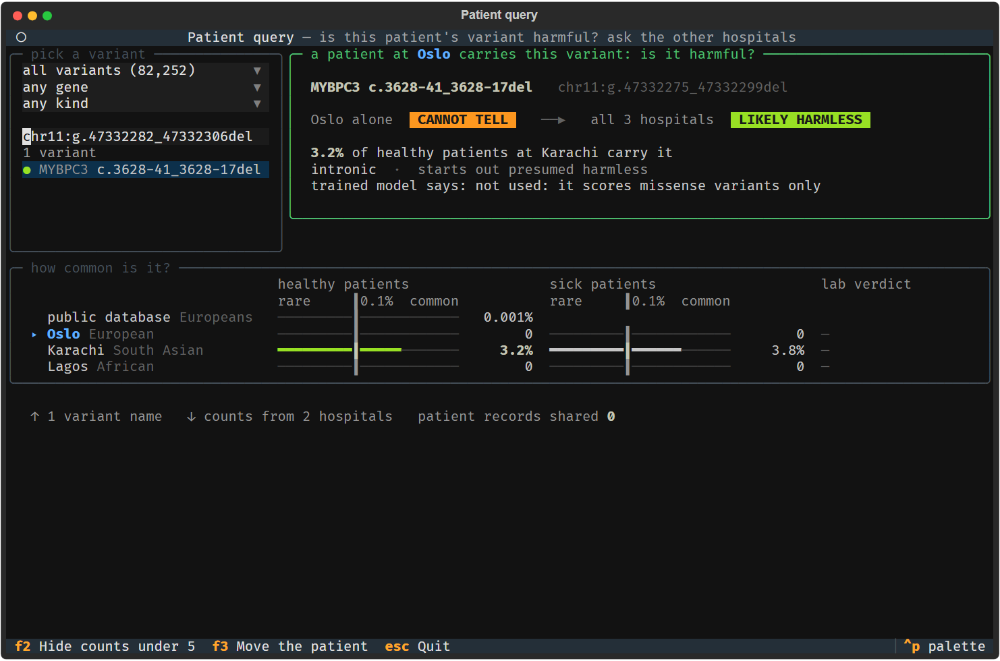

# Beyond missense: the count query for every small mutation

The judges asked whether this scales beyond missense variants. The answer built here: the trained model stays missense-only, on purpose, and the scaling happens in the hospital count query, which does not care what a variant does to the protein. This page says what was added, why the model was left alone, how to build it, what the numbers are, and what is still missing.

Nothing on this page trains a model. Counts among sick patients are generated from the ClinVar verdict, as everywhere in this project: they demonstrate the query and are never evidence.

## What was added

| file | what it does |
|---|---|
| `scripts/01_build_other_types.py` | builds `data/other_types/variants.csv`: every ClinVar variant in the 104 heart genes that the missense table cannot hold, up to 50 letters long, with a `mutation_type` column and no score columns |
| `scripts/variant_spelling.py` | gives every insertion and deletion one canonical spelling, says how many other valid spellings it has, and fetches the reference sequence of each gene once into `data/raw_sequence/` |
| `scripts/02_simulate_other_types.py` | the three hospitals' files for that table, under `data/other_types/`, made with step 2's own functions and a separate random generator, so step 2's files are untouched |
| `scripts/06_check_other_types.py` | every number below, computed at run time into `data/other_types/results_checks.json` |
| `scripts/hospital_query.py`, `06_query_variant.py`, `06_query_tui.py`, `query_drawing.py` | the query answers for every kind of small mutation, by name, by canonical id, or by any valid spelling of an insertion or deletion. New `--no-spelling-fix` flag on the command line and `spelling_fix=False` in the library, new `mutation_type` column in `overview()`, new `kind` dropdown on the screen |
| `docs/patient_query_tui_other_types.png` | the screen, after pasting the second spelling of the MYBPC3 deletion |

For missense variants the query behaves exactly as it did. That was checked by recording, before any edit, every `overview()` count at every hospital with and without count hiding, and the full result for `DSP N1526K`, `TTR V142I`, `TNNT2 K253R` and `MYH7 R403Q` at every hospital, and comparing after: every count and every result field is identical. Two of the 8,682 missense names are now listed under the other of two DNA changes that patients carry equally often, because the sort that settles such ties was made stable; nothing shown for them changes.

## Why the model stays missense-only

Outside missense, the mutation type nearly is the ClinVar verdict. In the 104 heart genes, on the rows with a clean verdict:

| mutation type | harmful | harmless | contested | presumption | presumption right |
|---|---|---|---|---|---|
| protein cutting | 3,699 | 23 | 1 | harmful | 3,699 of 3,722 (99.4%) |
| frameshift | 6,261 | 41 | 2 | harmful | 6,261 of 6,302 (99.4%) |
| splice site | 2,420 | 20 | 5 | harmful | 2,420 of 2,440 (99.2%) |
| start or stop lost | 65 | 3 | 0 | none | |
| inframe indel | 205 | 21 | 4 | none | |
| missense without scores | 68 | 399 | 26 | none | |
| splice region | 195 | 4,513 | 39 | none | |
| synonymous | 22 | 34,349 | 112 | harmless | 34,349 of 34,371 (99.9%) |
| UTR | 13 | 1,281 | 18 | none | |
| intronic | 93 | 19,370 | 49 | harmless | 19,370 of 19,463 (99.5%) |
| other | 15 | 236 | 2 | none | |

Across every type that carries a presumption, the presumption equals the verdict for 66,099 of 66,298 rows, 99.7%. A model trained on these rows would learn the mutation type and little else, and its accuracy would say nothing about the frequency evidence this project is about. The prediction scores that make the missense model interesting also exist for missense changes only. So the model keeps its 8,790 missense rows, and the other types go to the query, where a starting presumption from the type plays the part the scores play for missense.

The presumption is what a clinical lab starts from: a change that cuts the protein short, shifts the reading frame or breaks a splice site is presumed harmful, a silent or intronic change harmless, and the rest carry no presumption. In the query it is one reason line, kept apart from the two frequency rules. The frequency rules make the call and can overrule it, which is exactly what the 84 harmless variants presumed harmful below are about.

## How to build

In this order, from the repository root. The first two need the network once; after that everything runs offline from the caches.

```
uv run python scripts/01_build_table.py             # the missense table, unchanged
uv run python scripts/02_simulate_hospitals.py      # the missense hospitals, unchanged
uv run python scripts/01_build_other_types.py       # downloads into data/raw_other_types/ and data/raw_sequence/
uv run python scripts/variant_spelling.py --self-check
uv run python scripts/02_simulate_other_types.py
uv run python scripts/06_check_other_types.py
```

What the build did on 17 and 18 September 2026:

- myvariant.info, hg38, sent 79,189 records for the 104 genes in 100 seconds. The cache is 98.9 MB.
- Ensembl sent the GRCh38 sequence of every gene, padded by 5,000 letters and widened where a variant filed under the gene lies further out: 14,789,399 letters, 14.9 MB. Ensembl answered slowly on the day, roughly 15 to 30 seconds per gene, and the builder widened 47 regions on its first full run, so the first build took about 15 minutes. With every cache in place a rerun took 7 seconds, needed no network, and wrote a byte-identical table.
- Kept 73,570 rows: 13,056 harmful, 60,256 harmless, 258 contested. Dropped 3,938 that ClinVar's labs are unsure about and that are under 0.1% at every site, 9 that ClinVar's labs disagree about and are just as rare, 1,318 with no starred record, 190 longer than 50 letters, and 164 with no exact DNA positions, mostly large deletions and duplications given as ranges.
- The mutation type comes from snpEff's annotation for the panel gene, most severe effect first, for 71,066 rows. myvariant.info has no snpEff annotation for duplications, so 2,504 rows take their type from ClinVar's protein and coding names instead.
- A safety check that the coordinates and the genome build are right: every one of the 64,222 single-letter changes names the letter that the fetched sequence has at that position, and every one of the 6,004 deletions for which ClinVar gives the deleted letters removes exactly those letters. 100% on both.

`data/other_types/columns.json` says what the columns are. The verdict rule is step 1's `clinvar_verdict()` unchanged, so `pathogenic` and `benign` mean exactly what they mean in the missense table. `contested` is new: a variant that ClinVar's labs are unsure or disagree about, kept only when it reaches 0.1% in one of the three site populations, because those are the ones a lab would ask other hospitals about. It has no label.

The hospitals, from `data/other_types/sites.json`:

| hospital | population | patients | verdicts | harmful | harmless | insertions and deletions its lab writes in a way other than the canonical one |
|---|---|---|---|---|---|---|
| site_oslo | nfe | 20,000 | 51,922 | 9,741 | 42,181 | 0 |
| site_karachi | sas | 4,000 | 20,195 | 3,847 | 16,348 | 6,494 |
| site_lagos | afr | 4,000 | 21,047 | 3,818 | 17,229 | 2,556 |

Only clean verdicts are dealt to hospitals. Contested variants sit in every hospital's patient counts, since patients carry what they carry, but in no hospital's verdict file.

## The spelling problem

The same insertion or deletion can be written several valid ways when it sits in a repeat. Deleting the first `GAGAGGG` of `GAGAGGGGAGAGGG` leaves the same DNA as deleting the second, but the two get different positions and so different ids. Variant-calling tools write the leftmost position, the HGVS naming rules ask for the rightmost, and a duplication can also be written as an insertion. If one hospital files a variant under one spelling and another asks for a different one, the count comes back zero, and nothing says why.

`scripts/variant_spelling.py` slides every insertion and deletion as far left as the reference sequence allows and writes it there, with a duplication written as the insertion it is. That is the canonical spelling, and `variant_id` in every file under `data/other_types/` uses it. The table also keeps `database_id`, the spelling myvariant.info uses, `rightmost_id`, the HGVS spelling, and `shift_room`, how many letters the change can slide. Room above zero means more than one valid spelling.

The size of the problem in these genes: of 8,890 insertions and deletions, 6,494 have more than one valid spelling, 73.0%. The longest can be written at 56 positions. The public database itself files 6,377 of them at the leftmost position and 2,424 at the rightmost.

Each simulated hospital writes its insertions and deletions in its own lab's convention in the `written_as` column of its files: Oslo leftmost, Karachi rightmost, Lagos as the public database files it. Every `written_as` is checked to be the same change as `variant_id` when the files are built. With the spelling fix on, which is the default, the query turns whatever was typed into the canonical spelling before any hospital is asked, and inside a hospital the row is found by canonical spelling. With `--no-spelling-fix`, the text travels as typed and each hospital matches it against `written_as` alone, which is the failure the demo shows.

One quirk found on the way: myvariant.info writes a ClinVar duplication as `g.START_ENDdup` where START and END are the two positions the copy goes between. Read as HGVS that would be a different change. The builder therefore reads every duplication from ClinVar's own before and after letters, checked against the reference sequence, and the query still accepts the database's id for it as an exact match.

## The numbers

All from `scripts/06_check_other_types.py`, on rows with a clean verdict.

**False alarms of the type rule.** 84 harmless variants are of a type presumed harmful: 23 protein cutting, 41 frameshift, 20 splice site. How many of them does frequency clear as LIKELY HARMLESS?

| patient at | of | by the public reference alone | by the patient's own hospital plus the public reference | by all hospitals |
|---|---|---|---|---|
| site_oslo | 84 | 1 | 1 | 3 |
| site_karachi | 84 | 1 | 1 | 3 |
| site_lagos | 84 | 1 | 3 | 3 |

The three cleared by all hospitals are `ACTN2 P32fs`, carried by most people everywhere, `PCSK9 C679*`, a protein-cutting change at 0.8% among Africans and near zero elsewhere, and `TTN c.11254+2T>C`, a splice-site change at 0.4% among Africans. The last two are cleared by Lagos alone. A patient at Oslo or Karachi carrying either would keep a harmful presumption until Lagos is asked. The other 81 are too rare at every hospital for frequency to say anything, and the presumption stands.

**The cost.** Among the 13,056 harmful variants, the public European-only reference wrongly clears one: `KCNH2 P298fs c.893del`, a frameshift at 0.3% among Europeans and unseen among South Asians and Africans, with a one-star pathogenic record. The patient's own hospital plus the public reference clears the same one for a patient at Karachi or Lagos, through the public reference, and none for a patient at Oslo, where the simulated cohort takes it back through rule 2. Counting rule 1 alone, common among healthy patients somewhere, all hospitals together also clear just that one. Rule 2 reads the counts among sick patients, which are generated from the verdict, so the rule-1-only line is the honest one for the cost.

**Population-discordant variants**, at least 0.1% at one site and ten times rarer at another: 2,317 rows, 1 harmful, 2,099 harmless, 217 contested. The one harmful is `KCNH2 P298fs c.893del` above. Two of the 84 false alarms of the type rule are lopsided across populations: `PCSK9 C679*` and `TTN c.11254+2T>C`, both common only among Africans.

**Spellings.** 6,494 of 8,890 insertions and deletions have more than one valid spelling, as above.

**The screen.** With every kind listed, `overview()` holds 82,252 names. In a headless run the screen mounted in 1.19 seconds, every dropdown change refilled the list in 0.01 to 0.11 seconds, and typing seven letters took 0.56 seconds. That is fast enough, so the `kind` dropdown starts on every kind and the demo examples stay the first view. Pasting a DNA change into the search box, in any valid spelling, lists its variant.

## The MYBPC3 demo

A 25-letter deletion in MYBPC3, rs36212066, sits in a repeat and has 8 valid spellings. myvariant.info holds it under two ids: `chr11:g.47332275_47332299del`, the record with ClinVar and gnomAD, and `chr11:g.47332282_47332306del`, a dbSNP record with neither. It is at 3.21% among South Asians, 0.0009% among Europeans and 0.0065% among Africans. ClinVar's records on it: Benign/Likely benign, Likely pathogenic, Likely benign, three of Conflicting interpretations, Benign without criteria, and Uncertain significance. So it is contested, intronic, and kept for the table because it is common at one site.

A patient at Oslo carries it. Oslo's lab writes it leftmost, which is also the ClinVar and gnomAD spelling. Without the fix, the text travels as written and Karachi, whose lab writes it rightmost, answers zero:

```
uv run python scripts/06_query_variant.py "chr11:g.47332275_47332299del" --patient-at site_oslo --no-spelling-fix
```

Healthy carriers: Oslo none of 34,000, Karachi none of 6,800, Lagos none of 6,800. Call: FREQUENCY SAYS NOTHING. With the fix, the same query:

```
uv run python scripts/06_query_variant.py "chr11:g.47332275_47332299del" --patient-at site_oslo
```

Healthy carriers: Oslo none of 34,000, Karachi 215 of 6,800, which is 3.16%, Lagos none of 6,800. Call: LIKELY HARMLESS, common among healthy patients at Karachi. The second spelling gives the same answer with the fix on, and so does the name:

```
uv run python scripts/06_query_variant.py "chr11:g.47332282_47332306del" --patient-at site_karachi
uv run python scripts/06_query_variant.py "MYBPC3 c.3628-41_3628-17del"
uv run python scripts/variant_spelling.py "chr11:g.47332282_47332306del"     # lists all 8 spellings
```

On the screen, `uv run python scripts/06_query_tui.py`, paste either id into the search box:



## Limits

- Contested variants have no truth. Their verdict says the labs disagree, their label is empty, and nothing here scores them. The MYBPC3 deletion is a demo of a count, and the count says common among South Asians, which is all it says.
- Counts among sick patients are generated from the verdict, in this table as in the missense one, and step 2's function adds solved cases per table, so they are generated independently of the missense run. They are demo only, never evidence, never a model input, and the rule-2 numbers above inherit that.
- No harmless protein-cutting, frameshift or splice-site variant in these genes is both lopsided across populations and common enough for the query to matter beyond the two named above, `PCSK9 C679*` and `TTN c.11254+2T>C`. Both are cleared by Lagos alone, which is the point of asking, but the list is two names long.
- Contested variants that are missense with prediction scores are in neither table: the missense table needs a clean verdict, and this table takes only what has no AlphaMissense score.
- Large deletions and duplications, changes given as ranges, inversions and repeat expansions are out. 190 records longer than 50 letters and 164 without exact positions were dropped, and a structural change needs other tools.
- A brand-new variant has zero counts at every hospital and the query can only say so. A count by gene and mutation type, how many healthy patients carry any protein-cutting change in this gene, would be the next thing a lab asks for, and it is not built.
- Names follow the transcript snpEff lists first for the gene, and for duplications the shortest of ClinVar's names, so position numbers can differ from papers, as they do in the missense table. A name shared by several DNA changes, or already used in the missense table, carries its coding change after it, such as `MYH7 A100= c.300G>A`, so that every name here is unique.
- The mutation type is the most severe effect across the panel gene's transcripts. A change that is intronic on one transcript and splice-site on another counts as splice site.
