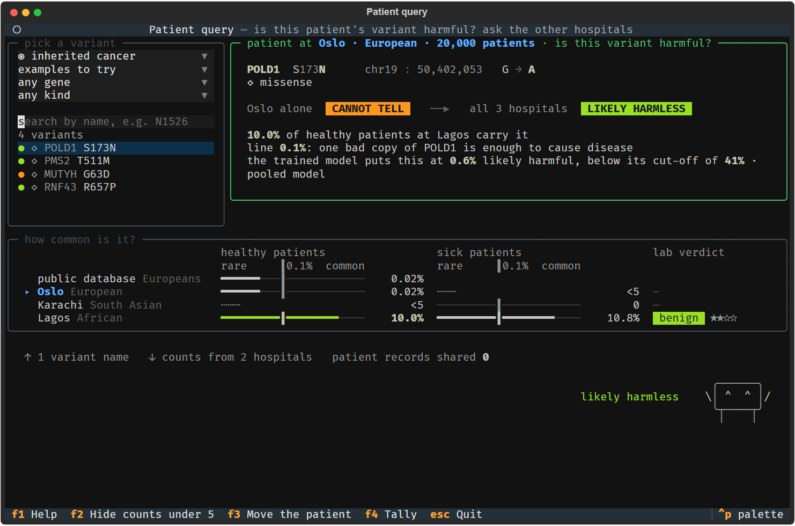
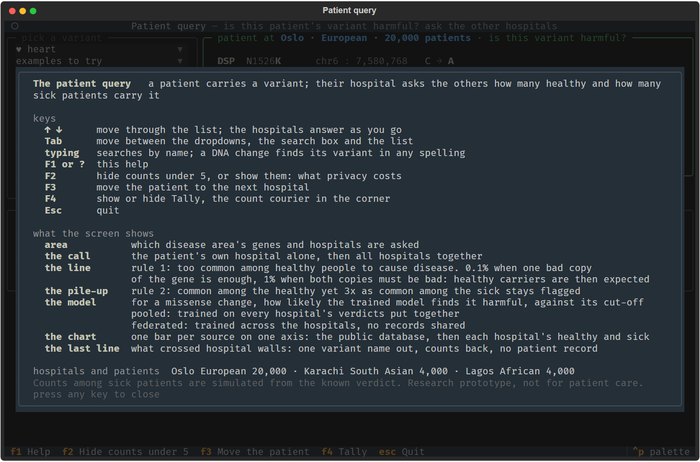

# The patient query: what a clinician sees, and what stands behind it

A patient carries a DNA variant. Their hospital asks the other hospitals how many healthy and how many sick patients carry it, and two rules a clinical lab already applies by hand read the answers. A trained model adds its opinion for missense changes. Nothing but one variant name leaves the patient's hospital, and nothing but counts comes back.

This page says what the screen shows and how to drive it, which disease areas it covers, how the two rules and the model line are computed, what the per-gene line changed, how the model in the query was proved to match the trained one, and what the query cannot do. Every number here is computed at run time by `scripts/06_check_query_rules.py`; the screen tests and the pictures come from `scripts/06_query_tui_check.py`.

```
uv run python scripts/06_query_tui.py                       # the screen, in a real terminal
uv run python scripts/06_query_tui.py --panel cancer        # start on the inherited cancer area
uv run python scripts/06_query_variant.py "DSP N1526K"      # one answer, printed
uv run python scripts/06_query_variant.py "MUTYH G63D" --panel cancer --json
uv run python scripts/06_check_query_rules.py               # the numbers on this page
uv run python scripts/06_query_tui_check.py                 # drives the screen headlessly, writes the pictures
```

## The screen


Top left, **pick a variant**: four dropdowns and a search box. The first dropdown is the disease area, with one glyph per area: ♥ heart, ◉ inherited cancer, ⊕ all panels. Only areas whose hospitals are built are listed. Then what to show: the examples to try, the variants whose call changes once the other hospitals answer, the variants kept flagged, or everything. Then one gene, and one kind of mutation. Typing in the search box narrows the list by name, and a DNA change pasted in any of its valid spellings lists its variant. Every row of the list carries a dot in the colour of the call and the glyph of its mutation type.

Top right, **the verdict**. The title names the hospital the patient is at, with its population and how many patients it has sequenced. Then the variant, its mutation type, and the call twice: the patient's own hospital alone, with the public database, and then all hospitals together. Under the call, three lines: the one fact behind it, rule 1's line for this gene and why it applies, and the trained model's opinion. For a change that cuts the protein short, shifts the reading frame or breaks a splice site, a fourth line says how many patients at each hospital carry any such change in the gene.

Below, **how common is it?**: one chart with a row per source of evidence, the public database and then each hospital, every bar on one axis from rare to common, with the gene's line marked as a tick. Healthy patients on the left, sick patients on the right, and the hospital's own lab verdict, if it has one, at the end. Only the number that decides the call is drawn bright and coloured.

The last line says what crossed hospital walls: one variant name out, counts from the other hospitals back, patient records shared 0.

The keys:

| key | what it does |
|---|---|
| up, down | move through the list; the hospitals answer as you go |
| Tab | move between the dropdowns, the search box and the list |
| typing | search by name, or paste a DNA change in any of its spellings |
| F1 or ? | help: the keys and what each part of the screen shows |
| F2 | hide counts under 5 or show them, to see what privacy costs |
| F3 | move the patient to the next hospital |
| Escape | quit |

Bottom right stands Tally, the count courier, a small character of our own drawn with box lines and dots. It stands for what crosses hospital walls: when a query runs it sets off, comes back holding the highest share of healthy carriers any hospital reported, shows the call for a moment, arms up for LIKELY HARMLESS, an exclamation mark for KEEP FLAGGED, a shrug for CANNOT TELL, and then stands idle with a blink now and then. F4 hides or shows it for the session; a window under 30 rows has no room for it. The web demo draws the same frames from the same file, `scripts/mascot.py`, and the check script holds it at one frame so the pictures always show the same pose.

The screen reflows with the window. Below about 90 columns the picker sits above the verdict; below 30 rows the header goes and the panels lose their blank lines; at 80 by 24 the screen scrolls. The glyphs come from the symbol blocks every terminal font carries. Setting the environment variable `PATIENT_QUERY_PLAIN=1` draws words instead.





## Disease areas

The heart area is the default and its files sit at the top of `data/`. Any other area built by steps 1 and 2 with `--panel` lives in `data/<area>/`, with `data/<area>/other_types/` beside it when that was built, and the query lists it once `data/<area>/sites.json` exists. Three areas are built on this machine: `cardiac`, 104 genes; `cancer`, 41 genes; `all`, every NHS signed-off panel, 4,206 genes. The heart area also has the other mutation types built, 73,570 variants beside the 8,790 missense ones. The other two hold missense variants only.

Each area has its own examples to try. For the heart area they are `DSP N1526K`, `TTR V142I`, `FLNC T834M`, `MYH7 R403Q` and the MYBPC3 deletion filed under two ids. For inherited cancer they are `POLD1 S173N`, `PMS2 T511M`, `MUTYH G63D` and `RNF43 R657P`. An area with no stories written down shows the four variants whose call changes most clearly once the other hospitals answer.

When an area is asked for and its files are missing, both the screen and the command line say which file is missing and print the commands that build it.

## The two rules

Every hospital answers with four numbers: healthy carriers out of healthy patients, and sick carriers out of sick patients. A count above zero and under 5 is reported as fewer than 5, so that no single patient can be picked out. F2 switches that off to show what it costs.

**Rule 1, too common.** A variant carried by this share of healthy people somewhere, or of people in the public database, is too common to cause a rare disease: LIKELY HARMLESS. The line depends on how the gene is inherited, which `config/<area>_gene_panel.txt` records for every gene from PanelApp:

- 0.1% when one bad copy of the gene is enough to cause disease. That is every gene recorded as MONOALLELIC, X-LINKED-MONOALLELIC, BOTH, MITOCHONDRIAL or UNKNOWN, and every gene the file does not list.
- 1% when every recorded mode says both copies must be bad, BIALLELIC or X-LINKED-BIALLELIC. A two-copy disease expects healthy carriers of one copy, so a harmful variant can be fairly common among healthy people.

The verdict panel always says which line applied and why, for instance `line 1%: both copies of MUTYH must be bad to cause disease, so healthy carriers of one copy are expected`. The chart's tick moves with it.

**Rule 2, the pile-up.** A variant that is common among the healthy yet at least 3 times as common among the sick at the same hospital is KEEP FLAGGED, whatever rule 1 says. When neither rule fires the call is CANNOT TELL, in the data FREQUENCY SAYS NOTHING, and the screen says what is left to decide: the scores for a missense change, the presumption from the mutation type for the others.

For the other mutation types, a change that cuts the protein short, shifts the reading frame or breaks a splice site starts out presumed harmful, and a synonymous or intronic change presumed harmless. That is a reason line of its own. The two rules make the call and can overrule it.

## What the per-gene line changed

Rule 1 alone, all hospitals plus the public database, counts under 5 hidden, so that the counts among sick patients play no part. A variant counts as cleared when the most any source reports reaches the line. Computed by `scripts/06_check_query_rules.py` on 18 September 2026.

| area | genes | need two bad copies | variants in those genes | harmful, cleared on 0.1% | harmful, cleared on 1% | harmless, cleared on 0.1% | harmless, cleared on 1% |
|---|---|---|---|---|---|---|---|
| heart | 104 | 19 | 5,415 | 1 | 0 | 372 | 205 |
| inherited cancer | 41 | 3 | 118 | 2 | 0 | 16 | 9 |
| all panels | 4,206 | 2,339 | 44,297 | 129 | 6 | 13,010 | 7,011 |

The harmful variants the old line cleared and the new one keeps: in the heart area `PPA2 E172K`, at 0.12%. In inherited cancer `MUTYH G63D`, at 0.49%, and `MUTYH Y151C`, at 0.27%, the two MUTYH variants that a person needs two copies of to develop polyposis. Across all panels, 123 of the 129 are kept; the 6 still cleared on the 1% line are `HFE C259Y` at 5.74%, `BTD D424H` at 3.97%, `SERPINA1 E288V` at 3.66%, `WNT10A F228I` at 2.13%, `ABCA4 R899H` at 2.12% and `ABCA4 G753E` at 1.38%. Those six are well-known common recessive alleles, and a lab would want a line above 1% or a disease-specific one for them. The price of the higher line is the harmless variants in two-copy genes that frequency no longer clears: 167 in the heart area, 7 in inherited cancer, 5,999 across all panels.

For one-copy genes nothing changed. That was checked by recording, before any edit, every `overview()` count at every hospital with and without count hiding, and the full result for `DSP N1526K`, `TTR V142I`, `TNNT2 K253R`, `MYH7 R403Q` and the MYBPC3 deletion at every hospital, and comparing after: every row of a one-copy gene is identical, and the five results differ only in the model line and in the new fields. The rows that changed all belong to the 19 two-copy heart genes: 48 missense and 148 other-type names for a patient at Oslo, 45 and 147 at Karachi, 45 and 143 at Lagos. The three false alarms of the type rule that frequency clears, and the one harmful variant the public database wrongly clears, in [other_mutation_types.md](other_mutation_types.md), are unchanged, because none of those genes needs two copies.

## The model line

Step 3 trains one logistic regression per hospital and one on every hospital's verdicts pooled, from 13 prediction scores plus the frequency, and saves each model's weights and cut-off in `data/results_local.json`. The query reads that file and builds the feature row for a missense variant the way step 3 does: the same score columns, a missing score replaced by the neutral 0.5, and the frequency put through the same fixed log transform. The frequency it uses is the best the query found, the highest share of healthy carriers any hospital reported. The result is one sentence, for example `the trained model puts this at 96% likely harmful, above its cut-off of 57% · pooled model`. The cut-off is the one step 3 set on its training rows at 95% sensitivity.

When step 4 has saved `data/results_federated.json`, the query uses the NVFlare model from its first run instead and says `federated model`. On this machine that file does not exist yet, so the pooled model is wired. Other areas read their own `results_local.json`; the inherited cancer model has 15 scores and a cut-off of 41%.

The model scores missense changes only. Every other mutation type gets the line `the trained model scores missense changes only, so it is not used here`, and a missing model file gives `not scored`.

**The proof.** The heart test set, 2,373 variants, was scored through the query's own feature pipeline under the four frequency settings step 3 uses, and compared with the numbers step 3 saved. The feature rows are identical to step 3's, with a largest difference of 0. The false alarms of the pooled model on the 183 population-discordant benign rows are 7, 11, 2 and 2 for the public database, the patient's own hospital, the federated count query and the ceiling, the same as saved. The unseen-gene AUC and the sensitivity under each setting match to the last digit. The AUC over all rows matches to 6 decimals with the saved weights, which are rounded to 4 decimals in the file, and to the last digit once the pooled model is refitted with step 3's own `fit()` and its unrounded weights are sent through the same pipeline.

## Any change of the same class

A brand-new protein-cutting, frameshift or splice-site variant has zero counts everywhere, and the next thing a lab asks is how many patients carry any such change in the gene. For those three mutation types the query adds that count for each hospital, healthy and sick, with the same hiding of counts under 5. For `KCNH2 P298fs c.893del`, a patient at Lagos: 108 of 34,000 healthy patients at Oslo carry some protein-cutting, frameshift or splice-site change in KCNH2, none of 6,800 at Karachi, 17 of 6,800 at Lagos. The counts among sick patients are simulated from the verdict and are shown for the demonstration only.

## Limits

- The hospitals and their patients are simulated. Counts among sick patients are generated from the known verdict, so rule 2 and the same-class counts among the sick demonstrate the query and prove nothing about a variant.
- The two lines are illustrative. Clinical labs use disease-specific limits, and the six common recessive alleles across all panels show that 1% is not always enough.
- A gene recorded as BOTH, or with several modes, takes the 0.1% line. That is the cautious choice and it keeps harmful variants flagged, at the price of harmless ones in those genes.
- The model line is the pooled model of step 3 until step 4 saves its file. Its cut-off was set on training rows, and its probability for a variant in a gene the model has seen partly reflects the gene.
- The model covers missense changes only. For the other types the presumption from the mutation type and the two rules are all there is.
- The all-panels area has no other mutation types built, and no area but the heart one has them.
- Hiding counts under 5 is the only privacy protection.
- The screen was tested headlessly at 118 by 36, 120 by 38, 118 by 32 and 80 by 24. Glyphs were checked in headless Chrome, and the plain-words fallback has to be switched on by hand.
